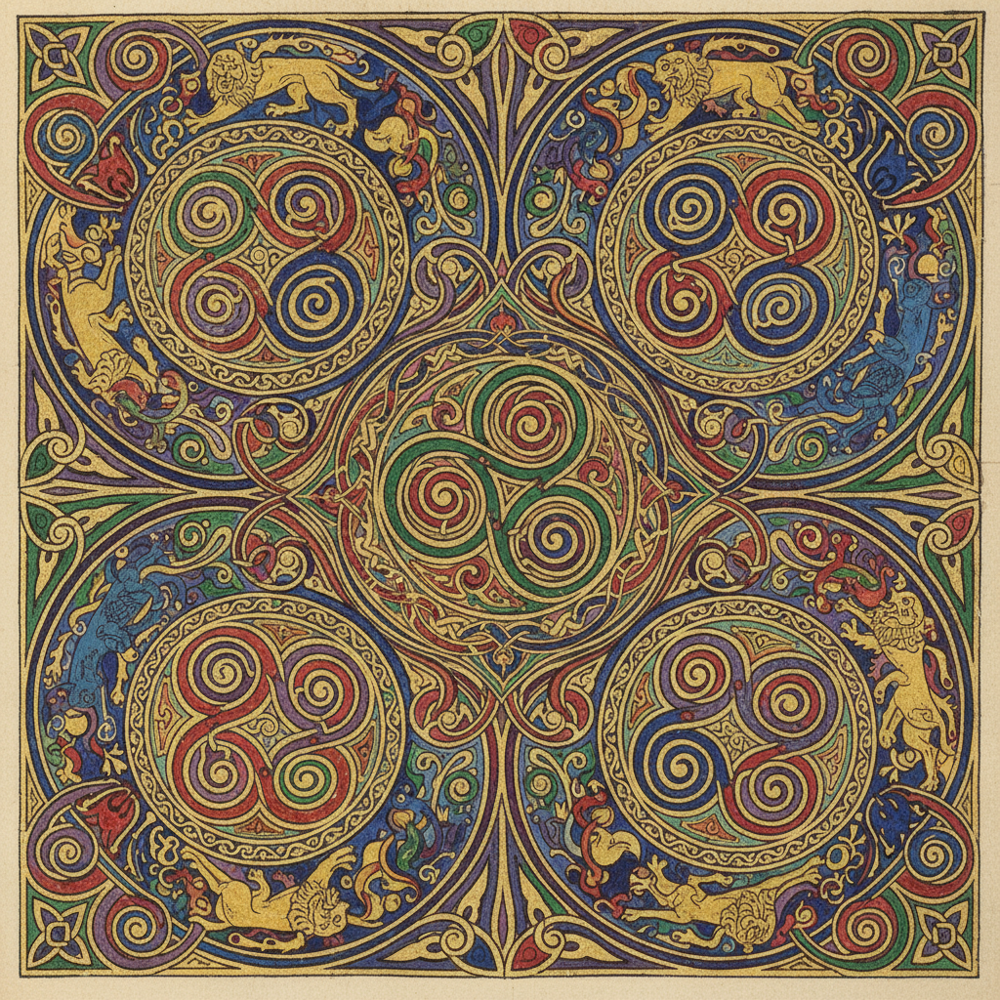

# Celtic Knotwork 凯尔特结 | Snaidhm Cheilteach

> **"没有起点也没有终点——爱尔兰修士用永恒的交织线条编织神圣。"**

## 概述

凯尔特结（Celtic Knotwork / Snaidhm Cheilteach）是凯尔特文化（爱尔兰、苏格兰、威尔士、布列塔尼）的传统装饰艺术，以其无始无终的交织线条著称。这种艺术在公元5-9世纪的"岛屿艺术"（Insular Art）时期达到巅峰，最著名的代表是《凯尔斯之书》（Book of Kells，约800年）。凯尔特结的核心特征是一条或多条线条不断交织、穿越、回环，形成没有起点和终点的封闭图案——象征永恒、生命的循环和万物的相互联系。

## 主要类型

| 类型 | 特征 |
|------|------|
| 交织结 Interlace | 线条互相穿越交织 |
| 螺旋纹 Spiral | 三重螺旋（Triskelion） |
| 钥匙纹 Key Pattern | 直角转折的迷宫图案 |
| 动物交织 Zoomorphic | 动物身体形成的交织 |
| 十字架 High Cross | 凯尔特十字上的装饰 |

## 核心特征

- **无始无终**：线条形成封闭的循环
- **交织穿越**：线条有规律地上下穿越
- **对称性**：严格的对称构图
- **单线或多线**：一条线或多条线交织
- **填充装饰**：填满整个可用空间
- **数学精确**：基于网格的精确构图

## 象征含义

| 图案 | 含义 |
|------|------|
| 三重螺旋 | 三位一体、生死再生 |
| 四重结 | 四季、四方 |
| 爱之结 | 永恒的爱 |
| 生命之树 | 天地连接 |
| 盾结 | 保护 |
| 水手结 | 安全归来 |

## 视觉特征

- 精密的交织线条
- 严格的对称构图
- 线条的上下穿越节奏
- 填满空间的密集图案
- 金色和彩色的装饰
- 数学般的精确

## 与其他风格的关系

| 风格 | 关系 |
|------|------|
| 维京交织纹 | 共享北欧交织传统 |
| 伊斯兰几何 | 共享无限重复的几何美学 |
| Ainu螺旋纹 | 共享螺旋纹（独立发展） |
| Art Nouveau | 受凯尔特曲线影响 |
| 当代纹身 | 凯尔特结是流行纹身题材 |

## 概念图

---

*浮光艺志 | Chronicle of Artistry*
