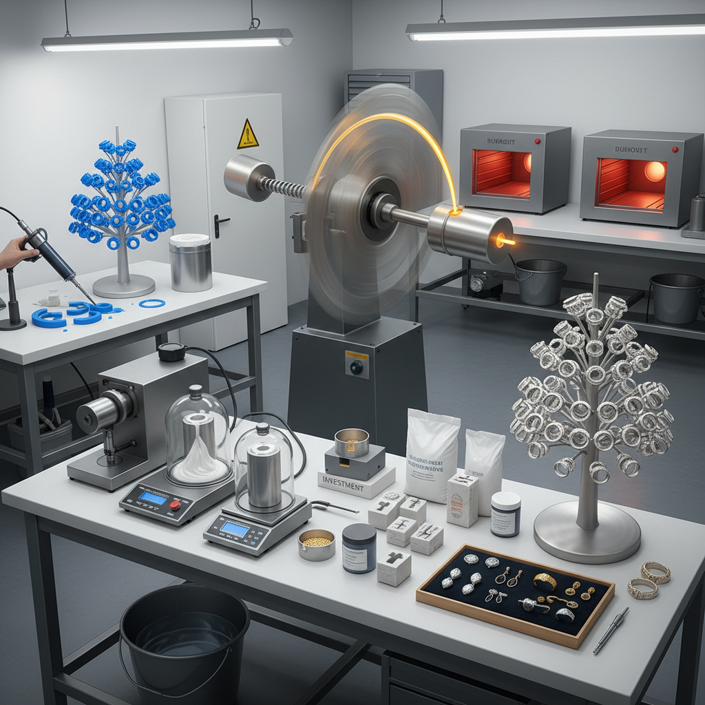

# Centrifugal Casting Art 离心铸造艺术

> "Centrifugal casting harnesses the oldest force in the universe — rotation — to fill molds with molten metal in ways that gravity alone could never achieve. As the mold spins, centrifugal force drives liquid metal into every crevice, every undercut, every microscopic detail with a pressure and completeness that produces castings of extraordinary density and precision. It is physics in service of art." — Unknown

## 概述

离心铸造艺术（Centrifugal Casting Art）是利用离心力将熔融金属压入旋转铸型中的铸造技法——通过高速旋转产生的离心力，使金属液充满铸型的每一个细节，获得比重力铸造更致密、更精细的铸件。离心铸造在珠宝制作和精密艺术铸造中有重要应用。

离心铸造艺术的实践包括：1）珠宝离心铸造——精密首饰的离心铸造；2）牙科铸造——牙科修复体的精密铸造；3）艺术铸造——小型艺术品的离心铸造；4）工业离心铸造——管材和筒形件的铸造；5）真空离心铸造——结合真空和离心力的铸造；6）当代应用——将离心铸造与3D打印蜡模结合的新工艺。

## 核心特征

| 特征 | 描述 |
|------|------|
| 离心力 | 利用旋转的离心力 |
| 精密 | 极其精密的铸件 |
| 致密 | 铸件密度极高 |
| 细节 | 完美的细节填充 |
| 快速 | 金属快速填充铸型 |
| 珠宝 | 珠宝铸造的主流方法 |

## 视觉特征

- **精细**：极其精细的铸造细节
- **致密**：无气孔的致密表面
- **锐利**：锐利的边缘和棱角
- **复杂**：复杂的镂空结构
- **光滑**：光滑的铸造表面
- **均匀**：均匀的壁厚分布

## 代表作品

| 作品 | 艺术家/文化 | 年代 | 意义 |
|------|-------------|------|------|
| *Fine jewelry castings* | 珠宝行业 | 1930s至今 | 精密珠宝铸造 |
| *Dental prosthetics* | 牙科 | 1900s至今 | 牙科精密铸造 |
| *Art bronze miniatures* | 艺术铸造 | 当代 | 小型艺术铸件 |
| *Industrial pipe castings* | 工业 | 1800s至今 | 工业离心铸管 |
| *3D printed jewelry* | 当代技术 | 2010s至今 | 3D打印+离心铸造 |

## 历史时间线

| 时期 | 事件 |
|------|------|
| 1809年 | 离心铸造概念提出 |
| 1848年 | 工业离心铸造专利 |
| 1907年 | 牙科离心铸造的发展 |
| 1930年代 | 珠宝离心铸造的普及 |
| 当代 | 与3D打印和CAD的结合 |

## 中国语境

离心铸造艺术在中国有广泛的工业和艺术应用。中国的珠宝制造业大量使用离心铸造——深圳、番禺等珠宝加工中心拥有大量离心铸造设备。中国的工业离心铸造在管材、筒形件等领域处于世界前列——为石油、化工等行业提供高质量铸件。中国的牙科行业也广泛使用离心铸造——用于制作精密的牙科修复体。中国当代的一些独立珠宝设计师使用离心铸造实现自己的设计——从蜡雕或3D打印原型到金属成品。中国的珠宝教育中，离心铸造是金工课程的重要组成部分——学生学习从蜡模制作到离心铸造的完整流程。中国的3D打印珠宝行业正在快速发展——3D打印蜡模+离心铸造的工艺流程正在改变传统珠宝制造。

## AI生成概念图

## 与其他风格的关系

- **Lost-Wax Casting** → 失蜡铸造
- **Sand Casting** → 砂型铸造
- **Jewelry Art** → 珠宝艺术
- **Metalsmithing** → 金属锻造
- **3D Printing** → 3D打印
- **Industrial Design** → 工业设计

---

*浮光艺志 | Chronicle of Artistry*
