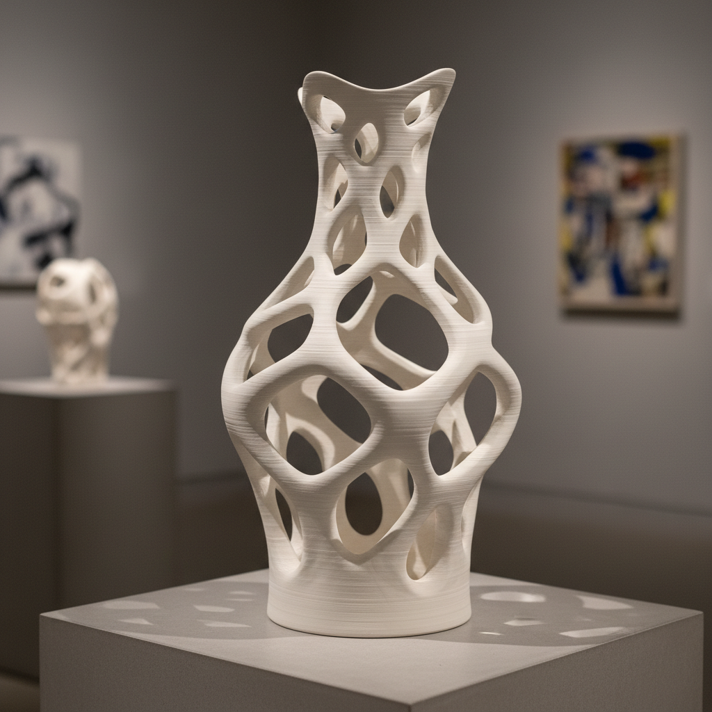

# Ceramic 3D Printing Art 陶瓷3D打印艺术

> "3D printing doesn't replace the potter's hand — it extends the potter's imagination into geometries that hands alone cannot reach." — Contemporary digital ceramics

## 概述

陶瓷3D打印艺术（Ceramic 3D Printing Art）是利用增材制造技术（3D打印）以陶瓷材料为介质进行艺术创作的当代新兴领域。陶瓷3D打印将数字设计与传统陶瓷材料相结合——通过计算机控制的挤出系统将液态黏土逐层堆积，创造出传统手工无法实现的复杂几何形态，同时保留了陶瓷材料的温润质感和烧成后的永久性。

陶瓷3D打印技术始于2000年代——随着桌面级3D打印机的普及，陶艺家和设计师开始探索将这一技术应用于陶瓷创作。与塑料3D打印不同，陶瓷3D打印使用的是真正的黏土——打印完成后仍需经过干燥、施釉和高温烧成等传统陶瓷工艺流程。这使得陶瓷3D打印成为数字技术与传统工艺的独特交汇点。

陶瓷3D打印艺术的核心要素包括：1）数字设计——计算机辅助的形态设计；2）逐层堆积——液态黏土的逐层挤出；3）复杂几何——传统手工无法实现的形态；4）材料真实——使用真正的陶瓷材料；5）传统烧成——仍需高温烧制；6）参数化设计——算法驱动的形态生成；7）可重复性——精确的数字化重复。

## 核心特征

| 特征 | 描述 |
|------|------|
| 数字设计 | 计算机辅助形态设计 |
| 逐层堆积 | 液态黏土逐层挤出 |
| 复杂几何 | 传统手工无法实现形态 |
| 材料真实 | 使用真正陶瓷材料 |
| 传统烧成 | 仍需高温烧制 |
| 参数化设计 | 算法驱动形态生成 |

## 视觉特征

- **层纹肌理**：逐层堆积留下的水平层纹
- **复杂镂空**：数学曲面的镂空结构
- **有机形态**：算法生成的有机曲面
- **精确重复**：完美重复的图案单元
- **扭转造型**：连续扭转的几何体
- **多孔结构**：蜂窝状或网格状结构

## 代表作品

| 作品 | 年代 | 意义 |
|------|------|------|
| *Unfold Design Studio作品* | 2009至今 | 先驱工作室 |
| *Jonathan Keep作品* | 2010年代 | 自然形态 |
| *Olivier van Herpt作品* | 2014至今 | 大型打印 |
| *Emerging Objects建筑陶瓷* | 2012至今 | 建筑应用 |
| *WASP大型陶瓷打印* | 2015至今 | 建筑尺度 |
| *景德镇3D打印陶瓷* | 2010年代至今 | 中国探索 |

## 历史时间线

| 时期 | 事件 |
|------|------|
| 2000年代初 | 早期陶瓷3D打印实验 |
| 2009年 | Unfold Design Studio开始探索 |
| 2012年 | 商业陶瓷3D打印机出现 |
| 2015年 | 大型陶瓷打印技术突破 |
| 2018年 | 建筑尺度陶瓷打印 |
| 当代 | 技术成熟，艺术应用扩展 |

## 中国语境

中国作为世界陶瓷的发源地和3D打印技术的重要发展国，在陶瓷3D打印领域有着独特的优势和潜力。景德镇——这座千年瓷都——已经开始拥抱3D打印技术，多家工作室和研究机构正在探索将数字制造与传统制瓷工艺相结合。中国的陶瓷3D打印研究在材料科学方面尤其活跃——开发适合3D打印的高性能陶瓷浆料，包括氧化铝、氧化锆等工程陶瓷和传统的瓷土配方。陶瓷3D打印为中国传统陶瓷艺术提供了新的可能性——既可以精确复制古代器形用于文物修复和研究，也可以创造全新的当代陶瓷艺术形式。

## 概念图

## 与其他风格的关系

- **Digital Ceramic** → 数字陶瓷（广义数字陶瓷）
- **Parametric Design** → 参数化设计
- **Studio Pottery** → 工作室陶艺（传统对照）
- **Architectural Ceramics** → 建筑陶瓷
- **Bio-Ceramic** → 生物陶瓷
- **Computational Art** → 计算艺术

---

*浮光艺志 | Chronicle of Artistry*
