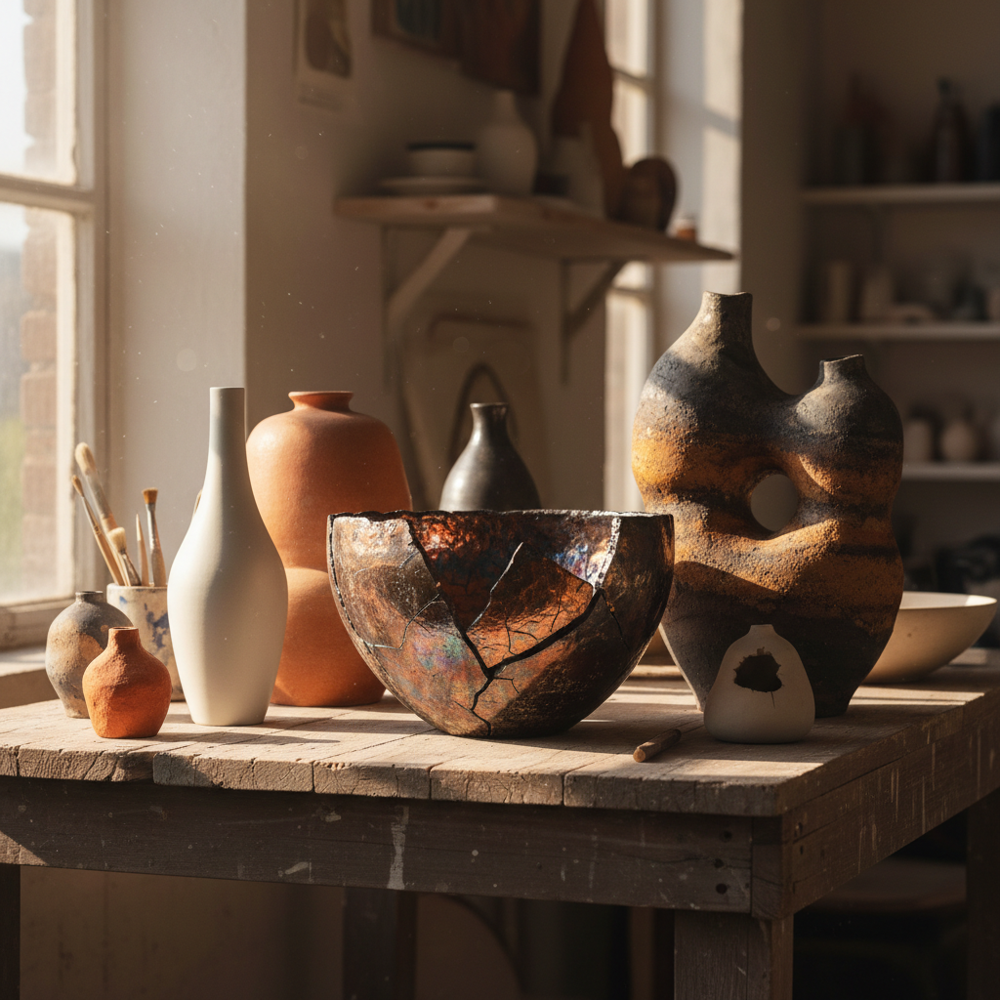

# Ceramic Art 陶瓷艺术

> "Clay is the most human of materials." — Edmund de Waal

## 概述

陶瓷艺术（Ceramic Art）是以黏土为主要材料，通过成型和烧制创作的艺术形式。它是人类最古老的艺术媒介之一，从新石器时代的陶罐到当代的概念性陶瓷雕塑，跨越了数千年的历史。

20世纪后半叶，陶瓷艺术经历了从"工艺"到"纯艺术"的身份转变。Peter Voulkos在1950年代将抽象表现主义引入陶瓷，打破了功能性器皿的传统，开启了陶瓷作为雕塑和概念艺术媒介的新时代。

## 核心特征

| 特征 | 描述 |
|------|------|
| 泥土媒介 | 黏土——来自大地的原始材料 |
| 火的转化 | 烧制使脆弱的泥变为永恒的瓷 |
| 功能与艺术 | 在实用器皿与纯艺术之间游走 |
| 触觉性 | 手与泥的直接接触——最亲密的创作 |
| 偶然性 | 窑变、裂纹——火的不可控带来惊喜 |
| 文化深度 | 每种文明都有独特的陶瓷传统 |

## 视觉特征

- **材质**：陶、炻、瓷——从粗糙到细腻的光谱
- **釉色**：从素烧的泥土色到华丽的釉彩
- **形态**：器皿、雕塑、装置、建筑构件
- **表面**：光滑釉面、粗糙肌理、裂纹、窑变
- **尺度**：从茶杯到建筑尺度的陶瓷墙
- **温度**：低温陶（800°C）到高温瓷（1300°C+）

## 代表作品

| 作品 | 艺术家 | 年代 | 意义 |
|------|--------|------|------|
| *Untitled Stack* | Peter Voulkos | 1960s | 打破器皿传统的抽象陶瓷雕塑 |
| *Cloud Gate* series | Lucie Rie | 1970s | 极简优雅的现代器皿 |
| *Breathing Light* | Edmund de Waal | 2010s | 白瓷容器的诗意装置 |
| *Untitled* | Ron Nagle | 2000s+ | 微型陶瓷的色彩实验 |
| *Ceramic Sculptures* | Ai Weiwei | 2000s+ | 传统陶瓷的当代政治转化 |
| *Sunflower Seeds* | Ai Weiwei | 2010 | 1亿颗手工瓷瓜子——劳动与个体 |

## 历史时间线

| 时期 | 事件 |
|------|------|
| 前20000年 | 最早的陶器出现（中国江西仙人洞） |
| 前3000年 | 中国龙山文化黑陶——薄如蛋壳 |
| 7-10世纪 | 中国唐三彩、宋代五大名窑 |
| 15世纪 | 中国青花瓷影响全球 |
| 1950s | Peter Voulkos——陶瓷的抽象表现主义革命 |
| 1960s-70s | 美国陶瓷运动——功能与雕塑的辩论 |
| 1980s | 后现代陶瓷——叙事、装饰、政治 |
| 2000s | Edmund de Waal——陶瓷的文学化 |
| 2010s-至今 | 陶瓷艺术的全面复兴和博物馆化 |

## 子类型

| 子类型 | 特征 |
|--------|------|
| 器皿艺术 | Rie、Hamada——功能性器皿的美学 |
| 陶瓷雕塑 | Voulkos——打破器皿的雕塑性 |
| 装置陶瓷 | de Waal——大量瓷器的空间诗意 |
| 概念陶瓷 | Ai Weiwei——陶瓷作为政治媒介 |
| 建筑陶瓷 | 瓷砖、陶板——建筑表面的艺术 |
| 微型陶瓷 | Nagle——极小尺度的色彩宝石 |

## 中国语境

中国是陶瓷艺术的发源地和最高峰。从仰韶彩陶到宋代汝窑、从元青花到清代粉彩，中国陶瓷代表了人类在这一媒介上的最高成就。"China"（瓷器）即中国——陶瓷是中国文明的代名词。当代中国陶瓷艺术在景德镇等传统产区焕发新生，年轻艺术家将传统技艺与当代观念结合，创造出既有文化根基又有当代性的作品。

## 争议与遗产

- **争议**：陶瓷是工艺还是艺术？功能性是否降低了艺术性？
- **传统与创新**：如何在尊重传统的同时推动创新？
- **工业化**：手工陶瓷在工业化时代的意义
- **遗产**：证明了最古老的媒介可以承载最当代的观念
- **当代回响**：陶艺工作坊热潮、慢生活运动、手工复兴

## AI生成概念图

## 与其他风格的关系

- **Textile Art** → 纺织艺术共享工艺与纯艺术的身份辩论
- **Minimalism** → 极简主义影响了当代陶瓷的简约美学
- **Abstract Expressionism** → Voulkos将抽象表现主义引入陶瓷
- **Arts and Crafts** → 工艺美术运动为陶瓷的艺术地位奠基
- **Wabi-Sabi** → 侘寂美学深刻影响了陶瓷的不完美之美
- **Installation Art** → 大型陶瓷装置是装置艺术的重要分支

---

*浮光艺志 | Chronicle of Artistry*
