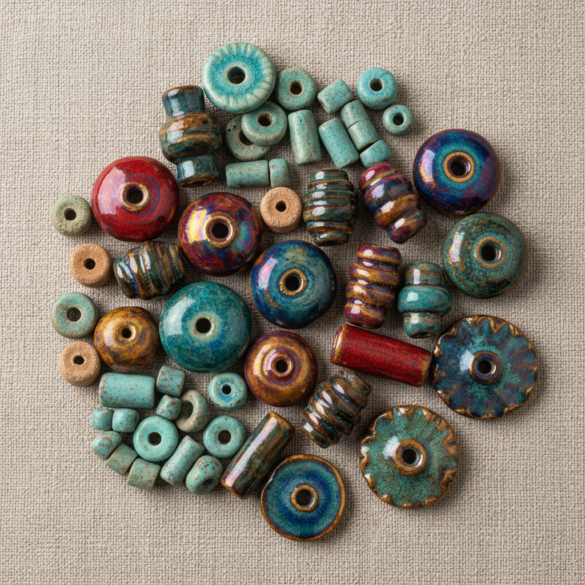

# Ceramic Bead Art 陶瓷珠饰艺术

> "The ceramic bead is adornment at its most elemental — a small sphere of fired clay pierced for stringing, among the oldest decorative objects ever made, found in graves forty thousand years old, each bead a universe in miniature where glaze pools in tiny craters and color concentrates into jewel-like intensity, proof that the human desire for beauty begins at the smallest scale." — Unknown

## 概述

陶瓷珠饰艺术（Ceramic Bead Art）是一种以陶瓷材料制作珠子和饰品的艺术形式。陶瓷珠是人类最古老的装饰品之一——考古发现的最早陶珠可追溯到数万年前。陶瓷珠饰将微型陶瓷工艺与装饰美学结合——每一颗珠子都是一个微型的陶瓷作品，展现了釉色、造型和装饰的精湛技艺。

陶瓷珠饰艺术的核心要素包括：1）微型尺度——小巧精致的尺度；2）穿孔设计——便于串联的穿孔；3）釉色丰富——丰富多彩的釉色；4）造型多样——各种形状的珠子；5）装饰功能——用于人体装饰；6）文化象征——承载文化和宗教意义；7）工艺精湛——微型陶瓷的精湛工艺。

## 核心特征

| 特征 | 描述 |
|------|------|
| 微型尺度 | 小巧精致的尺度 |
| 穿孔设计 | 便于串联的穿孔 |
| 釉色丰富 | 丰富多彩的釉色 |
| 造型多样 | 各种形状珠子 |
| 装饰功能 | 用于人体装饰 |
| 文化象征 | 承载文化宗教意义 |

## 视觉特征

- **小巧精致**：微型的精致造型
- **色彩丰富**：丰富多彩的釉色
- **光泽感**：釉面的光泽效果
- **形态多样**：圆形、管状、异形等
- **纹饰精细**：微型的精细纹饰
- **串联之美**：串联组合的整体美

## 代表作品

| 作品 | 艺术家/文化 | 年代 | 意义 |
|------|-------------|------|------|
| *埃及费昂斯珠* | 古埃及 | 前3000年 | 最早的釉面珠饰 |
| *美索不达米亚珠* | 两河流域 | 前4000年 | 早期陶瓷珠饰 |
| *非洲陶珠* | 非洲各文化 | 各时期 | 非洲珠饰传统 |
| *中国陶珠* | 中国 | 各时期 | 中国珠饰传统 |
| *当代陶瓷珠* | 各地陶艺家 | 当代 | 当代珠饰艺术 |

## 历史时间线

| 时期 | 事件 |
|------|------|
| 前40000年 | 最早的陶制珠饰 |
| 前4000年 | 费昂斯釉面珠的出现 |
| 各时期 | 各文化陶珠传统的发展 |
| 中世纪 | 贸易珠的全球流通 |
| 当代 | 陶瓷珠饰的艺术化复兴 |

## 中国语境

中国有悠久的陶瓷珠饰传统。新石器时代的仰韶文化和龙山文化遗址中都出土了大量陶珠——这些陶珠是中国最早的装饰品之一。中国唐代的三彩珠饰色彩斑斓——是丝绸之路贸易中的重要商品。中国传统的瓷珠（如景德镇的青花瓷珠）将中国瓷器的精湛工艺浓缩在微型尺度上——每一颗珠子都是一件微型的瓷器艺术品。中国的佛珠（念珠）传统中也有大量使用陶瓷珠的——陶瓷佛珠以其温润的手感和丰富的釉色受到信众喜爱。中国当代陶艺家正在重新探索陶瓷珠饰的艺术可能性——将传统珠饰工艺与当代首饰设计结合。

## AI生成概念图

## 与其他风格的关系

- **Faience** → 费昂斯
- **Jewelry Design** → 首饰设计
- **Miniature Ceramics** → 微型陶瓷
- **Trade Beads** → 贸易珠
- **Buddhist Prayer Beads** → 佛珠
- **Body Adornment** → 人体装饰

---

*浮光艺志 | Chronicle of Artistry*
