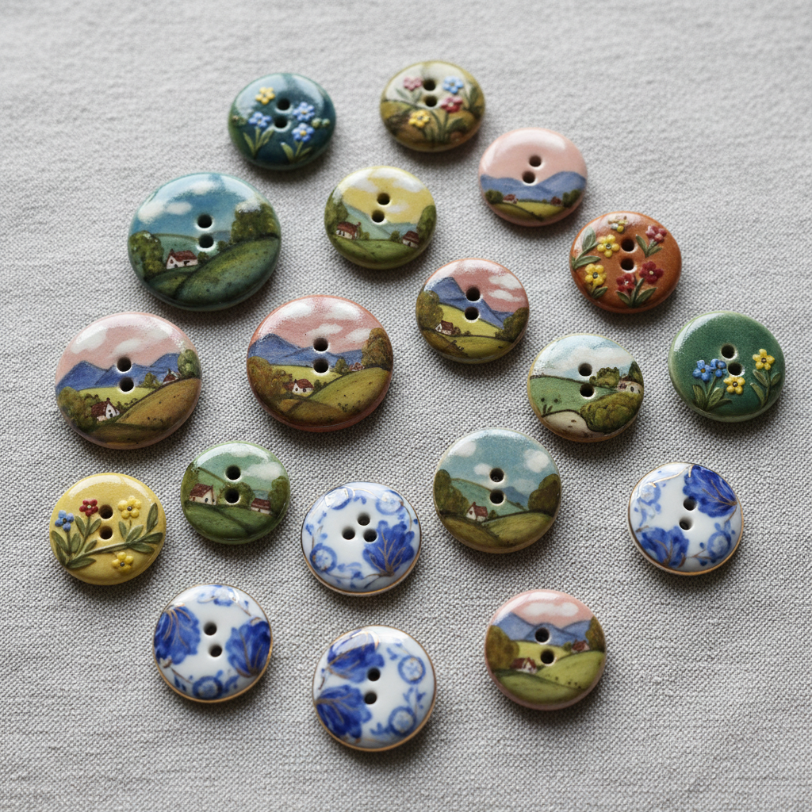

# Ceramic Button Art 陶瓷纽扣艺术

> "A button is a small thing, but it can hold the world together." — Anonymous

## 概述

陶瓷纽扣艺术（Ceramic Button Art）是一种将陶瓷工艺应用于纽扣制作的装饰艺术传统，起源于18世纪欧洲。陶瓷纽扣不仅是服装的功能性配件，更是微型艺术品——它们以精美的彩绘、浮雕和釉色展现了陶瓷工艺的极致精细。从18世纪的韦奇伍德碧玉纽扣到19世纪的手绘瓷器纽扣，再到当代的艺术陶瓷纽扣——这一传统见证了陶瓷艺术在最小尺度上的表现力。

陶瓷纽扣的黄金时代是18-19世纪的欧洲——当时纽扣是身份和品味的象征，贵族和上流社会对精美纽扣的需求推动了这一工艺的发展。韦奇伍德的碧玉浮雕纽扣、法国的手绘瓷器纽扣和德国的转印花纽扣都代表了各自时代的最高水平。20世纪后，随着工业化生产的普及，手工陶瓷纽扣逐渐成为收藏品和艺术品——当代陶艺家重新发现了这一微型艺术形式的魅力。

陶瓷纽扣艺术的核心要素包括：1）微型艺术——在极小尺度上的精细表现；2）功能与美——实用性与装饰性的统一；3）多样技法——彩绘、浮雕、转印、釉色；4）收藏传统——纽扣收藏的悠久历史；5）身份象征——社会地位和品味的标志；6）材料多样——瓷器、陶器、碧玉等；7）当代复兴——手工陶瓷纽扣的艺术化。

## 核心特征

| 特征 | 描述 |
|------|------|
| 微型艺术 | 极小尺度精细表现 |
| 功能与美 | 实用性装饰性统一 |
| 多样技法 | 彩绘浮雕转印釉色 |
| 收藏传统 | 纽扣收藏悠久历史 |
| 身份象征 | 社会地位品味标志 |
| 当代复兴 | 手工陶瓷纽扣艺术化 |

## 视觉特征

- **精细彩绘**：微型花卉和风景画
- **浮雕装饰**：碧玉浮雕的古典图案
- **釉色变化**：丰富的釉色效果
- **圆形构图**：在圆形空间内的构图
- **金边装饰**：金色边缘的点缀
- **自然题材**：花卉、动物、风景

## 代表作品

| 作品 | 年代 | 意义 |
|------|------|------|
| *韦奇伍德碧玉纽扣* | 18世纪末 | 新古典主义 |
| *法国手绘瓷器纽扣* | 19世纪 | 彩绘巅峰 |
| *德国转印花纽扣* | 19世纪 | 工业化生产 |
| *日本萨摩纽扣* | 19世纪末 | 东方风格 |
| *Art Nouveau陶瓷纽扣* | 1900年前后 | 新艺术风格 |
| *当代艺术陶瓷纽扣* | 21世纪 | 当代复兴 |

## 历史时间线

| 时期 | 事件 |
|------|------|
| 18世纪中叶 | 陶瓷纽扣开始流行 |
| 1770年代 | 韦奇伍德开始制作碧玉纽扣 |
| 19世纪 | 手绘瓷器纽扣的黄金时代 |
| 1850年代 | 转印花技术应用于纽扣 |
| 1900年前后 | 新艺术运动风格纽扣 |
| 20世纪中叶 | 塑料纽扣取代陶瓷纽扣 |
| 21世纪 | 手工陶瓷纽扣的艺术复兴 |

## 中国语境

陶瓷纽扣艺术在中国有着独特的历史和当代意义。中国作为世界最大的纽扣生产国——浙江温州和嘉兴是全球纽扣制造中心——对纽扣工艺有着深厚的产业基础。然而，中国传统服装（如旗袍的盘扣）使用的是布艺纽扣而非陶瓷纽扣——陶瓷纽扣主要是西方服装传统的产物。当代中国陶艺家开始探索陶瓷纽扣作为微型艺术品的可能性——将中国传统陶瓷技法（如青花、粉彩）应用于纽扣设计，创造出具有中国特色的陶瓷纽扣艺术。这一领域展示了传统工艺如何在最小的尺度上找到新的表达空间——也展示了东西方服饰文化交流的一个微观切面。

## 概念图

## 与其他风格的关系

- **Wedgwood** → 韦奇伍德（碧玉纽扣）
- **Miniature Painting** → 微型绑画
- **Porcelain Painting** → 瓷器彩绘
- **Art Nouveau** → 新艺术运动
- **Satsuma** → 萨摩烧（日本纽扣）
- **Contemporary Ceramics** → 当代陶艺

---

*浮光艺志 | Chronicle of Artistry*
