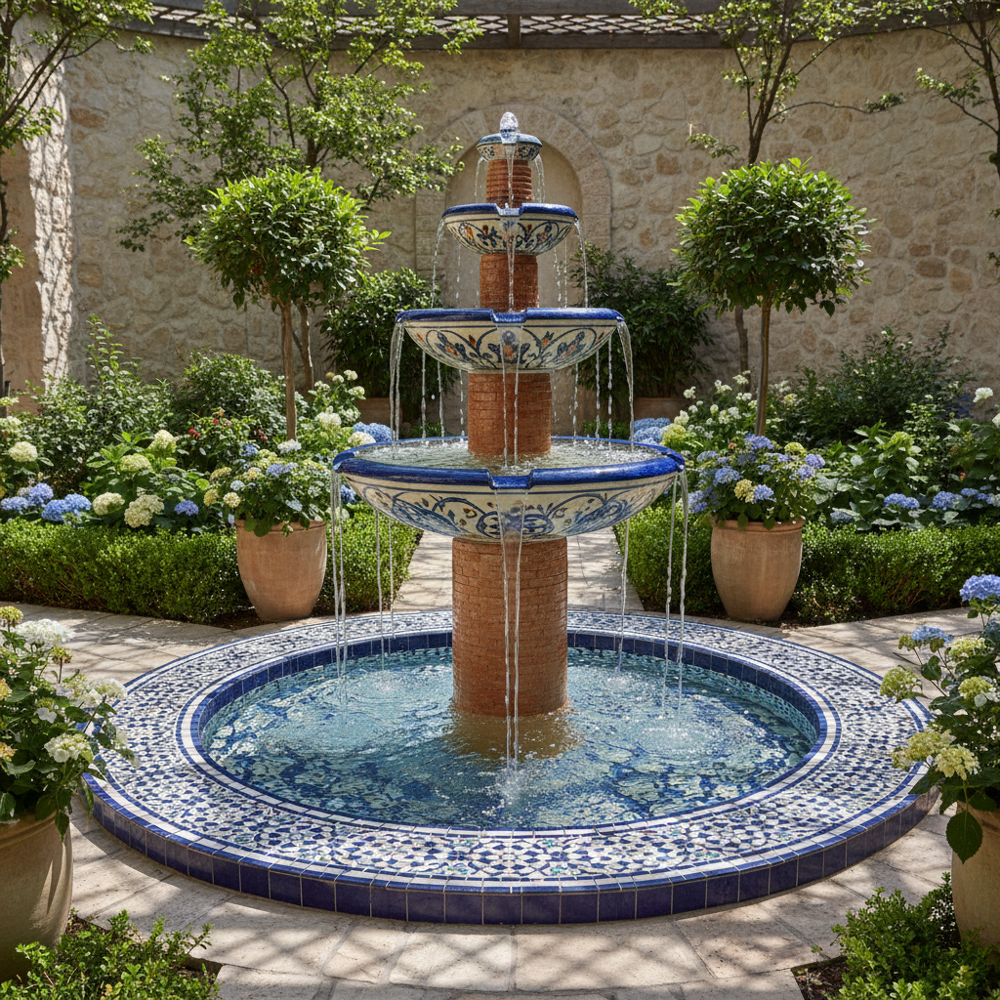

# Ceramic Fountain Art 陶瓷喷泉艺术

> "A ceramic fountain is water's stage — clay shaped into channels, basins, and spouts that give water a voice and a path, the ancient marriage of earth and water made architectural, each fountain a small ecosystem where the mineral patience of fired clay meets the restless energy of flowing water, creating a dialogue between stillness and motion that has cooled courtyards and calmed minds for millennia." — Unknown

## 概述

陶瓷喷泉艺术（Ceramic Fountain Art）是一种将陶瓷材料用于喷泉和水景设计的艺术形式。陶瓷喷泉将陶瓷的防水性、耐久性和装饰性与水的流动美感结合——从伊斯兰庭院的瓷砖喷泉到当代的陶瓷水景装置，陶瓷一直是水景艺术的重要材料。陶瓷喷泉的魅力在于土与水的对话——坚硬的陶瓷引导柔软的水流，静止的器形承载流动的水。

陶瓷喷泉艺术的核心要素包括：1）土水对话——陶瓷与水的互动；2）防水耐久——陶瓷的防水特性；3）水流设计——引导水流的造型；4）声音美学——水流产生的声音；5）空间营造——营造庭院空间氛围；6）装饰功能——装饰与功能的结合；7）文化传统——各文化的喷泉传统。

## 核心特征

| 特征 | 描述 |
|------|------|
| 土水对话 | 陶瓷与水的互动 |
| 防水耐久 | 陶瓷的防水特性 |
| 水流设计 | 引导水流的造型 |
| 声音美学 | 水流的声音之美 |
| 空间营造 | 营造庭院氛围 |
| 装饰功能 | 装饰与功能结合 |

## 视觉特征

- **水流动态**：水在陶瓷上的流动
- **釉面反光**：水与釉面的光线互动
- **层叠结构**：多层叠放的水流结构
- **装饰图案**：陶瓷表面的装饰
- **自然融合**：与庭院环境的融合
- **动静对比**：静止陶瓷与流动水的对比

## 代表作品

| 作品 | 艺术家/文化 | 年代 | 意义 |
|------|-------------|------|------|
| *伊斯兰庭院喷泉* | 伊斯兰世界 | 各时期 | 瓷砖喷泉传统 |
| *西班牙瓷砖喷泉* | 西班牙 | 各时期 | 安达卢西亚传统 |
| *意大利陶瓷喷泉* | 意大利 | 文艺复兴 | 马约利卡喷泉 |
| *日本水钵* | 日本 | 各时期 | 茶庭水钵 |
| *当代陶瓷水景* | 各地艺术家 | 当代 | 当代陶瓷水景 |

## 历史时间线

| 时期 | 事件 |
|------|------|
| 古代 | 早期陶制水容器 |
| 伊斯兰时期 | 瓷砖喷泉的辉煌 |
| 文艺复兴 | 意大利陶瓷喷泉 |
| 日本 | 茶庭水钵的发展 |
| 当代 | 陶瓷水景的当代设计 |

## 中国语境

中国传统园林中虽然更多使用石材作为水景材料，但陶瓷在水景中也有独特的应用。中国传统的陶缸养鱼是一种独特的"微型水景"——大型陶缸中养金鱼、种荷花，是中国庭院的经典景观。中国的龙头出水口常用陶瓷制作——琉璃龙头是中国传统建筑水景的标志性元素。中国当代景观设计中，陶瓷水景越来越受到重视——将传统陶瓷工艺与现代水景设计结合，创造出具有中国文化特色的当代水景。中国的陶瓷产区如景德镇、佛山等地也在开发适合户外水景使用的大型陶瓷产品。

## AI生成概念图

## 与其他风格的关系

- **Islamic Tile** → 伊斯兰瓷砖
- **Garden Design** → 园林设计
- **Water Feature** → 水景
- **Architectural Ceramics** → 建筑陶瓷
- **Public Art** → 公共艺术
- **Landscape Architecture** → 景观建筑

---

*浮光艺志 | Chronicle of Artistry*
