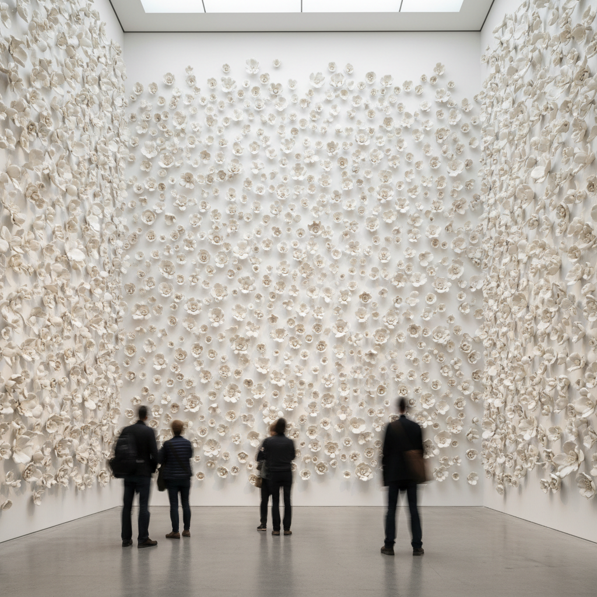

# Ceramic Installation Art 陶瓷装置艺术

> "Ceramic installation is clay liberated from the shelf and the vitrine — thousands of individual pieces assembled into environments that surround the viewer, walls of porcelain flowers, floors of broken shards, ceilings dripping with ceramic stalactites, the material's fragility amplified by sheer quantity until a room becomes a cave of fired earth, sculpture expanded to the scale of architecture, the pot exploded into space." — Unknown

## 概述

陶瓷装置艺术（Ceramic Installation Art）是一种将陶瓷材料用于大型空间装置作品的当代艺术形式。陶瓷装置突破了传统陶瓷作为单件器物的限制——通过大量陶瓷元素的组合、重复和空间排列，创造出沉浸式的艺术体验。陶瓷装置艺术将陶瓷的物质性（重量、脆弱、质感、色彩）放大到建筑尺度，让观众身处其中而非仅仅观看。

陶瓷装置艺术的核心要素包括：1）空间性——占据和定义空间；2）大量重复——通过重复创造整体效果；3）沉浸体验——观众身处作品之中；4）材料放大——将陶瓷特性放大到空间尺度；5）场域特定——为特定空间创作；6）临时性——可能是临时展示；7）跨界融合——融合雕塑、建筑和设计。

## 核心特征

| 特征 | 描述 |
|------|------|
| 空间占据 | 占据和定义整个空间 |
| 大量重复 | 成百上千的陶瓷元素 |
| 沉浸体验 | 观众身处作品之中 |
| 材料放大 | 陶瓷特性的空间放大 |
| 场域特定 | 为特定空间而创作 |
| 跨界融合 | 雕塑、建筑、设计的融合 |

## 视觉特征

- **大量重复**：成百上千的相似元素
- **空间填充**：填满墙壁、天花板或地面
- **光影效果**：大量元素创造的光影
- **色彩渐变**：大量元素的色彩渐变
- **有机生长**：如自然生长般的排列
- **震撼尺度**：超越人体尺度的规模

## 代表作品

| 作品 | 艺术家/文化 | 年代 | 意义 |
|------|-------------|------|------|
| *Ai Weiwei向日葵种子* | 艾未未 | 2010 | 亿万瓷制葵花籽 |
| *刘建华作品* | 刘建华 | 当代 | 中国陶瓷装置先驱 |
| *Clare Twomey作品* | Clare Twomey | 当代 | 英国陶瓷装置 |
| *白明作品* | 白明 | 当代 | 中国当代陶瓷装置 |
| *当代陶瓷装置* | 各地艺术家 | 当代 | 全球陶瓷装置实践 |

## 历史时间线

| 时期 | 事件 |
|------|------|
| 1960年代 | 装置艺术概念的兴起 |
| 1980年代 | 陶瓷开始进入装置领域 |
| 2000年代 | 陶瓷装置的全球化发展 |
| 2010年 | 艾未未葵花籽引发全球关注 |
| 当代 | 陶瓷装置成为当代艺术重要门类 |

## 中国语境

中国在陶瓷装置艺术领域有突出的贡献——艾未未的《葵花籽》（一亿颗手工制作的瓷制葵花籽铺满泰特现代美术馆）是世界上最著名的陶瓷装置之一。中国当代陶艺家——刘建华、白明、吕品昌等——都创作了大量重要的陶瓷装置作品。景德镇作为世界瓷都，为陶瓷装置提供了独特的生产条件——大量熟练的手工艺人可以在短时间内制作出数千件陶瓷元素。中国的陶瓷装置艺术将中国深厚的陶瓷传统与当代艺术观念结合，在国际艺术界产生了重要影响。

## AI生成概念图

## 与其他风格的关系

- **Installation Art** → 装置艺术
- **Public Art** → 公共艺术
- **Conceptual Art** → 观念艺术
- **Site-Specific Art** → 场域特定艺术
- **Repetition Art** → 重复艺术
- **Contemporary Ceramics** → 当代陶瓷

---

*浮光艺志 | Chronicle of Artistry*
