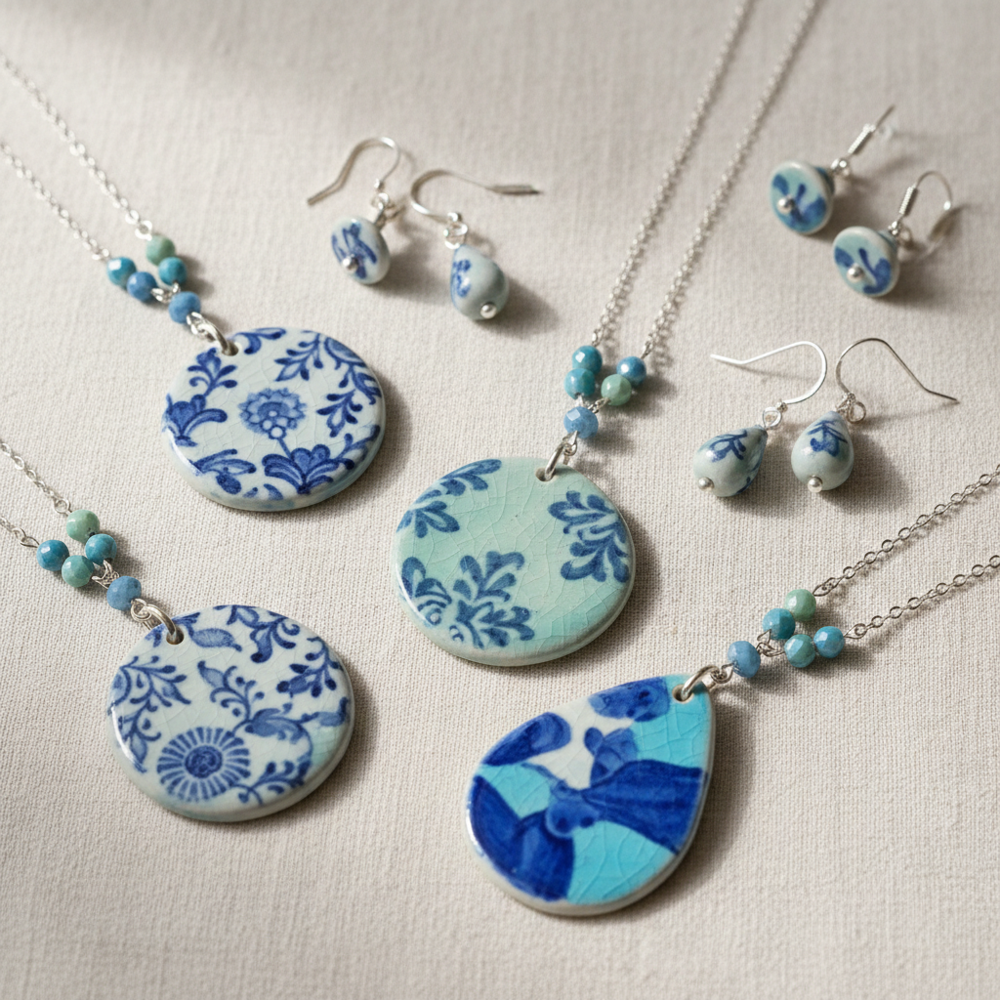

# Ceramic Jewelry Art 陶瓷首饰艺术

> "Ceramic jewelry is fire worn on the body — beads and pendants and brooches shaped from clay and glazed in colors no metal can match, lightweight enough to hang from an earlobe yet hard enough to outlast gold, each piece carrying the warmth of earth and the memory of flame against the skin, adornment that connects the wearer to the oldest human craft through the most intimate of objects." — Unknown

## 概述

陶瓷首饰艺术（Ceramic Jewelry Art）是一种将陶瓷材料应用于人体装饰品——项链、耳环、胸针、手镯、戒指等——的艺术形式。陶瓷首饰将陶瓷的色彩丰富性、质感多样性和造型自由度带入可穿戴的领域。与金属首饰相比，陶瓷首饰更轻盈、色彩更丰富、造型更自由；与塑料首饰相比，陶瓷首饰更有质感、更耐久、更具手工温度。

陶瓷首饰艺术的核心要素包括：1）可穿戴——适合人体佩戴的尺寸和重量；2）轻盈——陶瓷的轻量特性；3）色彩丰富——釉色的无限可能；4）质感独特——陶瓷特有的触感；5）手工温度——手工制作的独特性；6）耐久性——不褪色不变质；7）艺术性——超越装饰的艺术表达。

## 核心特征

| 特征 | 描述 |
|------|------|
| 可穿戴 | 适合人体佩戴 |
| 轻盈 | 比金属首饰更轻 |
| 色彩丰富 | 釉色的无限可能 |
| 质感独特 | 陶瓷特有的触感 |
| 手工独特 | 每件都是唯一的 |
| 艺术表达 | 超越装饰的艺术 |

## 视觉特征

- **丰富色彩**：釉色带来的丰富色彩
- **有机形态**：自由的有机造型
- **质感对比**：光滑与粗糙的对比
- **微型雕塑**：如微型雕塑般的造型
- **珠串组合**：陶瓷珠的串联组合
- **与身体的关系**：与人体的和谐关系

## 代表作品

| 作品 | 艺术家/文化 | 年代 | 意义 |
|------|-------------|------|------|
| *古代陶珠* | 各文明 | 远古 | 最早的陶瓷首饰 |
| *Wedgwood浮雕首饰* | Wedgwood | 18世纪 | 工业陶瓷首饰 |
| *当代陶瓷首饰* | 各地艺术家 | 当代 | 陶瓷首饰的艺术化 |
| *景德镇瓷首饰* | 中国景德镇 | 当代 | 中国陶瓷首饰 |
| *日本陶瓷首饰* | 日本 | 当代 | 日本陶瓷首饰传统 |

## 历史时间线

| 时期 | 事件 |
|------|------|
| 远古 | 最早的陶制珠饰 |
| 古埃及 | 费昂斯珠饰的发展 |
| 18世纪 | Wedgwood等工业陶瓷首饰 |
| 20世纪 | 工作室陶瓷首饰运动 |
| 当代 | 陶瓷首饰作为独立艺术门类 |

## 中国语境

中国的陶瓷首饰传统可以追溯到新石器时代的陶制珠饰。中国当代陶瓷首饰正在经历快速发展——景德镇已经形成了完整的陶瓷首饰产业链，从设计到生产到销售。中国年轻设计师特别喜欢将传统青花、粉彩等装饰元素应用于首饰设计——创造出既有中国文化特色又有当代时尚感的陶瓷首饰。中国的陶瓷首饰市场正在快速增长——消费者越来越欣赏陶瓷首饰的独特质感和文化内涵。景德镇陶瓷大学等机构也开设了陶瓷首饰设计专业，培养专业人才。

## AI生成概念图

## 与其他风格的关系

- **Bead Art** → 珠饰艺术
- **Wearable Art** → 可穿戴艺术
- **Porcelain** → 瓷器
- **Miniature Ceramics** → 微型陶瓷
- **Fashion Design** → 时尚设计
- **Body Adornment** → 人体装饰

---

*浮光艺志 | Chronicle of Artistry*
