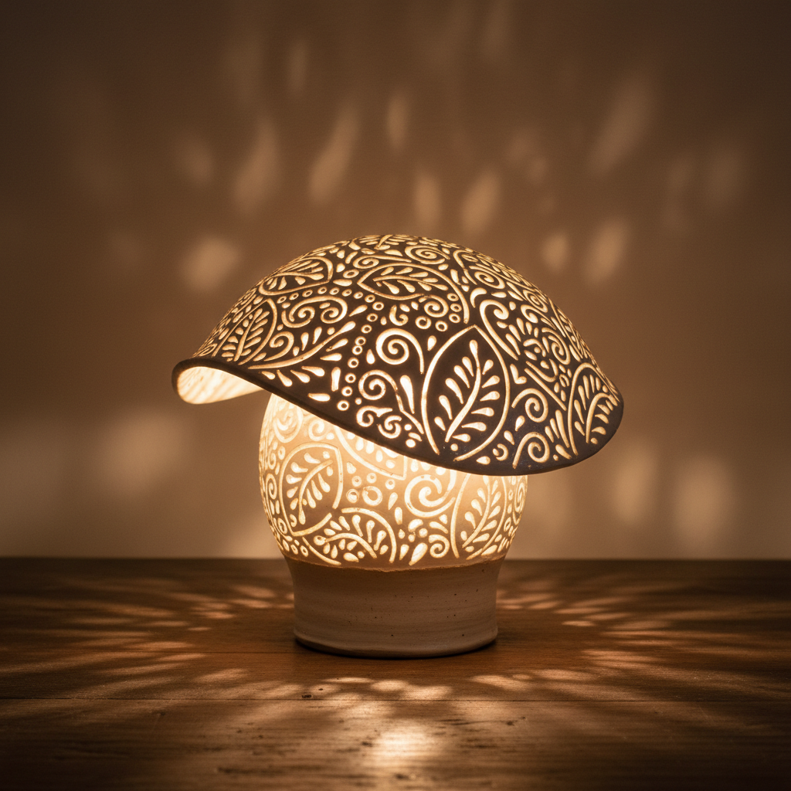

# Ceramic Lamp Art 陶瓷灯具艺术

> "A ceramic lamp is light twice born — first in the kiln's fire that transforms clay into vessel, then in the flame or filament it holds aloft, the translucency of thin porcelain allowing light to pass through like dawn through alabaster, while stoneware and earthenware shape and direct light with their opacity, every lamp a small architecture of illumination built from earth." — Unknown

## 概述

陶瓷灯具艺术（Ceramic Lamp Art）是一种将陶瓷材料用于照明器具设计和制作的艺术形式。陶瓷灯具将陶瓷的材质美感与照明功能结合——从古代的油灯到现代的台灯、吊灯、壁灯，陶瓷一直是灯具制作的重要材料。陶瓷灯具的魅力在于其材质的多样性——薄胎瓷器可以透光，厚实的陶器可以塑造光影，釉色可以为光线增添色彩。

陶瓷灯具艺术的核心要素包括：1）光与材质——陶瓷与光的互动；2）透光性——薄胎瓷的透光效果；3）造型设计——灯具的造型美学；4）釉色光影——釉色对光线的影响；5）功能美学——照明功能与美观的结合；6）空间氛围——营造空间氛围；7）传统与现代——从油灯到现代灯具。

## 核心特征

| 特征 | 描述 |
|------|------|
| 光与材质 | 陶瓷与光的互动 |
| 透光效果 | 薄胎瓷的透光 |
| 造型美学 | 灯具的造型设计 |
| 釉色光影 | 釉色影响光线 |
| 功能美学 | 照明与美观结合 |
| 空间氛围 | 营造空间氛围 |

## 视觉特征

- **透光效果**：薄瓷透出的柔和光线
- **光影投射**：镂空陶瓷的光影图案
- **釉色发光**：釉面在光线下的色彩
- **造型多样**：从传统到现代的造型
- **温暖氛围**：陶瓷灯具的温暖感
- **材质质感**：陶瓷表面的质感美

## 代表作品

| 作品 | 艺术家/文化 | 年代 | 意义 |
|------|-------------|------|------|
| *汉代陶灯* | 中国汉代 | 汉代 | 早期陶瓷灯具 |
| *伊斯兰镂空灯* | 伊斯兰世界 | 各时期 | 镂空灯具传统 |
| *景德镇灯罩* | 中国 | 各时期 | 薄胎透光灯罩 |
| *当代陶瓷灯* | 各地设计师 | 当代 | 当代陶瓷灯具设计 |
| *北欧陶瓷灯* | 北欧 | 当代 | 北欧简约陶瓷灯 |

## 历史时间线

| 时期 | 事件 |
|------|------|
| 远古 | 最早的陶制油灯 |
| 汉代 | 中国精美陶瓷灯具 |
| 中世纪 | 伊斯兰镂空陶灯 |
| 19世纪 | 工业化陶瓷灯具生产 |
| 当代 | 陶瓷灯具的设计复兴 |

## 中国语境

中国有悠久的陶瓷灯具传统。汉代的陶灯已经非常精美——有人形灯、动物形灯、多枝灯等多种造型。唐代的三彩灯具色彩绚丽。景德镇的薄胎瓷灯罩以其透光性著称——光线透过薄如蛋壳的瓷壁，呈现出柔和温暖的光芒。中国传统的宫灯虽然多用纱绢，但也有陶瓷材质的变体。中国当代设计师正在重新发现陶瓷灯具的魅力——将传统陶瓷工艺与现代照明设计结合，创造出既有中国传统韵味又符合当代生活方式的陶瓷灯具。镂空陶瓷灯具在中国当代设计中特别受欢迎——光线透过镂空图案投射出美丽的光影。

## AI生成概念图

## 与其他风格的关系

- **Porcelain** → 瓷器
- **Pierced Decoration** → 镂空装饰
- **Lighting Design** → 照明设计
- **Functional Art** → 功能艺术
- **Interior Design** → 室内设计
- **Translucency** → 透光性

---

*浮光艺志 | Chronicle of Artistry*
