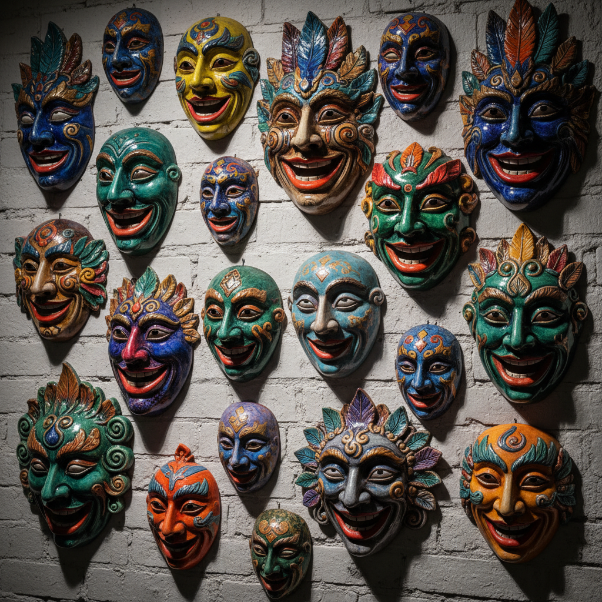

# Ceramic Mask Art 陶瓷面具艺术

> "A ceramic mask is a face without a body — clay pressed into the likeness of human, animal, or spirit, fired into permanence, then hung on a wall or worn in ceremony, each mask a threshold between the visible and invisible worlds, the hollow behind it a space where identity can be shed or assumed, the oldest form of theater frozen in earth." — Unknown

## 概述

陶瓷面具艺术（Ceramic Mask Art）是一种以陶瓷材料制作面具的艺术形式，涵盖仪式面具、装饰面具和艺术面具等多种类型。陶瓷面具将人类最古老的面具传统与陶瓷的永久性结合——从非洲的仪式面具到日本的能面，从墨西哥的亡灵面具到当代的艺术面具，陶瓷面具跨越文化和时代，承载着人类对身份、变形和超越的永恒追求。

陶瓷面具艺术的核心要素包括：1）面部造型——人脸或动物面部的塑造；2）仪式功能——宗教和仪式的使用；3）身份转换——面具的身份转换象征；4）装饰美学——作为墙面装饰的美学；5）文化多样——各文化的面具传统；6）表情凝固——凝固的表情和情感；7）永久性——陶瓷的永久保存。

## 核心特征

| 特征 | 描述 |
|------|------|
| 面部造型 | 人脸或动物面部 |
| 仪式功能 | 宗教仪式使用 |
| 身份转换 | 身份转换象征 |
| 装饰美学 | 墙面装饰美学 |
| 文化多样 | 各文化面具传统 |
| 永久保存 | 陶瓷的永久性 |

## 视觉特征

- **面部特征**：夸张或写实的面部
- **表情凝固**：凝固的表情和情感
- **色彩装饰**：鲜艳的彩绘装饰
- **浮雕质感**：立体的浮雕质感
- **空洞眼睛**：空洞的眼孔设计
- **文化符号**：各文化的特征符号

## 代表作品

| 作品 | 艺术家/文化 | 年代 | 意义 |
|------|-------------|------|------|
| *三星堆面具* | 中国古蜀 | 商代 | 中国古代面具 |
| *日本能面* | 日本 | 各时期 | 日本面具传统 |
| *非洲陶面具* | 非洲各族 | 各时期 | 非洲面具传统 |
| *墨西哥面具* | 墨西哥 | 各时期 | 中美洲面具传统 |
| *当代陶瓷面具* | 各地艺术家 | 当代 | 当代面具艺术 |

## 历史时间线

| 时期 | 事件 |
|------|------|
| 远古 | 最早的陶制面具 |
| 商代 | 三星堆青铜面具（相关传统） |
| 各时期 | 各文化陶瓷面具的发展 |
| 中世纪 | 欧洲陶瓷面具装饰 |
| 当代 | 陶瓷面具的当代艺术实践 |

## 中国语境

中国有丰富的面具文化传统——虽然中国传统面具多用木材和纸浆制作，但陶瓷面具也有重要的地位。三星堆出土的青铜面具虽然不是陶瓷，但其铸造技术与陶瓷有密切关系——陶范铸造法本身就是陶瓷技术的应用。中国傩戏面具是中国面具文化的重要代表——一些地区也有陶瓷傩面的传统。中国当代陶艺家创作了大量陶瓷面具作品——将中国传统面具文化与当代艺术表达结合。陶瓷面具在中国当代艺术中常被用来探讨身份、社会角色和文化认同等主题。中国的面具文化从远古的宗教仪式延续到今天的艺术创作，陶瓷面具是这一传统的重要载体。

## AI生成概念图

## 与其他风格的关系

- **Sculpture** → 雕塑
- **Ritual Art** → 仪式艺术
- **Theater** → 戏剧
- **Folk Art** → 民间艺术
- **Identity Art** → 身份艺术
- **Wall Decoration** → 墙面装饰

---

*浮光艺志 | Chronicle of Artistry*
