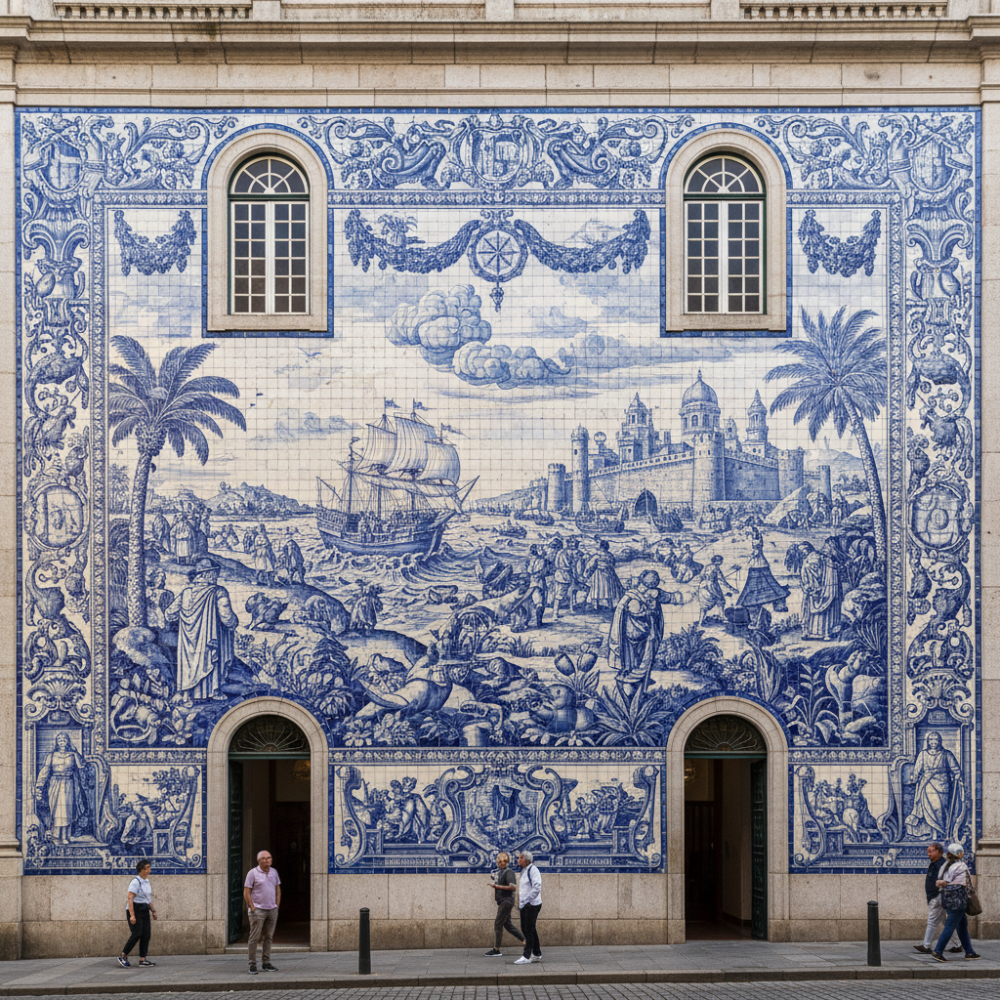

# Ceramic Mural Art 陶瓷壁画艺术

> "The ceramic mural is painting made permanent by fire — pigments fused into glaze on tiles assembled into images that outlast any canvas, color that neither sun nor rain can fade, murals that survive earthquakes and centuries of weather because their medium is stone born from earth, public art at its most durable, stories told on walls in a language that time cannot erase." — Unknown

## 概述

陶瓷壁画艺术（Ceramic Mural Art）是一种将陶瓷材料用于大型墙面装饰画的艺术形式。陶瓷壁画通过在瓷砖或陶板上绑制图案，再经高温烧制固定，创造出永久性的墙面艺术作品。陶瓷壁画的最大优势是其极高的耐久性——釉下彩或釉中彩的色彩不会褪色，陶瓷材料不怕风雨侵蚀，使壁画可以在户外环境中保存数百年。

陶瓷壁画艺术的核心要素包括：1）大尺度——覆盖整面墙壁的规模；2）模块拼接——由多块瓷砖或陶板拼接；3）永久色彩——烧制固定的不褪色颜料；4）耐候性——抵御户外环境的侵蚀；5）公共性——面向公众的艺术表达；6）叙事性——讲述故事或表达主题；7）建筑整合——与建筑空间的融合。

## 核心特征

| 特征 | 描述 |
|------|------|
| 大尺度 | 覆盖整面墙壁 |
| 永久色彩 | 不褪色的烧制颜料 |
| 极耐候 | 抵御风雨侵蚀 |
| 公共艺术 | 面向公众的表达 |
| 模块拼接 | 多块瓷砖拼接成画 |
| 叙事表达 | 讲述故事或主题 |

## 视觉特征

- **大画面**：建筑尺度的画面
- **色彩鲜艳**：永不褪色的鲜艳色彩
- **拼接线条**：瓷砖拼接的网格线
- **浮雕效果**：立体的浮雕壁画
- **叙事场景**：故事性的画面内容
- **与建筑融合**：与建筑空间的和谐

## 代表作品

| 作品 | 艺术家/文化 | 年代 | 意义 |
|------|-------------|------|------|
| *葡萄牙瓷砖壁画* | 葡萄牙 | 16世纪起 | 欧洲陶瓷壁画传统 |
| *墨西哥壁画陶瓷* | 墨西哥 | 20世纪 | 拉美陶瓷壁画 |
| *中国陶瓷壁画* | 中国 | 各时期 | 中国陶瓷壁画传统 |
| *地铁站陶瓷壁画* | 各城市 | 当代 | 公共交通中的陶瓷艺术 |
| *当代陶瓷壁画* | 各地艺术家 | 当代 | 陶瓷壁画的当代实践 |

## 历史时间线

| 时期 | 事件 |
|------|------|
| 古代 | 美索不达米亚的釉面砖壁画 |
| 15世纪 | 葡萄牙瓷砖壁画传统的形成 |
| 20世纪 | 现代公共陶瓷壁画的发展 |
| 当代 | 地铁站等公共空间的陶瓷壁画 |
| 当代 | 数字技术辅助的陶瓷壁画 |

## 中国语境

中国的陶瓷壁画传统可以追溯到唐代的琉璃壁画和宋代的磁州窑壁画砖。中国当代陶瓷壁画在公共艺术领域有广泛应用——从地铁站到机场，从酒店大堂到城市广场，陶瓷壁画以其耐久性和色彩丰富性成为公共空间装饰的重要选择。景德镇的陶瓷壁画制作技术在全国领先——可以将任何图像精确转化为大型陶瓷壁画。中国当代艺术家也在探索陶瓷壁画的艺术可能——将传统壁画的叙事性与当代艺术的观念性结合。

## AI生成概念图

## 与其他风格的关系

- **Tile Art** → 瓷砖艺术
- **Architectural Ceramics** → 建筑陶瓷
- **Public Art** → 公共艺术
- **Mosaic** → 马赛克
- **Fresco** → 湿壁画
- **Azulejo** → 葡萄牙瓷砖

---

*浮光艺志 | Chronicle of Artistry*
