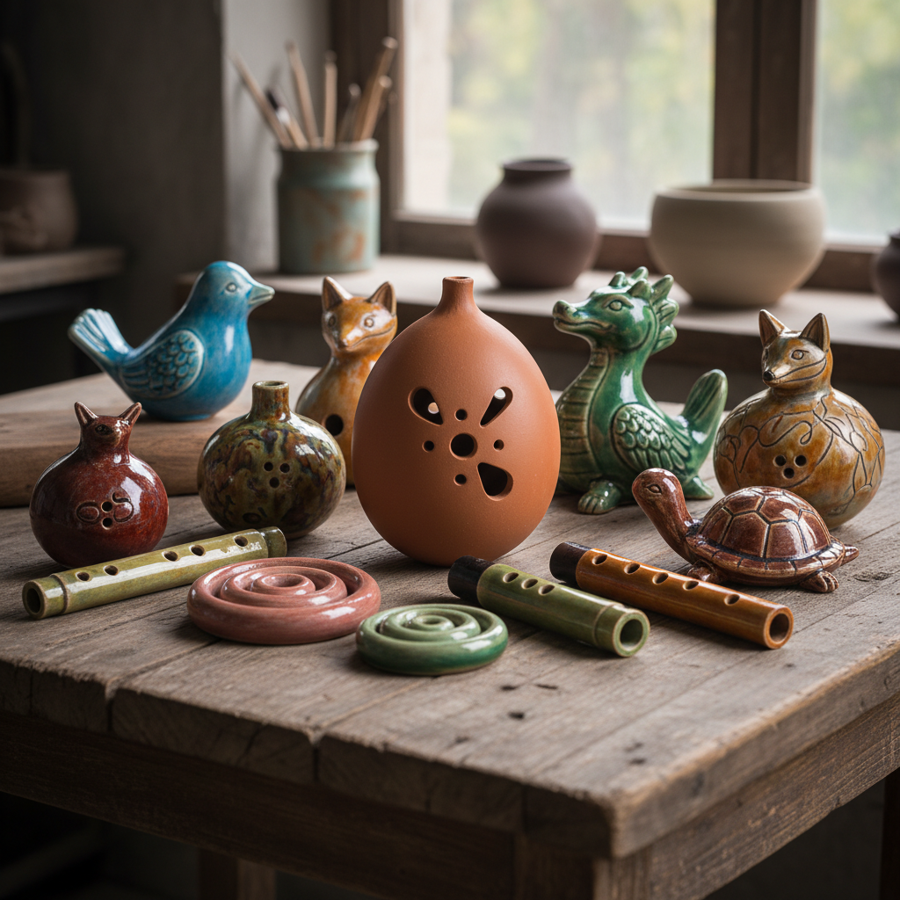

# Ceramic Musical Instrument Art 陶瓷乐器艺术

> "Ceramic musical instruments are earth singing — clay shaped into ocarinas, drums, bells, and flutes that give voice to the material itself, the resonance of fired clay producing tones that no wood or metal can replicate, ancient instruments that prove music was born not from strings but from the breath of humans passing through holes in shaped earth, the oldest melody makers after the human voice itself." — Unknown

## 概述

陶瓷乐器艺术（Ceramic Musical Instrument Art）是一种以陶瓷材料制作乐器的艺术形式。陶瓷乐器将音乐功能与陶瓷工艺结合——从远古的陶埙到当代的陶瓷鼓，陶瓷一直是人类制作乐器的重要材料。陶瓷乐器的独特之处在于其音色——陶瓷的共鸣特性产生温暖、圆润、带有泥土气息的独特音色，这是其他材料无法复制的。

陶瓷乐器艺术的核心要素包括：1）音乐功能——能够发出乐音；2）陶瓷共鸣——陶瓷材质的独特共鸣；3）造型美学——乐器的造型设计；4）古老传统——最古老的乐器之一；5）文化多样——各文化的陶瓷乐器；6）手工制作——手工塑造的独特性；7）艺术与音乐——视觉与听觉的结合。

## 核心特征

| 特征 | 描述 |
|------|------|
| 音乐功能 | 能够发出乐音 |
| 陶瓷共鸣 | 独特的共鸣特性 |
| 造型美学 | 乐器的造型设计 |
| 古老传统 | 最古老的乐器之一 |
| 文化多样 | 各文化的传统 |
| 艺术音乐 | 视觉与听觉结合 |

## 视觉特征

- **有机造型**：圆润的有机形态
- **音孔设计**：精心设计的音孔
- **装饰图案**：乐器表面的装饰
- **小巧精致**：多为小型手持乐器
- **动物造型**：常见动物形态设计
- **质朴材质**：陶瓷的质朴质感

## 代表作品

| 作品 | 艺术家/文化 | 年代 | 意义 |
|------|-------------|------|------|
| *中国陶埙* | 中国 | 远古至今 | 中国最古老的乐器之一 |
| *秘鲁陶笛* | 安第斯 | 各时期 | 南美陶瓷乐器传统 |
| *非洲陶鼓* | 非洲 | 各时期 | 非洲陶鼓传统 |
| *意大利陶笛* | 意大利 | 19世纪 | 现代陶笛的发明 |
| *当代陶瓷乐器* | 各地艺术家 | 当代 | 当代陶瓷乐器创新 |

## 历史时间线

| 时期 | 事件 |
|------|------|
| 远古 | 最早的陶制乐器（陶埙） |
| 各时期 | 各文化陶瓷乐器的发展 |
| 19世纪 | 意大利现代陶笛的发明 |
| 20世纪 | 陶瓷乐器的学术研究 |
| 当代 | 陶瓷乐器的当代创新 |

## 中国语境

中国的陶埙是世界上最古老的乐器之一——距今已有七千多年的历史。陶埙最早出土于河姆渡文化遗址，最初只有一个吹孔，后来逐渐发展为多孔乐器。中国古代将埙列为"八音"之一（土类乐器），在宫廷雅乐中有重要地位。埙的音色低沉、悲凉、苍古——被形容为"如怨如慕，如泣如诉"，在中国音乐美学中代表了一种独特的情感表达。中国当代音乐家重新发现了陶埙的魅力——改良的多孔陶埙能够演奏复杂的旋律。中国当代陶艺家也在探索新型陶瓷乐器——将传统陶埙的制作工艺与当代音乐需求结合，创造出新的陶瓷乐器形式。

## AI生成概念图

## 与其他风格的关系

- **Ocarina** → 陶笛
- **Xun** → 埙
- **Sound Art** → 声音艺术
- **Folk Music** → 民间音乐
- **Functional Ceramics** → 功能陶瓷
- **Ancient Instruments** → 古代乐器

---

*浮光艺志 | Chronicle of Artistry*
