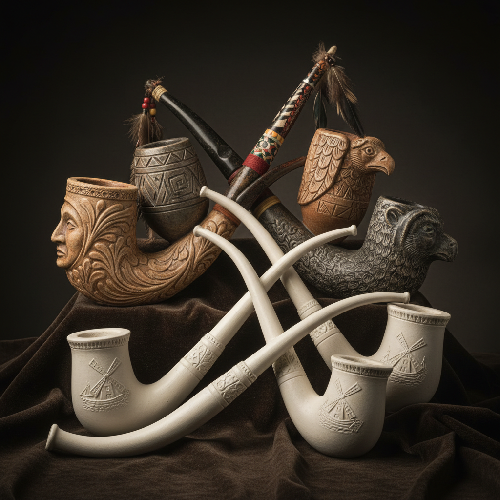

# Ceramic Pipe Art 陶瓷管道艺术

> "The ceramic pipe is infrastructure made eternal — clay shaped into conduits that carry water beneath cities, smoke through walls, and sound through instruments, a form so ancient that Roman aqueducts still hold their terracotta channels intact after two millennia, proving that fired earth outlasts the civilizations it serves." — Unknown

## 概述

陶瓷管道艺术（Ceramic Pipe Art）是一种以陶瓷材料制作管状器物的艺术形式，涵盖从古代的排水管道到烟斗、乐器管件等多种功能性管状陶瓷制品。陶瓷管道是人类最早的工程材料之一——古代城市的供水和排水系统大量使用陶瓷管道。除了基础设施用途，陶瓷管道还包括精美的烟斗、乐器部件和装饰性管状器物。

陶瓷管道艺术的核心要素包括：1）管状形态——中空的管状结构；2）功能多样——排水、输送、吸烟、音乐等；3）工程精度——需要精确的尺寸控制；4）连接设计——管道之间的连接方式；5）耐久性——陶瓷的耐腐蚀特性；6）装饰传统——烟斗等的精美装饰；7）文化载体——承载文化信息的管状器物。

## 核心特征

| 特征 | 描述 |
|------|------|
| 管状形态 | 中空管状结构 |
| 功能多样 | 排水输送吸烟音乐 |
| 工程精度 | 精确尺寸控制 |
| 连接设计 | 管道连接方式 |
| 耐久性 | 陶瓷耐腐蚀性 |
| 装饰传统 | 精美装饰传统 |

## 视觉特征

- **中空管状**：中空的管状结构
- **圆形截面**：通常为圆形截面
- **连接口**：管道连接的接口设计
- **装饰雕刻**：烟斗等的精美雕刻
- **釉面保护**：内外釉面的保护层
- **尺度多样**：从微小到巨大

## 代表作品

| 作品 | 艺术家/文化 | 年代 | 意义 |
|------|-------------|------|------|
| *罗马陶管* | 古罗马 | 各时期 | 罗马供水系统 |
| *荷兰白陶烟斗* | 荷兰 | 17世纪 | 经典白陶烟斗 |
| *美洲原住民烟斗* | 北美原住民 | 各时期 | 仪式用烟斗 |
| *中国排水管* | 中国古代 | 各时期 | 中国排水工程 |
| *当代陶瓷管* | 各地陶艺家 | 当代 | 当代的艺术诠释 |

## 历史时间线

| 时期 | 事件 |
|------|------|
| 前3000年 | 最早的陶瓷排水管 |
| 古罗马 | 大规模陶瓷管道系统 |
| 17世纪 | 荷兰白陶烟斗的流行 |
| 工业化 | 标准化陶瓷管道生产 |
| 当代 | 陶瓷管道的艺术化探索 |

## 中国语境

中国有悠久的陶瓷管道传统。考古发现表明，中国在商周时期就已使用陶瓷排水管——殷墟出土的陶制排水管是中国最早的城市排水设施之一。秦汉时期的宫殿和城市大量使用陶瓷管道进行排水——秦始皇陵的排水系统就使用了精密的陶瓷管道。中国传统建筑中的"瓦当"虽然不是管道，但其半圆形的设计与管道有密切关系。中国的陶瓷烟斗（旱烟袋）也是陶瓷管道艺术的一种——民间的陶制烟锅造型质朴，有些还带有精美的装饰。中国当代陶艺家也在探索管状陶瓷的艺术可能性——将工业管道的形态转化为雕塑和装置艺术。

## AI生成概念图

## 与其他风格的关系

- **Infrastructure Ceramics** → 基础设施陶瓷
- **Tobacco Pipe** → 烟斗
- **Roman Engineering** → 罗马工程
- **Drainage Systems** → 排水系统
- **Musical Instruments** → 乐器
- **Industrial Ceramics** → 工业陶瓷

---

*浮光艺志 | Chronicle of Artistry*
