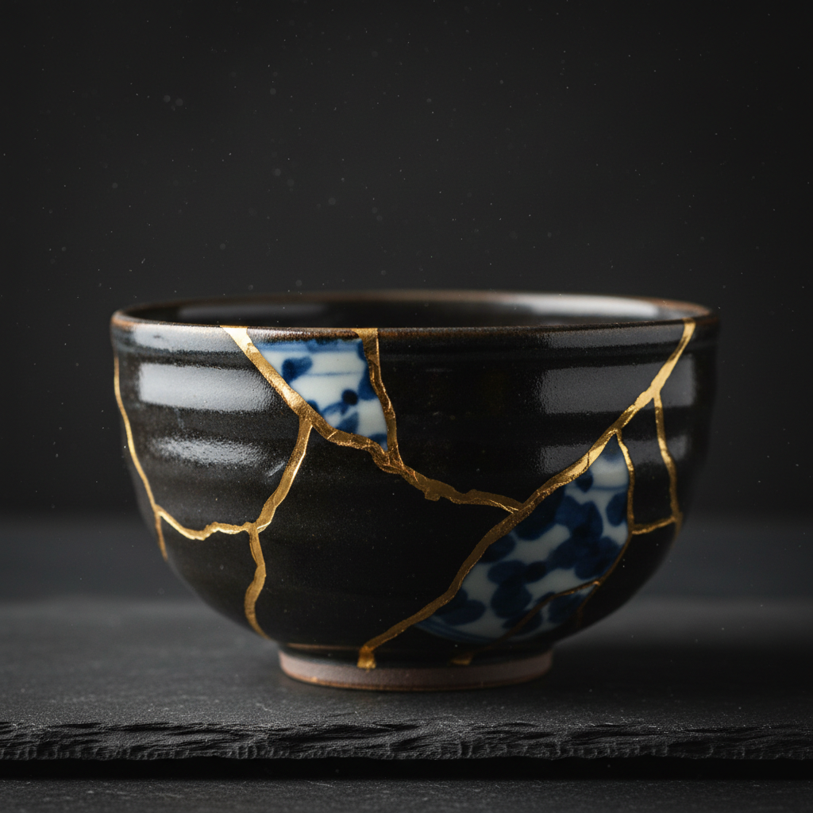

# Ceramic Restoration Art 陶瓷修复艺术

> "Ceramic restoration is time reversed by hand — a shattered bowl reassembled shard by shard, missing fragments sculpted from matching clay, lost glazes replicated through patient chemistry, cracks filled and retouched until the break becomes invisible or, in the Japanese way, celebrated with gold, each restoration a negotiation between the object's original intention and its history of survival, preservation as a creative act." — Unknown

## 概述

陶瓷修复艺术（Ceramic Restoration Art）是一种对破损、残缺或老化的陶瓷器物进行修复、保护和再生的专业艺术。陶瓷修复不仅是技术工作，更是一种艺术判断——修复师需要决定修复到什么程度、是否显示修复痕迹、如何平衡历史真实性与视觉完整性。从博物馆的科学修复到日本金缮的美学修复，陶瓷修复展现了人类对物质文化遗产的珍视和对"破碎之美"的不同理解。

陶瓷修复艺术的核心要素包括：1）碎片拼接——将破碎的碎片重新组合；2）缺失补全——补全缺失的部分；3）釉面修复——修复或模拟原有釉面；4）历史尊重——尊重器物的历史信息；5）可逆性——修复应尽可能可逆；6）美学判断——修复程度的美学决策；7）材料科学——修复材料的选择和应用。

## 核心特征

| 特征 | 描述 |
|------|------|
| 碎片重组 | 将破碎碎片重新组合 |
| 缺失补全 | 补全缺失的部分 |
| 历史尊重 | 尊重器物历史信息 |
| 可逆原则 | 修复应可逆 |
| 美学判断 | 修复程度的决策 |
| 材料科学 | 修复材料的选择 |

## 视觉特征

- **金缮之美**：金色漆线的修复痕迹
- **无痕修复**：看不出修复痕迹的完美修复
- **碎片拼图**：碎片重新拼合的纹路
- **补全部分**：新补全部分的微妙差异
- **时间痕迹**：保留的历史使用痕迹
- **修复记录**：修复过程的文档记录

## 代表作品

| 作品 | 艺术家/文化 | 年代 | 意义 |
|------|-------------|------|------|
| *金缮修复* | 日本 | 15世纪起 | 以金修复的美学 |
| *博物馆科学修复* | 各博物馆 | 当代 | 科学修复标准 |
| *锔瓷* | 中国 | 宋代起 | 中国传统修复技艺 |
| *当代修复艺术* | 各地修复师 | 当代 | 修复作为艺术表达 |
| *考古修复* | 考古机构 | 当代 | 考古出土物修复 |

## 历史时间线

| 时期 | 事件 |
|------|------|
| 古代 | 最早的陶瓷修复尝试 |
| 宋代 | 中国锔瓷技艺的发展 |
| 15世纪 | 日本金缮修复的诞生 |
| 19世纪 | 科学修复方法的建立 |
| 当代 | 修复伦理和标准的完善 |

## 中国语境

中国有独特的陶瓷修复传统——"锔瓷"是中国特有的修复技艺，通过在破碎的瓷器上钻孔、用金属锔钉将碎片固定在一起。锔瓷不仅是修复，更是一种装饰——精美的锔钉排列本身就是一种美学表达。中国当代正在经历陶瓷修复的复兴——金缮（源自日本但在中国广泛流行）和锔瓷都成为热门的手工艺课程。中国的博物馆修复也在不断进步——故宫博物院等机构拥有世界一流的陶瓷修复团队。中国文化中"惜物"的传统——珍惜物品、修复而非丢弃——与陶瓷修复的精神高度契合。

## AI生成概念图

## 与其他风格的关系

- **Kintsugi** → 金缮
- **Conservation** → 文物保护
- **Archaeology** → 考古学
- **Material Science** → 材料科学
- **Wabi-Sabi** → 侘寂美学
- **Cultural Heritage** → 文化遗产

---

*浮光艺志 | Chronicle of Artistry*
