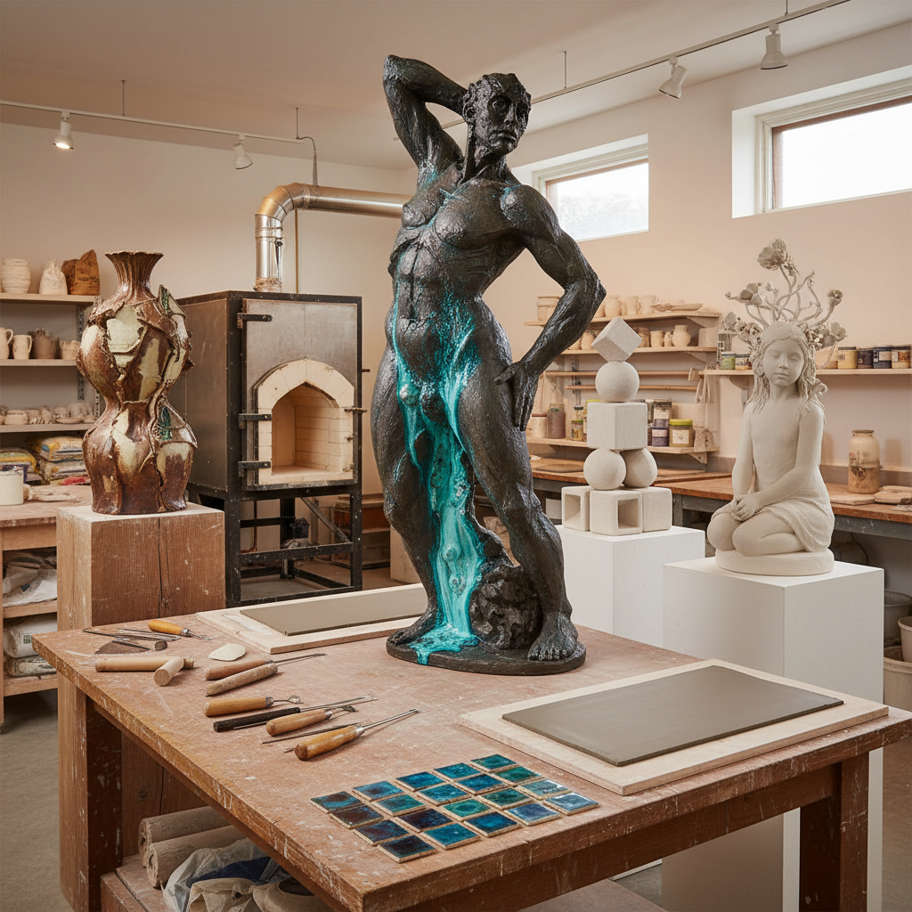

# Ceramic Sculpture Art 陶瓷雕塑艺术

> "Ceramic sculpture frees clay from the tyranny of the vessel — no longer must it hold water or food, no longer must it be round or symmetrical or functional. Instead, clay becomes a medium for pure expression: figures that twist and reach, abstractions that defy gravity, installations that fill rooms with fired earth. The kiln remains the final collaborator, adding its own transformations of color and surface that no other sculptural medium can match." — Unknown

## 概述

陶瓷雕塑艺术（Ceramic Sculpture Art）是以陶瓷为媒介进行非功能性雕塑创作的艺术形式——突破传统陶瓷器皿的功能限制，将黏土作为纯粹的雕塑材料，创造人物、动物、抽象造型和大型装置。陶瓷雕塑结合了陶瓷工艺的独特质感与雕塑艺术的表现力。

陶瓷雕塑的实践包括：1）人物陶塑——陶瓷人物雕塑；2）动物陶塑——陶瓷动物雕塑；3）抽象陶塑——抽象造型的陶瓷雕塑；4）大型陶瓷装置——大尺度的陶瓷装置艺术；5）陶瓷浮雕——墙面陶瓷浮雕；6）釉彩雕塑——强调釉色效果的雕塑；7）混合媒介陶塑——陶瓷与其他材料结合的雕塑。

## 核心特征

| 特征 | 描述 |
|------|------|
| 泥塑 | 黏土的可塑性 |
| 烧制 | 高温烧制的永久性 |
| 釉色 | 独特的釉色表面 |
| 质感 | 陶瓷特有的质感 |
| 脆性 | 烧制后的脆性 |
| 表现 | 强烈的艺术表现力 |

## 视觉特征

- **质感**：陶土或瓷土的质感
- **釉色**：丰富的釉色变化
- **肌理**：手工塑造的肌理
- **色彩**：釉料和泥料的色彩
- **体量**：从微型到大型的体量
- **细节**：精细的雕塑细节

## 代表作品

| 作品 | 艺术家 | 年代 | 意义 |
|------|--------|------|------|
| *Terracotta Army* | 秦代工匠 | 公元前210年 | 兵马俑 |
| *Ceramic sculptures* | Peter Voulkos | 1950s-60s | 抽象表现主义陶塑 |
| *Figurative ceramics* | Grayson Perry | 当代 | 叙事性陶瓷 |
| *Porcelain installations* | Ai Weiwei | 当代 | 当代陶瓷装置 |
| *Ceramic figures* | Klara Kristalova | 当代 | 当代陶瓷人物 |

## 历史时间线

| 时期 | 事件 |
|------|------|
| 古代 | 各文明的陶塑传统 |
| 公元前210年 | 秦始皇兵马俑 |
| 文艺复兴 | 意大利陶瓷雕塑（della Robbia） |
| 1950年代 | Peter Voulkos的陶瓷革命 |
| 当代 | 陶瓷雕塑的当代艺术化 |

## 中国语境

陶瓷雕塑在中国有极其辉煌的传统——秦始皇兵马俑是世界上最伟大的陶瓷雕塑群之一。中国历代都有精美的陶瓷雕塑——从汉代的陶俑到唐三彩、从宋代的瓷塑到明清的德化白瓷人物。中国的石湾陶塑是中国民间陶瓷雕塑的代表——以其生动的人物造型和丰富的釉色著称。中国当代的陶瓷雕塑艺术非常活跃——许多艺术家将传统陶瓷技艺与当代艺术理念相结合。景德镇不仅是瓷器之都，也是当代陶瓷雕塑的重要创作基地——吸引了国内外众多陶艺家。中国的美术院校普遍设有陶瓷专业——培养了大量陶瓷雕塑人才。艾未未等中国当代艺术家也将陶瓷作为重要的创作媒介。

## AI生成概念图

## 与其他风格的关系

- **Pottery** → 陶艺
- **Sculpture** → 雕塑
- **Porcelain Art** → 瓷器艺术
- **Installation Art** → 装置艺术
- **Figurative Art** → 具象艺术
- **Craft Art** → 工艺美术

---

*浮光艺志 | Chronicle of Artistry*
