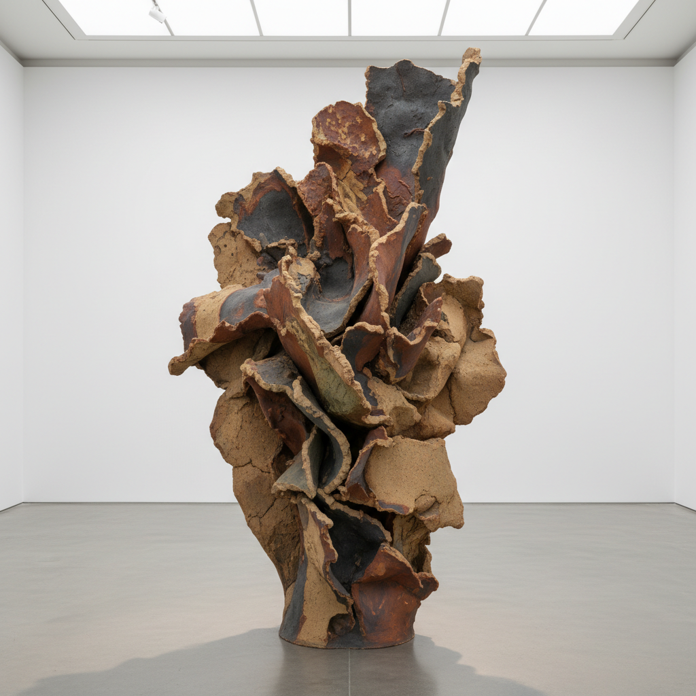

# Ceramic Sculpture 陶瓷雕塑

> **时期：** 1950年代–至今  
> **关键词：** 泥土表现力、釉色实验、大型陶塑、功能性解放、火的艺术

## 概述

陶瓷雕塑运动将陶瓷从功能性器物中解放出来，使其成为纯粹的雕塑媒介。从Peter Voulkos在1950年代对抽象表现主义的陶瓷回应，到当代艺术家用陶瓷探索身份、政治和环境议题——泥土的可塑性、釉色的不可预测性和窑火的转化力量，赋予了这种古老材料全新的当代语言。

## 风格特征

- **表现性**：粗犷的手工痕迹和即兴造型
- **釉色实验**：意外效果和化学反应的美
- **大尺度**：突破传统陶瓷的尺寸限制
- **混合技法**：手捏、拉坯、泥板、注浆的自由组合
- **火的痕迹**：窑变、落灰、烟熏等火的印记

## 代表人物与作品

- Peter Voulkos 抽象表现主义陶瓷
- Ken Price 彩色有机形态
- Betty Woodman 建筑性陶瓷
- Grayson Perry 叙事性陶罐

## 概念图

