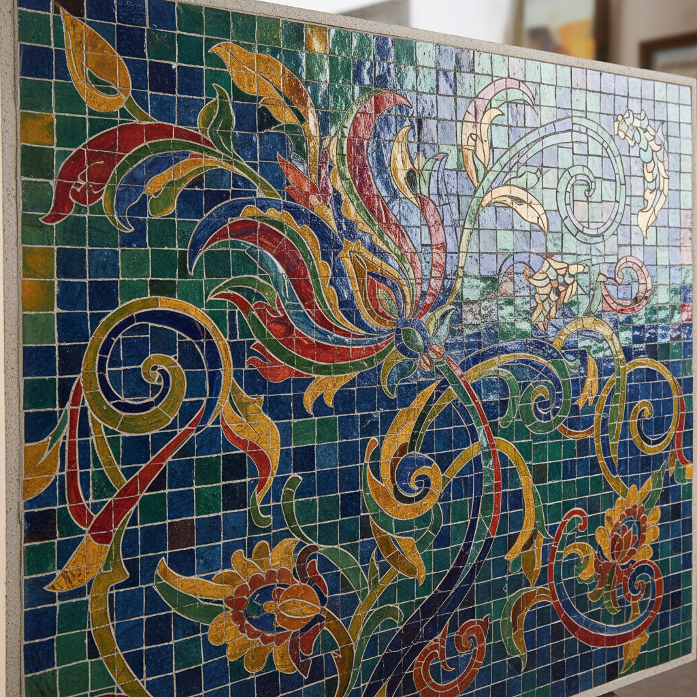

# Ceramic Tile Mosaic Art 陶瓷马赛克艺术

> "Ceramic tile mosaic is painting with fragments — small pieces of fired clay in every color arranged like pixels into images that shimmer with the light caught between their edges, each tessera a solid note in a visual chord, the grout lines creating a vibration that no flat surface can achieve, an art form that turns breakage into beauty and patience into permanence, one tile at a time building worlds from shards." — Unknown

## 概述

陶瓷马赛克艺术（Ceramic Tile Mosaic Art）是一种将小块陶瓷片（马赛克/tessera）按照设计图案拼贴组合成大型装饰画面的艺术形式。陶瓷马赛克将陶瓷的色彩稳定性和耐久性与马赛克艺术的表现力结合——通过成千上万块小瓷片的精心排列，创造出从远处看如同绘画、近看则充满材质肌理的独特视觉效果。

陶瓷马赛克艺术的核心要素包括：1）小块拼贴——将小瓷片按图案排列；2）色彩丰富——利用釉色的丰富变化；3）耐久性——极高的耐候和耐久性；4）光影效果——瓷片角度差异产生的光影；5）大尺度——可覆盖大面积墙面或地面；6）精细工艺——需要极大的耐心和精确；7）公共艺术——适合公共空间的装饰。

## 核心特征

| 特征 | 描述 |
|------|------|
| 小块拼贴 | 小瓷片按图案排列 |
| 色彩丰富 | 釉色的丰富变化 |
| 极耐久 | 不褪色不变质 |
| 光影效果 | 瓷片角度的光影 |
| 大尺度 | 可覆盖大面积 |
| 精细工艺 | 需要极大耐心 |

## 视觉特征

- **像素感**：小块瓷片如像素般排列
- **色彩渐变**：通过不同色块实现渐变
- **光影闪烁**：瓷片角度差异的闪烁
- **缝隙纹理**：勾缝线条的网格纹理
- **远近效果**：远看成画近看成块
- **材质丰富**：不同釉面质感的组合

## 代表作品

| 作品 | 艺术家/文化 | 年代 | 意义 |
|------|-------------|------|------|
| *拜占庭马赛克* | 拜占庭 | 6-15世纪 | 马赛克艺术的巅峰 |
| *伊斯兰几何马赛克* | 伊斯兰世界 | 各时期 | 几何马赛克传统 |
| *高迪马赛克* | Antoni Gaudi | 20世纪初 | 现代马赛克创新 |
| *地铁站马赛克* | 各城市 | 当代 | 公共空间马赛克 |
| *当代陶瓷马赛克* | 各地艺术家 | 当代 | 马赛克的当代实践 |

## 历史时间线

| 时期 | 事件 |
|------|------|
| 前3000年 | 美索不达米亚的早期马赛克 |
| 罗马时期 | 罗马马赛克的繁荣 |
| 拜占庭 | 金色马赛克的辉煌 |
| 伊斯兰 | 几何马赛克的发展 |
| 当代 | 陶瓷马赛克在公共艺术中的广泛应用 |

## 中国语境

马赛克艺术在中国有独特的发展轨迹。中国传统建筑中虽然没有西方意义上的马赛克，但琉璃拼花和瓷片镶嵌有类似的美学效果。中国当代公共艺术中，陶瓷马赛克被广泛应用于地铁站、广场、公园等公共空间——许多中国城市的地铁站都有大型陶瓷马赛克壁画。中国的佛山是世界上最大的陶瓷马赛克生产基地之一，其产品覆盖全球市场。中国当代艺术家也在探索陶瓷马赛克的艺术可能——将传统图案与当代设计结合，创造出具有中国特色的马赛克艺术。

## AI生成概念图

## 与其他风格的关系

- **Mosaic** → 马赛克
- **Tile Art** → 瓷砖艺术
- **Architectural Ceramics** → 建筑陶瓷
- **Public Art** → 公共艺术
- **Pixel Art** → 像素艺术
- **Islamic Geometry** → 伊斯兰几何

---

*浮光艺志 | Chronicle of Artistry*
