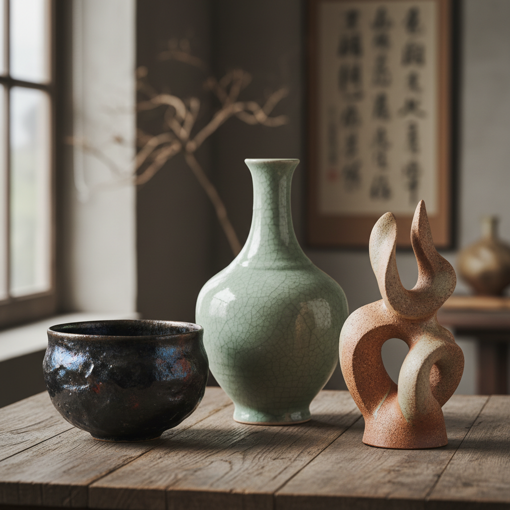

# Ceramics 陶瓷艺术

> "The potter's wheel is the oldest machine — and clay is the oldest conversation between hand and earth." — Edmund de Waal

## 概述

陶瓷艺术（Ceramics）是人类最古老的创造性活动之一——将泥土通过火的转化变成永恒的器物和艺术品。从新石器时代的陶罐到宋代的天青釉，从日本的侘寂茶碗到当代的陶瓷雕塑，陶瓷跨越了实用与艺术、传统与创新的所有边界。它是唯一一种同时涉及地（泥土）、水（塑形）、火（烧制）、气（窑内气氛）四种元素的艺术形式。

陶瓷的哲学在于：转化——泥土经过火的洗礼，从脆弱变为坚硬，从暂时变为永恒，这是物质最深刻的蜕变。

## 核心特征

| 特征 | 描述 |
|------|------|
| 泥土 | 以泥土为基本材料 |
| 火 | 通过烧制完成转化 |
| 釉 | 釉料的色彩与质感 |
| 器形 | 三维的器物形态 |
| 触感 | 丰富的表面触感 |
| 永恒 | 烧制后极其持久 |

## 视觉特征

- **釉色**：丰富多变的釉色
- **质感**：从光滑到粗糙的表面
- **器形**：优美的三维形态
- **裂纹**：开片等装饰性裂纹
- **手感**：手工痕迹的温度
- **窑变**：不可预测的窑变效果

## 代表作品

| 作品 | 艺术家 | 年代 | 意义 |
|------|--------|------|------|
| *仰韶彩陶* | 匿名 | 公元前5000年 | 中国最早的彩陶 |
| *汝窑天青釉* | 匿名 | 北宋 | 中国陶瓷的巅峰 |
| *千利休茶碗* | 长次郎 | 16世纪 | 日本乐烧的侘寂美学 |
| *Ceramic sculptures* | Peter Voulkos | 1950s-60s | 打破陶瓷的功能边界 |
| *The Hare with Amber Eyes* | Edmund de Waal | 2010s | 当代陶瓷装置 |

## 历史时间线

| 时期 | 事件 |
|------|------|
| 公元前20000年 | 最早的陶器（中国） |
| 新石器时代 | 各文明的陶器传统 |
| 中国宋代 | 五大名窑的巅峰 |
| 15-18世纪 | 欧洲对中国瓷器的追求 |
| 1709 | 欧洲发明硬质瓷器 |
| 1950s | 陶瓷作为当代艺术媒介 |
| 当代 | 陶瓷艺术的多元发展 |

## 中国语境

中国是陶瓷的故乡——"China"一词本身就意味着瓷器。从仰韶彩陶到宋代五大名窑（汝、官、哥、钧、定），从元青花到明清彩瓷，中国陶瓷代表了人类在这一领域的最高成就。景德镇作为"瓷都"延续了千年的制瓷传统。当代中国陶瓷艺术在传统与创新之间寻找新的表达，既有对传统技艺的传承，也有前卫的实验性创作。

## AI生成概念图

## 与其他风格的关系

- **Raku** → 乐烧是陶瓷的特殊技法
- **Kintsugi** → 金缮修复陶瓷
- **Porcelain** → 瓷器是陶瓷的高级形式
- **Majolica** → 锡釉陶器传统
- **Studio Craft** → 工作室陶艺运动
- **Wabi-sabi** → 侘寂美学与陶瓷

---

*浮光艺志 | Chronicle of Artistry*
