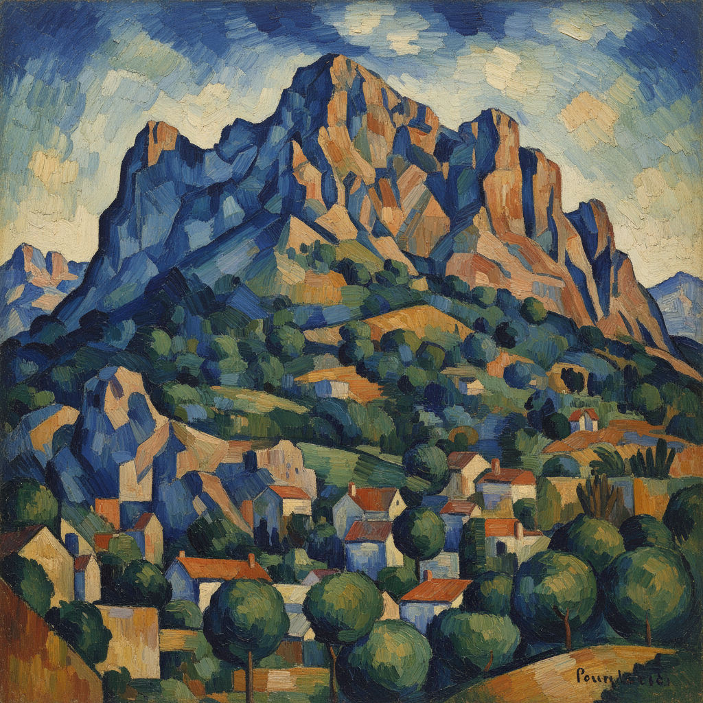

# Paul Cézanne 塞尚

> "Treat nature by the cylinder, the sphere, the cone." — Paul Cézanne

## 概述

保罗·塞尚（Paul Cézanne，1839–1906）是法国后印象派画家，被誉为"现代艺术之父"。他在印象派的色彩革命基础上，重新引入了结构和体积感，为立体主义和整个20世纪抽象艺术铺平了道路。

塞尚追求的不是瞬间印象，而是自然的永恒结构——他要把印象派"变成像博物馆里的艺术一样坚实持久的东西"。

## 核心特征

| 特征 | 描述 |
|------|------|
| 几何化自然 | 将自然简化为圆柱、球体、圆锥 |
| 建构性笔触 | 平行的、砖块般的色块堆砌 |
| 多视点 | 同一画面中融合多个观察角度 |
| 色彩造型 | 用冷暖色彩关系而非明暗来塑造体积 |
| 未完成感 | 刻意保留画布空白和未完成区域 |
| 反复观察 | 同一主题反复描绘（圣维克多山、苹果） |

## 视觉特征

- **笔触**：平行的、方向一致的色块——"建构性笔触"
- **色彩**：蓝绿色调为主，暖色点缀
- **轮廓**：深蓝色轮廓线勾勒物体边缘
- **空间**：扁平化的空间，前景与背景压缩
- **质感**：厚重的颜料层，可见笔触肌理
- **构图**：稳定的三角形和金字塔结构

## 代表作品

| 作品 | 年代 | 意义 |
|------|------|------|
| *Mont Sainte-Victoire* 系列 | 1882–1906 | 同一主题的无尽探索 |
| *The Large Bathers* | 1900–1906 | 现代艺术的里程碑 |
| *Still Life with Apples* | 1890s | 静物画的革命 |
| *The Card Players* | 1890–95 | 人物画的几何化 |
| *Basket of Apples* | 1893 | 多视点的经典示范 |

## 真实作品（公共领域）

| 作品 | 来源 |
|------|------|
| *Mont Sainte-Victoire* | [Courtauld Gallery](https://courtauld.ac.uk/gallery/collection/impressionism-post-impressionism/paul-cezanne-montagne-sainte-victoire/) |
| *The Large Bathers* | [Philadelphia Museum](https://philamuseum.org/collection/object/59981) |
| *The Card Players* | [Musée d'Orsay](https://www.musee-orsay.fr/en/artworks/les-joueurs-de-cartes-702) |

> ⚠️ 本条目优先使用真实作品。

## AI生成概念图

## 与其他风格的关系

- **Impressionism** → 从印象派出发但超越了它
- **Cubism** → 毕加索和布拉克直接受塞尚启发
- **Post-Impressionism** → 后印象派核心人物
- **Abstract Art** → 几何化自然为抽象铺路
