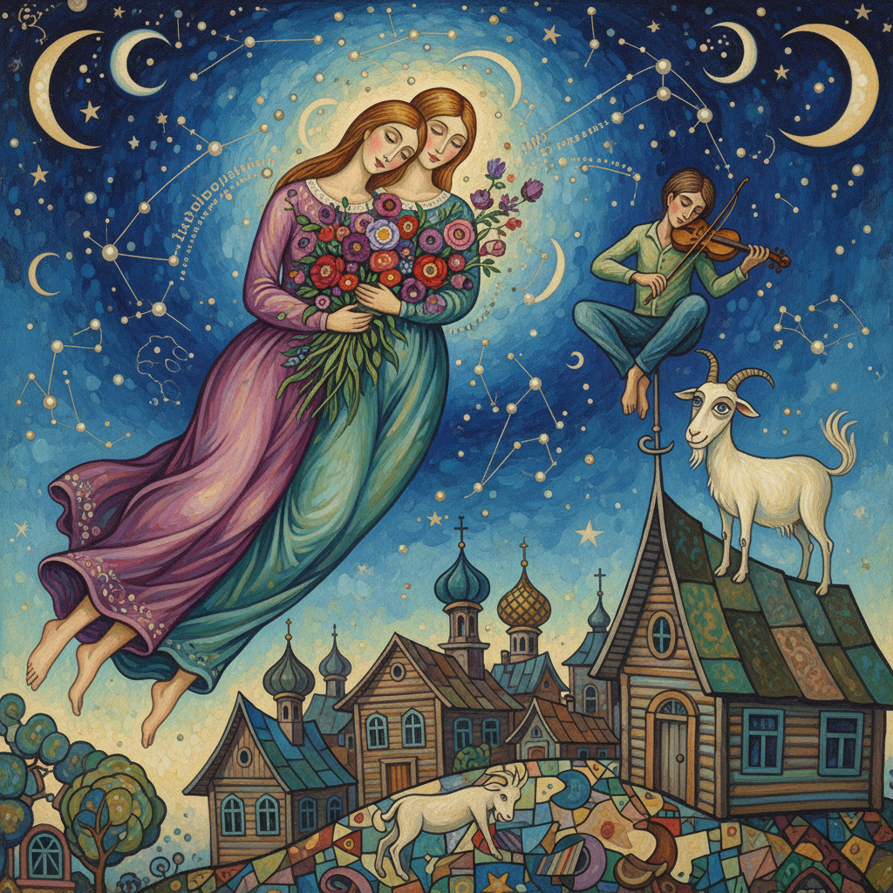

# Chagall Art 夏加尔艺术

> "If I create from the heart, nearly everything works; if from the head, almost nothing." — Marc Chagall

## 概述

夏加尔艺术（Chagall Art）是20世纪俄裔法国画家马克·扎哈罗维奇·夏加尔（Marc Zakharovich Chagall, 1887-1985）创立的梦幻诗意绑画风格。夏加尔被誉为"色彩的诗人"和"梦幻的画家"——他以独特的想象力将犹太民间传说、俄罗斯乡村记忆和巴黎的现代气息融为一体，创造了一个充满飞翔、爱情和奇迹的梦幻世界。他的画中，恋人在空中飞翔，小提琴手站在屋顶上，公鸡和山羊拥有人的表情。

夏加尔的艺术不属于任何流派——他吸收了立体主义的形式、野兽派的色彩和超现实主义的想象，但始终保持着自己独特的诗意语言。他最著名的作品《我和村庄》（1911）以梦幻般的构图将故乡维捷布斯克的记忆碎片组合在一起——人脸、牛脸、教堂、农妇在画面中自由漂浮。夏加尔活了98岁，创作生涯跨越近80年。

夏加尔艺术的核心要素包括：1）梦幻飞翔——人物和动物在空中飞翔；2）爱情主题——对爱情的永恒歌颂；3）故乡记忆——维捷布斯克的乡村记忆；4）犹太传统——犹太民间传说和宗教；5）色彩诗意——如宝石般绚丽的色彩；6）自由构图——不受重力和逻辑约束；7）童真想象——保持童年般的想象力。

## 核心特征

| 特征 | 描述 |
|------|------|
| 梦幻飞翔 | 人物动物空中飞翔 |
| 爱情主题 | 对爱情永恒歌颂 |
| 故乡记忆 | 维捷布斯克乡村记忆 |
| 犹太传统 | 犹太民间传说宗教 |
| 色彩诗意 | 如宝石般绚丽色彩 |
| 自由构图 | 不受重力逻辑约束 |

## 视觉特征

- **飞翔人物**：在空中飞翔的恋人
- **蓝色主调**：深邃的蓝色夜空
- **动物拟人**：有表情的公鸡和山羊
- **乡村意象**：木屋、教堂、栅栏
- **花束**：巨大而绚丽的花束
- **小提琴手**：屋顶上的小提琴手

## 代表作品

| 作品 | 年代 | 意义 |
|------|------|------|
| *我和村庄* (I and the Village) | 1911 | 故乡的梦 |
| *城市之上* (Over the Town) | 1918 | 飞翔的爱情 |
| *生日* (Birthday) | 1915 | 爱的喜悦 |
| *白色十字架* (White Crucifixion) | 1938 | 犹太苦难 |
| *巴黎歌剧院天顶画* | 1964 | 公共艺术巅峰 |
| *美国之窗* (America Windows) | 1977 | 彩色玻璃 |

## 历史时间线

| 时期 | 事件 |
|------|------|
| 1887年 | 出生于维捷布斯克（白俄罗斯） |
| 1910-1914年 | 第一次巴黎时期 |
| 1914-1922年 | 回到俄罗斯，经历革命 |
| 1923-1941年 | 第二次巴黎时期 |
| 1941-1948年 | 流亡美国 |
| 1948-1985年 | 定居法国南部 |
| 1985年 | 在圣保罗德旺斯去世 |

## 中国语境

夏加尔在中国有着广泛的知名度和影响力。他的梦幻诗意风格与中国传统绑画中"意在笔先"和"超以象外"的美学理念有深层的共鸣——都追求超越现实表象的精神表达。夏加尔画中人物飞翔的意象与中国传统仙人飞天的意象有文化上的呼应。他对故乡的终身眷恋和诗意化表达，也与中国文学中"乡愁"的传统有相通之处。中国当代艺术家从夏加尔身上学到了如何将个人记忆和民族文化转化为具有普世感染力的艺术语言。夏加尔证明了想象力和诗意可以成为绑画最强大的力量——不需要遵循任何流派的规则，忠于内心就是最好的艺术。

## 概念图

## 与其他风格的关系

- **Surrealism** → 超现实主义
- **Fauvism** → 野兽派（色彩）
- **Cubism** → 立体主义（形式）
- **Expressionism** → 表现主义
- **Jewish Art** → 犹太艺术传统
- **Naive Art** → 素朴艺术

---

*浮光艺志 | Chronicle of Artistry*
