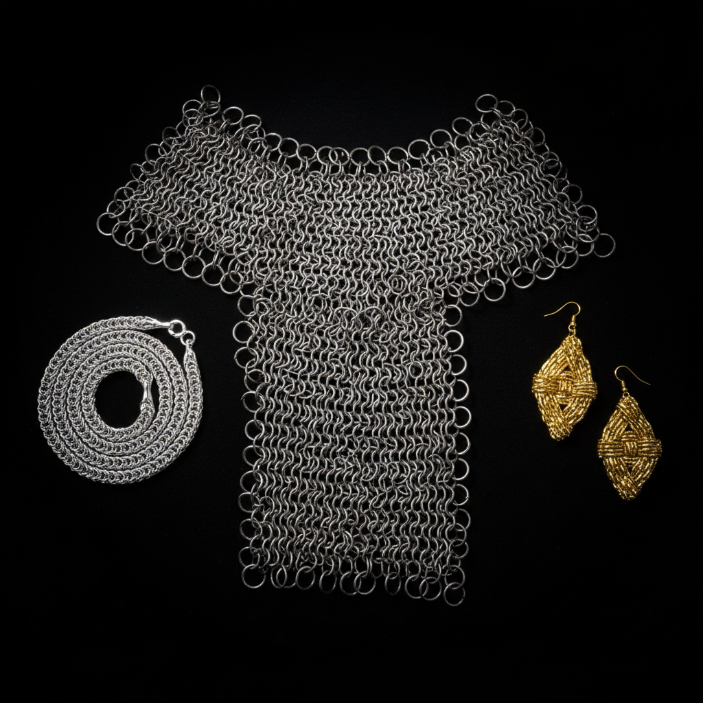

# Chain Maille 锁子甲编织

> "Chain maille is patience made armor — thousands of rings linked one by one into an impenetrable fabric of metal." — Unknown

## 概述

锁子甲编织（Chain Maille / Chainmail）是将金属环一个个连接起来形成金属织物的古老工艺。从公元前4世纪凯尔特人的战斗铠甲到中世纪骑士的全身锁子甲，从维京人的防护服到当代的珠宝和时装，锁子甲编织将最简单的元素——金属环——通过无数种连接方式组合成柔软、坚韧、美丽的金属织物。每一种编织图案（weave）都有自己的名字和特性，如同纺织中的不同织法。

锁子甲编织的哲学在于：简单的无限——一个环本身毫无意义，但数千个环按规则连接，就成为了既柔软又坚不可摧的整体。

## 核心特征

| 特征 | 描述 |
|------|------|
| 金属环 | 以金属环为基本单元 |
| 连接 | 环环相扣的连接 |
| 柔软 | 金属织物的柔软性 |
| 图案 | 多种编织图案 |
| 重复 | 重复性的手工劳动 |
| 坚韧 | 柔软中的坚韧 |

## 视觉特征

- **环形**：密集的金属环
- **织物**：如织物般的柔软质感
- **光泽**：金属环的光泽
- **图案**：不同编织的图案变化
- **流动**：如布料般的流动感
- **重量**：金属的重量感

## 代表作品

| 作品 | 艺术家 | 年代 | 意义 |
|------|--------|------|------|
| *Celtic chain armour* | 匿名 | 公元前4世纪 | 最早的锁子甲 |
| *Medieval hauberks* | 匿名 | 中世纪 | 中世纪骑士铠甲 |
| *Paco Rabanne dresses* | Paco Rabanne | 1960s | 时装中的金属编织 |
| *Contemporary maille jewelry* | Various | 当代 | 当代锁子甲珠宝 |
| *Maille sculptures* | Various | 当代 | 锁子甲雕塑 |

## 历史时间线

| 时期 | 事件 |
|------|------|
| 公元前4世纪 | 凯尔特人发明锁子甲 |
| 罗马帝国 | Lorica hamata的广泛使用 |
| 中世纪 | 锁子甲的黄金时代 |
| 14-15世纪 | 板甲逐渐取代锁子甲 |
| 1960s | Paco Rabanne的时装革命 |
| 当代 | 珠宝和艺术中的复兴 |

## 中国语境

中国古代也有锁子甲的使用——称为"锁子铠"或"环锁铠"，最早见于南北朝时期，可能通过丝绸之路从西方传入。唐代军队中有锁子甲的记载。中国传统更偏重鳞甲和札甲，锁子甲不如西方普及。当代中国的金属工艺爱好者社区中，锁子甲编织作为一种手工艺术正在流行，特别是在珠宝和cosplay领域。

## AI生成概念图

## 与其他风格的关系

- **Armor** → 铠甲制作传统
- **Metalwork** → 金属工艺
- **Textile** → 金属织物
- **Jewelry** → 锁子甲珠宝
- **Fashion** → 金属时装
- **Wire Wrapping** → 金属丝工艺

---

*浮光艺志 | Chronicle of Artistry*
