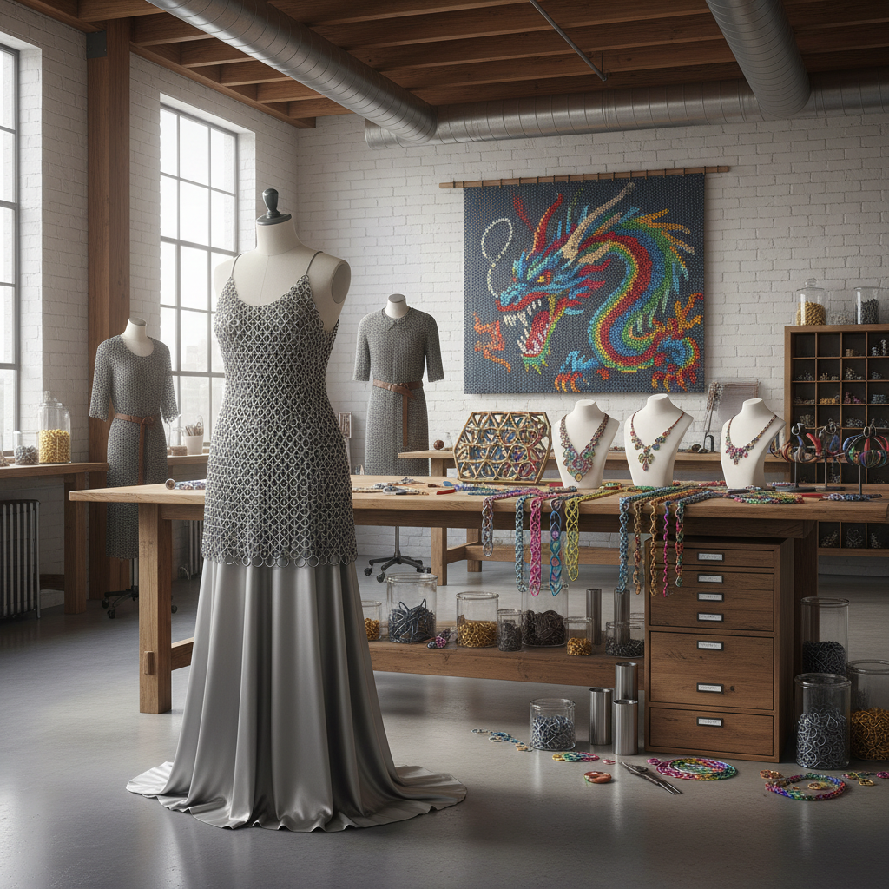

# Chainmail Art 锁子甲艺术

> "Chainmail is patience made metal — thousands of individual rings, each one opened, linked to its neighbors, and closed again, building up a fabric of steel one ring at a time. The result is a material that flows like cloth but resists like armor, that is rigid in aggregate but flexible in detail, that is ancient in origin but endlessly variable in pattern." — Unknown

## 概述

锁子甲艺术（Chainmail Art）是以金属环相互连接形成网状织物的艺术形式——通过将数千甚至数百万个金属环逐一连接，创造出具有织物般柔韧性的金属面料。锁子甲艺术从古代的防护铠甲发展为当代的首饰、雕塑和装饰艺术。

锁子甲艺术的实践包括：1）传统锁子甲——历史性的铠甲复制和制作；2）锁子甲首饰——用细小金属环编织的项链、手链等；3）锁子甲雕塑——用锁子甲技法创作的立体雕塑；4）锁子甲服装——用金属环编织的时装和配饰；5）锁子甲壁挂——用彩色金属环编织的装饰壁挂；6）微型锁子甲——用极小的环制作的精细作品；7）日本锁子甲（kusari）——日本传统的锁子甲编织。

## 核心特征

| 特征 | 描述 |
|------|------|
| 环环相扣 | 每个环与邻环连接 |
| 柔韧 | 金属的柔韧性 |
| 耐心 | 需要极大耐心 |
| 图案 | 多种编织图案 |
| 金属 | 金属的光泽和重量 |
| 古老 | 数千年的历史 |

## 视觉特征

- **金属光泽**：金属环的闪亮光泽
- **流动**：织物般的流动感
- **图案**：不同编织图案的纹理
- **重量**：视觉上的金属重量感
- **精密**：精密的环环相扣
- **反射**：无数小环的反射效果

## 代表作品

| 作品 | 艺术家 | 年代 | 意义 |
|------|--------|------|------|
| *Historical chainmail* | 各文化传统 | 古代至今 | 历史锁子甲 |
| *Chainmail jewelry* | Various | 当代 | 锁子甲首饰 |
| *Chainmail sculptures* | Various | 当代 | 锁子甲雕塑 |
| *Chainmail fashion* | Various | 当代 | 锁子甲时装 |
| *Japanese kusari* | 日本传统 | 古代至今 | 日本锁子甲 |

## 历史时间线

| 时期 | 事件 |
|------|------|
| 公元前4世纪 | 凯尔特人发明锁子甲 |
| 中世纪 | 锁子甲铠甲的黄金时代 |
| 日本战国 | 日本锁子甲的发展 |
| 20世纪 | 锁子甲作为工艺复兴 |
| 当代 | 锁子甲作为当代艺术媒介 |

## 中国语境

锁子甲艺术在中国有独特的历史。中国古代的"锁子甲"（又称"环锁铠"）在唐代通过丝绸之路从西域传入，在宋代和明代都有使用记录。中国传统的金属编织工艺——如银丝编织的首饰和装饰品——与锁子甲技法有相通之处。中国当代的锁子甲艺术爱好者群体在增长，他们将传统的欧洲和日本锁子甲编织技法与中国传统金属工艺结合，创作出融合东西方美学的作品。中国的一些当代首饰设计师也在探索锁子甲技法——用细小的金银环编织成精美的首饰和配饰。

## AI生成概念图

## 与其他风格的关系

- **Metal Art** → 金属艺术
- **Wire Art** → 金属丝艺术
- **Textile Art** → 纺织艺术
- **Jewelry Art** → 首饰艺术
- **Armor Art** → 铠甲艺术
- **Fashion Art** → 时尚艺术

---

*浮光艺志 | Chronicle of Artistry*
