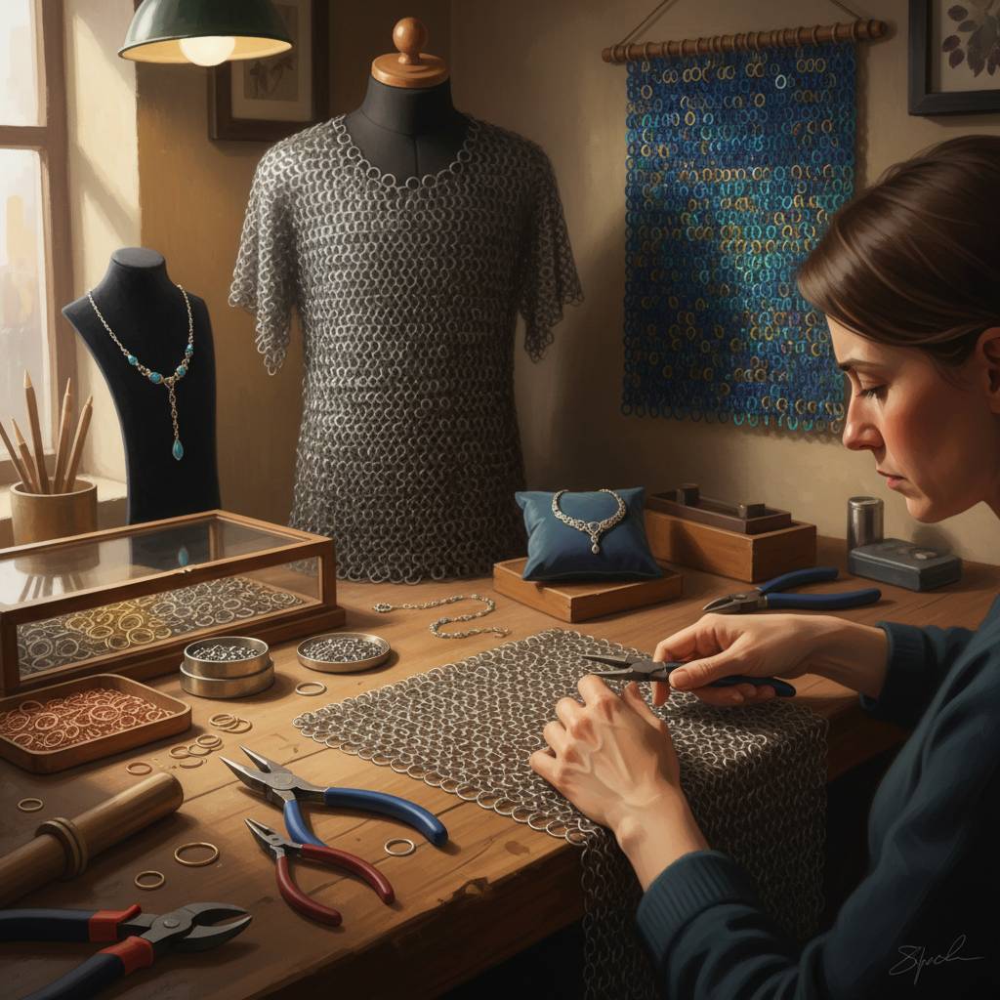

# Chainmaille 锁子甲编织

> "Chainmaille is patience in metal — ring by ring, link by link, building a fabric of steel that flows like cloth yet stops a blade, an ancient armor reborn as modern jewelry and art." — Unknown

## 概述

锁子甲编织（Chainmaille / Chain Mail）是将金属环（rings）相互连接形成网状织物的金属工艺。每个金属环穿过相邻的环并闭合，形成灵活的金属"布料"。锁子甲最初是作为防护铠甲发展的——从古罗马到中世纪欧洲，锁子甲是战士的主要防护装备。

当代的锁子甲编织已从军事用途转变为装饰艺术——珠宝、服装配饰、雕塑和装饰品。当代锁子甲艺术家使用各种金属（不锈钢、铝、铜、钛、贵金属）和各种编织模式（European 4-in-1、Japanese、Persian、Byzantine等），创造出从精致的首饰到大型装置的各种作品。锁子甲编织的魅力在于：简单的元素（环）通过不同的连接方式产生无限的变化。

## 核心特征

| 特征 | 描述 |
|------|------|
| 金属环 | 金属环为基本元素 |
| 连接 | 环环相扣 |
| 灵活 | 金属的灵活织物 |
| 模式 | 多种编织模式 |
| 耐久 | 极其耐久 |
| 重复 | 重复性的操作 |

## 视觉特征

- **金属**：金属的光泽
- **网状**：网状的结构
- **灵活**：灵活的垂坠
- **图案**：编织模式的图案
- **光影**：金属环的光影
- **精密**：精密的连接

## 代表作品

| 作品 | 艺术家 | 年代 | 意义 |
|------|--------|------|------|
| *Roman lorica hamata* | 匿名 | 罗马时期 | 罗马锁子甲 |
| *Medieval hauberks* | 匿名 | 中世纪 | 中世纪锁子甲 |
| *Japanese kusari* | 匿名 | 日本 | 日本锁子甲 |
| *Contemporary chainmaille jewelry* | Various | 当代 | 当代锁子甲首饰 |
| *Chainmaille sculptures* | Various | 当代 | 锁子甲雕塑 |

## 历史时间线

| 时期 | 事件 |
|------|------|
| 公元前4世纪 | 凯尔特人的早期锁子甲 |
| 罗马帝国 | 罗马锁子甲的标准化 |
| 中世纪 | 欧洲锁子甲的鼎盛 |
| 14-15世纪 | 板甲逐渐取代锁子甲 |
| 20世纪末 | 锁子甲作为爱好的复兴 |
| 当代 | 锁子甲首饰和艺术的繁荣 |

## 中国语境

锁子甲在中国历史上也有使用——中国古代的"锁子铠"（环锁铠）在唐代通过丝绸之路从西域传入，在宋代和明代都有使用记录。当代中国的锁子甲爱好者群体正在增长——受到中世纪文化、奇幻文学和COSPLAY文化的影响。一些中国的手工艺人制作锁子甲首饰和装饰品。中国的历史重演（reenactment）和LARP社区中也有锁子甲制作的需求。电商平台上有锁子甲材料和工具的供应。

## AI生成概念图

## 与其他风格的关系

- **Metalwork** → 金属工艺
- **Jewelry Making** → 首饰制作
- **Wire Wrapping** → 绕线
- **Armor Making** → 铠甲制作
- **Textile Structure** → 纺织结构
- **Filigree** → 金银丝工艺

---

*浮光艺志 | Chronicle of Artistry*
