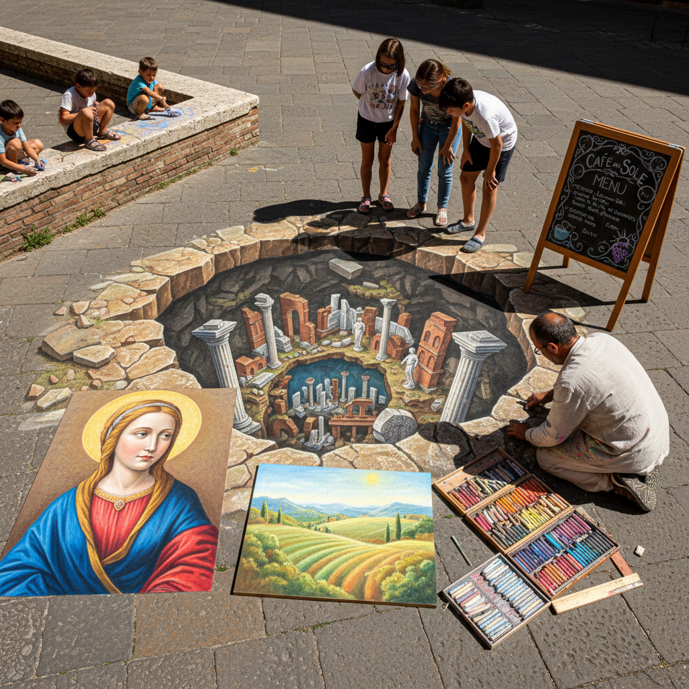

# Chalk Art 粉笔艺术

> "Chalk art is painting with dust on stone — the softest medium on the hardest surface, creating images that exist in a state of perpetual impermanence. Rain will wash it away, feet will wear it down, wind will scatter it. Yet this very fragility gives chalk art its urgency and its magic: every piece is a performance, a gift to the moment, a reminder that beauty does not need to last forever to matter." — Unknown

## 概述

粉笔艺术（Chalk Art）是以粉笔为主要绘画工具在各种表面上进行创作的艺术形式——包括在人行道上创作的街头粉笔画、黑板上的粉笔艺术、以及使用粉彩（软粉笔）在纸上创作的精细作品。粉笔艺术以其即兴性、公共性和短暂性著称。

粉笔艺术的实践包括：1）街头粉笔画——在人行道和广场上创作的大型粉笔画；2）3D粉笔画——利用透视错觉创造三维效果的街头粉笔画；3）黑板艺术——在黑板上创作的装饰性粉笔字和插图；4）粉彩画——使用软粉笔在纸上创作的精细作品；5）粉笔壁画——在墙面上创作的粉笔壁画；6）粉笔字体——装饰性的粉笔手写字体设计；7）互动粉笔艺术——邀请公众参与的粉笔艺术活动。

## 核心特征

| 特征 | 描述 |
|------|------|
| 短暂 | 作品的短暂性 |
| 公共 | 公共空间的艺术 |
| 即兴 | 即兴创作的特质 |
| 柔和 | 柔和的色彩过渡 |
| 参与 | 公众参与性强 |
| 直接 | 直接的手指触感 |

## 视觉特征

- **粉质**：粉笔特有的粉质感
- **柔和**：柔和的色彩边缘
- **渐变**：自然的色彩渐变
- **纹理**：地面或黑板的纹理
- **鲜艳**：鲜艳的粉笔色彩
- **透视**：3D粉笔画的透视效果

## 代表作品

| 作品 | 艺术家 | 年代 | 意义 |
|------|--------|------|------|
| *3D street chalk art* | Julian Beever | 1990s至今 | 3D透视粉笔画先驱 |
| *Madonnari* | 意大利传统 | 16世纪至今 | 意大利街头圣像画 |
| *Chalk murals* | Dana Tanamachi | 当代 | 当代粉笔字体艺术 |
| *Pastel portraits* | Various | 18世纪至今 | 粉彩肖像画 |
| *Interactive chalk art* | Various | 当代 | 互动粉笔艺术 |

## 历史时间线

| 时期 | 事件 |
|------|------|
| 16世纪 | 意大利Madonnari街头画传统 |
| 18世纪 | 粉彩画的黄金时代 |
| 20世纪 | 街头粉笔画的复兴 |
| 1990年代 | 3D粉笔画的兴起 |
| 当代 | 黑板艺术和粉笔字体的流行 |

## 中国语境

粉笔艺术在中国有多种表现形式。中国的学校教育中，黑板报是一种独特的粉笔艺术传统——学生们用彩色粉笔在黑板上创作精美的图文作品。中国的街头3D粉笔画在近年来非常流行——许多商业活动和旅游景点邀请艺术家创作大型3D粉笔画吸引游客。中国的一些粉笔艺术家在社交媒体上获得了大量关注——他们在黑板上创作的精美粉笔画和粉笔字体视频广受欢迎。中国的咖啡馆和餐厅文化中，黑板菜单和粉笔装饰画是常见的设计元素。中国的一些城市举办粉笔艺术节——邀请市民和艺术家在广场上共同创作。中国传统的"地书"——用水在地面上写书法——与粉笔艺术有精神上的相似之处，都是短暂的公共空间艺术。

## AI生成概念图

## 与其他风格的关系

- **Street Art** → 街头艺术
- **Pastel Art** → 粉彩艺术
- **Ephemeral Art** → 短暂艺术
- **Public Art** → 公共艺术
- **Typography** → 字体设计
- **3D Art** → 三维艺术

---

*浮光艺志 | Chronicle of Artistry*
