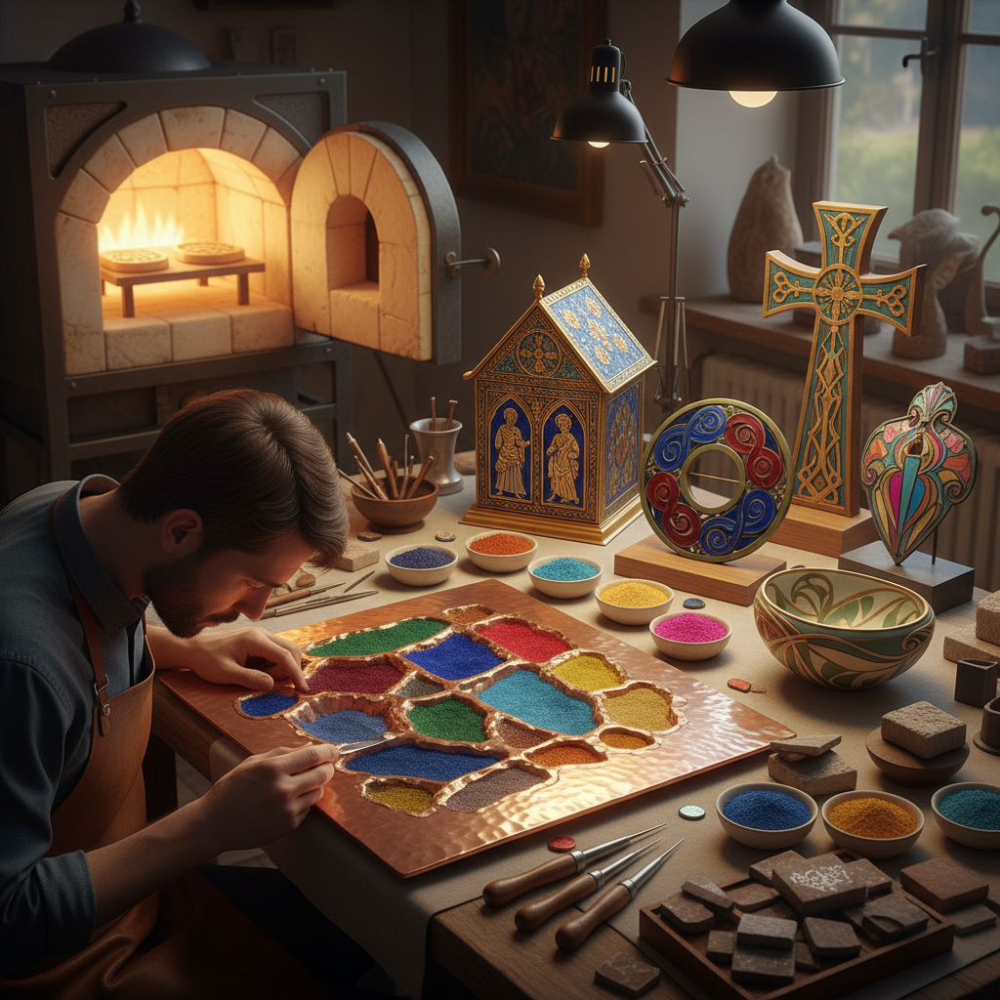

# Champlevé 凹雕填珐琅

> "Champlevé is painting with fire in carved fields — the engraver cuts troughs into metal, fills them with powdered glass, and the kiln fuses color permanently into the body of the work." — Unknown

## 概述

凹雕填珐琅（Champlevé，法语意为"凸起的田野"）是一种珐琅工艺——在金属基体（通常是铜或青铜）上雕刻或蚀刻出凹槽，然后将珐琅粉（磨碎的彩色玻璃）填入凹槽中，经过高温烧制使珐琅熔融并与金属结合。冷却后，珐琅表面与金属表面齐平，形成色彩鲜艳的图案。

Champlevé与Cloisonné（掐丝珐琅/景泰蓝）的区别在于：Cloisonné用金属丝围出图案区域，而Champlevé直接在金属基体上挖出凹槽。Champlevé的金属线条（未被挖去的部分）通常比Cloisonné的金属丝更粗、更有力。Champlevé在中世纪欧洲极为流行——特别是在利摩日（Limoges）地区，产生了大量精美的宗教器物。

## 核心特征

| 特征 | 描述 |
|------|------|
| 凹槽 | 在金属上雕刻凹槽 |
| 填充 | 填入珐琅粉 |
| 烧制 | 高温烧制融合 |
| 色彩 | 鲜艳的珐琅色彩 |
| 耐久 | 极其耐久 |
| 中世纪 | 中世纪欧洲的代表工艺 |

## 视觉特征

- **色彩**：鲜艳的珐琅色彩
- **金属**：金属线条的框架
- **平滑**：珐琅与金属齐平
- **对比**：色彩与金属的对比
- **图案**：几何或图形图案
- **光泽**：珐琅的玻璃光泽

## 代表作品

| 作品 | 艺术家 | 年代 | 意义 |
|------|--------|------|------|
| *Limoges enamels* | 利摩日工匠 | 12-13世纪 | 利摩日珐琅 |
| *Stavelot Triptych* | 匿名 | 1156-58 | 斯塔夫洛三联画 |
| *Celtic champlevé brooches* | 匿名 | 中世纪 | 凯尔特珐琅胸针 |
| *Romanesque reliquaries* | 匿名 | 罗马式时期 | 罗马式圣物箱 |
| *Contemporary champlevé* | Various | 当代 | 当代凹雕填珐琅 |

## 历史时间线

| 时期 | 事件 |
|------|------|
| 古代 | 凯尔特人的早期Champlevé |
| 罗马时期 | 罗马帝国的Champlevé |
| 中世纪 | 利摩日Champlevé的鼎盛 |
| 12-13世纪 | 莱茵河流域的Champlevé |
| 文艺复兴 | 绘画珐琅取代Champlevé |
| 当代 | Champlevé在当代首饰中的复兴 |

## 中国语境

凹雕填珐琅在中国的珐琅工艺体系中有其对应——中国传统的"錾胎珐琅"与Champlevé技法相同。中国的錾胎珐琅历史悠久，但不如景泰蓝（掐丝珐琅）知名。中国的一些传统金属工艺中使用类似Champlevé的技法——在铜器上錾刻凹槽后填入珐琅。当代中国的珐琅艺术家和首饰设计师也使用Champlevé技法创作。中国的珐琅工艺教育中，Champlevé是重要的教学内容之一。

## AI生成概念图

## 与其他风格的关系

- **Cloisonné** → 掐丝珐琅/景泰蓝
- **Plique-à-jour** → 透光珐琅
- **Basse-taille** → 浅浮雕珐琅
- **Enameling** → 珐琅工艺
- **Metal Engraving** → 金属雕刻
- **Limoges Enamel** → 利摩日珐琅

---

*浮光艺志 | Chronicle of Artistry*
