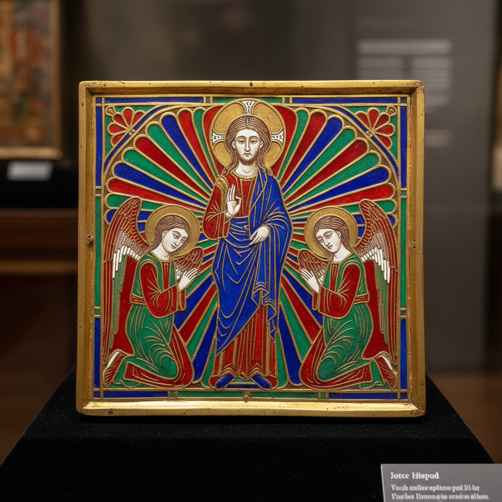

# Champlevé Art 凹雕珐琅艺术

> "Champlevé is enamel in its most architectural form — cells are carved, cast, or stamped directly into the metal surface, creating shallow troughs that are then filled with powdered glass and fired until the enamel fuses into brilliant pools of color set into the metal like jewels in a crown. Unlike cloisonné where wire walls define the design, in champlevé the metal itself is the framework, carved away to receive color and left standing as the outline." — Unknown

## 概述

凹雕珐琅艺术（Champlevé Art）是一种在金属表面雕刻出凹槽，然后在凹槽中填入珐琅粉末并烧制的传统金属装饰工艺——与掐丝珐琅（cloisonné）不同，凹雕珐琅是直接在金属上挖出凹陷来容纳珐琅。Champlevé（法语"凸起的田野"）在中世纪欧洲达到巅峰，是利摩日（Limoges）地区最著名的工艺传统。

凹雕珐琅艺术的实践包括：1）雕刻法——用雕刻刀在金属上挖出凹槽；2）铸造法——在铸造时直接形成凹槽；3）酸蚀法——用酸腐蚀出凹槽；4）冲压法——用模具冲压出凹槽；5）填充烧制——在凹槽中填入珐琅并烧制；6）打磨抛光——烧制后打磨至与金属表面平齐；7）当代凹雕珐琅——将传统技法与现代设计结合的创作。

## 核心特征

| 特征 | 描述 |
|------|------|
| 凹雕 | 在金属上雕出凹槽 |
| 珐琅 | 玻璃质珐琅的填充 |
| 金属 | 金属作为框架 |
| 烧制 | 高温烧制融合 |
| 耐久 | 极其耐久的装饰 |
| 中世纪 | 中世纪的巅峰 |

## 视觉特征

- **色彩**：珐琅的鲜艳色彩
- **金属**：金属框架的光泽
- **平滑**：打磨后的平滑表面
- **对比**：珐琅与金属的对比
- **深度**：凹槽中的色彩深度
- **庄严**：庄严华贵的整体感

## 代表作品

| 作品 | 艺术家/文化 | 年代 | 意义 |
|------|-------------|------|------|
| *Limoges enamels* | 法国 | 12-13世纪 | 利摩日珐琅 |
| *Mosan enamels* | 比利时 | 12世纪 | 默兹河谷珐琅 |
| *Celtic champlevé* | 凯尔特 | 古代 | 凯尔特凹雕珐琅 |
| *Romanesque reliquaries* | 欧洲 | 中世纪 | 罗马式圣物箱 |
| *Contemporary champlevé* | 当代 | 当代 | 当代凹雕珐琅 |

## 历史时间线

| 时期 | 事件 |
|------|------|
| 古代 | 凯尔特和罗马的凹雕珐琅 |
| 12-13世纪 | 利摩日凹雕珐琅的黄金时代 |
| 14世纪 | 被掐丝珐琅和画珐琅取代 |
| 19世纪 | 凹雕珐琅的复兴 |
| 当代 | 凹雕珐琅的艺术化发展 |

## 中国语境

凹雕珐琅艺术在中国有一定的传统和认知。中国的珐琅工艺以掐丝珐琅（景泰蓝）最为著名——但凹雕珐琅在中国也有应用。中国清代的宫廷珐琅器中有凹雕珐琅的作品——虽然不如掐丝珐琅普及。中国当代的珐琅艺术家开始探索凹雕珐琅技法——将其与中国传统金属工艺结合。中国的珠宝设计中，凹雕珐琅作为一种精致的装饰技法正在获得关注——特别是在高端手表和首饰中。中国的一些工艺美术学校开始教授凹雕珐琅——作为珐琅工艺教育的一部分。中国的钟表产业中，凹雕珐琅表盘是高端产品的重要装饰——将传统工艺与现代制表结合。

## AI生成概念图

## 与其他风格的关系

- **Cloisonné** → 掐丝珐琅
- **Plique-à-jour** → 透光珐琅
- **Enamel Art** → 珐琅艺术
- **Metalwork** → 金属工艺
- **Medieval Art** → 中世纪艺术
- **Jewelry** → 珠宝艺术

---

*浮光艺志 | Chronicle of Artistry*
