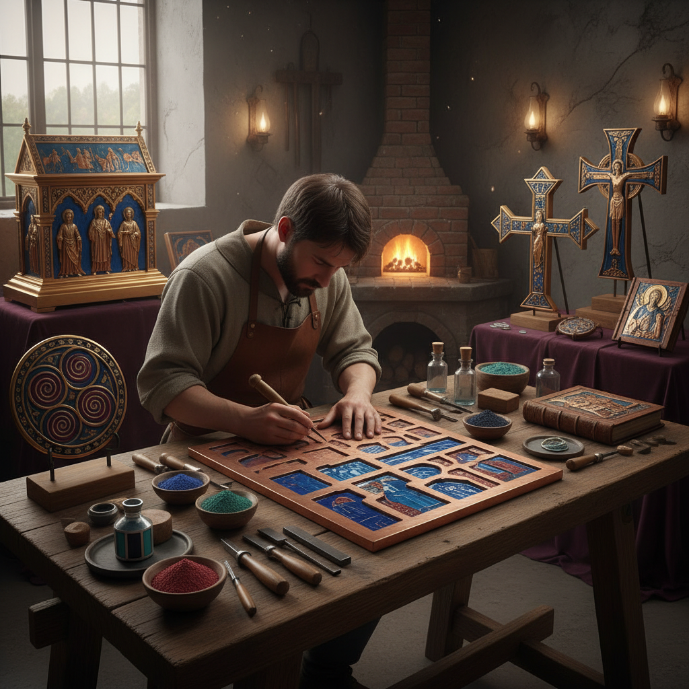

# Champlevé Enamel 凹雕珐琅

> "Champlevé is sculpture filled with light — the metalworker carving or etching channels into a thick metal plate, then filling those sunken fields with powdered glass and firing until the enamel melts into pools of color held within walls of gleaming metal, the raised metal surfaces polished to a mirror finish that frames each colored cell like a precious stone in its setting." — Unknown

## 概述

凹雕珐琅（Champlevé），法语意为"raised field"（凸起的场域），是一种在较厚的金属板（通常是铜或青铜）上通过雕刻、蚀刻或铸造的方式挖出凹槽或凹坑，然后在凹陷处填入珐琅釉料粉末，经高温烧制使釉料熔化填满凹槽，最后打磨至金属表面与珐琅表面齐平的珐琅技法。

与景泰蓝（Cloisonné）使用焊接的金属丝来分隔颜色不同，Champlevé是直接在金属板上挖出凹槽来容纳珐琅。这使得Champlevé的金属部分更加坚固厚实，适合制作较大的物件。Champlevé在中世纪欧洲（特别是法国利摩日地区和莱茵河流域）达到鼎盛——大量的教堂圣物箱、十字架、书封面和礼仪器具都使用Champlevé技法装饰。

## 核心特征

| 特征 | 描述 |
|------|------|
| 凹槽 | 在金属上挖凹槽 |
| 填釉 | 凹槽中填入珐琅 |
| 厚金属 | 使用较厚金属板 |
| 烧制 | 高温烧制 |
| 打磨 | 打磨至齐平 |
| 坚固 | 结构坚固耐久 |

## 视觉特征

- **金属面**：大面积的金属表面
- **色块**：珐琅色块填充凹槽
- **齐平**：金属与珐琅齐平
- **厚重**：厚重的金属质感
- **中世纪**：中世纪的装饰风格
- **宗教**：常见宗教题材

## 代表作品

| 作品 | 艺术家 | 年代 | 意义 |
|------|--------|------|------|
| *Limoges champlevé reliquaries* | 利摩日工匠 | 12-13世纪 | 利摩日圣物箱 |
| *Mosan champlevé* | 莫桑工匠 | 12世纪 | 莫桑珐琅 |
| *Celtic champlevé brooches* | 凯尔特工匠 | 1-5世纪 | 凯尔特珐琅胸针 |
| *Romanesque altar crosses* | 中世纪工匠 | 11-12世纪 | 罗马式祭坛十字架 |
| *Contemporary champlevé jewelry* | Various | 当代 | 当代凹雕珐琅珠宝 |

## 历史时间线

| 时期 | 事件 |
|------|------|
| 凯尔特时期 | 凯尔特珐琅的早期实践 |
| 罗马时期 | 罗马帝国的珐琅工艺 |
| 中世纪 | 利摩日和莫桑的鼎盛 |
| 文艺复兴 | 画珐琅取代凹雕珐琅 |
| 当代 | 凹雕珐琅的复兴 |

## 中国语境

凹雕珐琅在中国的传统中相对较少——中国的珐琅传统以景泰蓝（掐丝珐琅）和画珐琅为主。但中国的一些当代珐琅艺术家也在探索Champlevé技法。中国的铜器传统中有类似的"错金银"技法——在铜器表面挖槽嵌入金银丝，与Champlevé有技法上的相似性。中国的珐琅教育中也教授Champlevé作为珐琅技法的重要分支。

## AI生成概念图

## 与其他风格的关系

- **Enameling** → 珐琅艺术
- **Cloisonné** → 景泰蓝
- **Metalwork** → 金属工艺
- **Engraving** → 雕刻
- **Medieval Art** → 中世纪艺术
- **Jewelry** → 珠宝

---

*浮光艺志 | Chronicle of Artistry*
