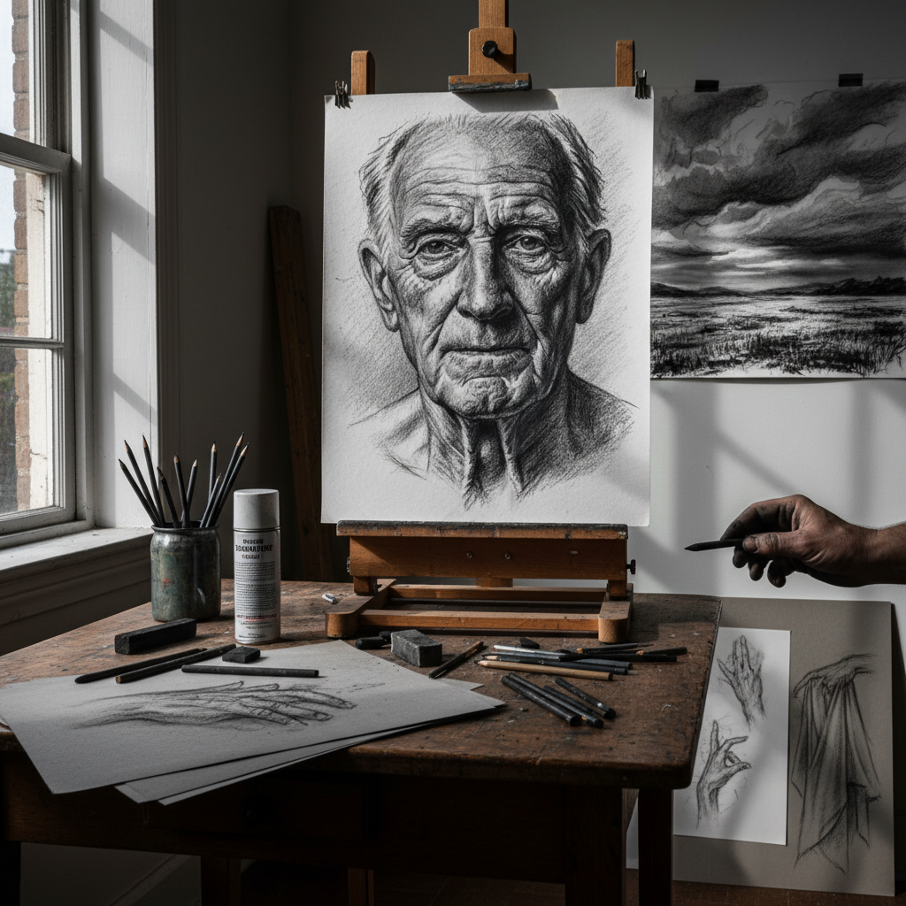

# Charcoal Art 炭笔艺术

> "Charcoal is drawing with fire's memory — wood that has been burned but not consumed, reduced to pure carbon that leaves its dark trace on paper with the lightest touch. It is the oldest drawing medium, used by cave painters forty thousand years ago, yet still the first tool placed in an art student's hand today. Charcoal teaches that darkness is not absence but presence, that shadows have weight and substance." — Unknown

## 概述

炭笔艺术（Charcoal Art）是以木炭条或压缩炭笔为主要绘画工具进行创作的艺术形式——利用炭笔深邃的黑色、丰富的灰度层次和独特的质感，在纸张上创造出具有强烈明暗对比和戏剧性效果的素描和绘画作品。炭笔是最古老也最基础的绘画媒介之一。

炭笔艺术的实践包括：1）炭笔素描——用炭笔进行的写实素描；2）炭笔肖像——炭笔人物肖像画；3）炭笔风景——炭笔风景画；4）表现性炭笔画——强调表现力的炭笔创作；5）大型炭笔画——大尺幅的炭笔作品；6）炭笔与混合媒介——炭笔与其他媒介的结合；7）动画炭笔——用炭笔创作的动画（如William Kentridge的作品）。

## 核心特征

| 特征 | 描述 |
|------|------|
| 深黑 | 极深的黑色 |
| 层次 | 丰富的灰度层次 |
| 质感 | 独特的粗糙质感 |
| 可擦 | 可擦除和修改 |
| 表现 | 强烈的表现力 |
| 直接 | 直接的手感 |

## 视觉特征

- **黑白**：强烈的黑白对比
- **质感**：炭粉的颗粒质感
- **模糊**：柔和的边缘过渡
- **戏剧**：戏剧性的明暗效果
- **笔触**：可见的笔触痕迹
- **深度**：深邃的暗部

## 代表作品

| 作品 | 艺术家 | 年代 | 意义 |
|------|--------|------|------|
| *Charcoal drawings* | Käthe Kollwitz | 20世纪初 | 表现主义炭笔画 |
| *Animated charcoal films* | William Kentridge | 1989至今 | 炭笔动画 |
| *Large charcoal drawings* | Robert Longo | 1980s至今 | 大型超写实炭笔画 |
| *Charcoal portraits* | John Singer Sargent | 19世纪末 | 炭笔肖像 |
| *Cave charcoal drawings* | 史前人类 | 4万年前 | 最早的炭笔画 |

## 历史时间线

| 时期 | 事件 |
|------|------|
| 4万年前 | 洞穴壁画中的木炭绘画 |
| 文艺复兴 | 炭笔作为素描工具的普及 |
| 19世纪 | 炭笔肖像画的流行 |
| 20世纪 | 表现主义炭笔画 |
| 当代 | 炭笔的当代艺术实践 |

## 中国语境

炭笔艺术在中国美术教育中占有重要地位——炭笔素描是中国美术院校入学考试的核心科目之一。中国的美术学生从学习炭笔素描开始接受系统的造型训练——石膏像素描、人物素描和静物素描都以炭笔为主要工具。中国的一些当代艺术家将炭笔发展为独立的创作媒介——不仅仅是素描练习工具。中国传统的水墨画与炭笔画有精神上的相似之处——都强调黑白灰的层次和笔触的表现力。中国的一些艺术家将炭笔与中国传统水墨美学相结合——创造出独特的当代炭笔艺术。中国的超写实炭笔画在社交媒体上非常受欢迎——一些艺术家的炭笔肖像作品因其惊人的细节而获得广泛关注。

## AI生成概念图

## 与其他风格的关系

- **Drawing** → 素描艺术
- **Graphite Art** → 铅笔艺术
- **Ink Wash** → 水墨画
- **Expressionism** → 表现主义
- **Realism** → 写实主义
- **Animation** → 动画艺术

---

*浮光艺志 | Chronicle of Artistry*
