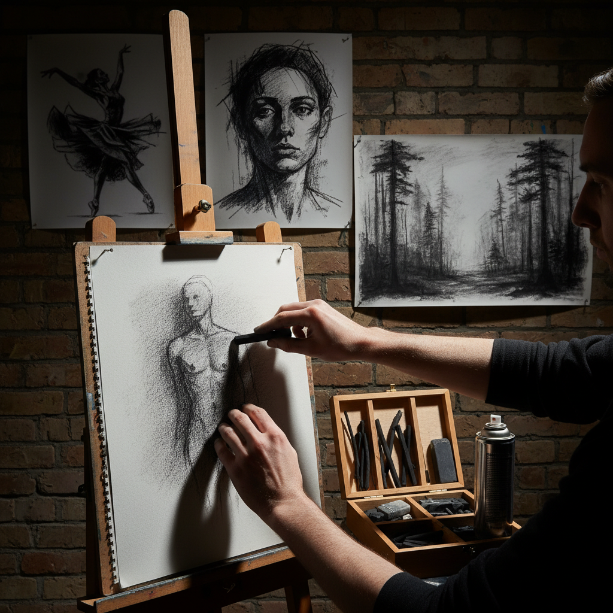

# Charcoal Drawing 炭笔画

> "Charcoal is drawing at its most primal — burnt wood on paper, the same mark-making our ancestors used on cave walls, still powerful after forty thousand years." — Unknown

## 概述

炭笔画（Charcoal Drawing）是使用木炭条或压缩炭笔在纸面上作画的技法。木炭是最古老的绘画材料之一——从史前洞穴壁画到当代大尺幅素描，炭笔始终是艺术家最基本、最有力的工具。炭笔的独特之处在于：它可以产生从最轻柔的灰色到最深沉的黑色之间的全部色调范围；它可以用手指、纸笔或橡皮轻松混合和擦除；它适合快速的大笔触也适合精细的细节。炭笔画的表面有独特的粉质质感——柔和、深沉、富有表现力。

炭笔画的哲学在于：本质的力量——最简单的材料，最直接的表达，回归绘画最原始的冲动。

## 核心特征

| 特征 | 描述 |
|------|------|
| 木炭 | 木炭为绘画材料 |
| 范围 | 极广的色调范围 |
| 可改 | 易于修改和混合 |
| 表现 | 极强的表现力 |
| 速度 | 适合快速作画 |
| 原始 | 最原始的绘画材料 |

## 视觉特征

- **深沉**：深沉的黑色
- **柔和**：柔和的灰度过渡
- **粉质**：粉质的表面质感
- **力量**：有力的笔触
- **氛围**：强烈的氛围感
- **戏剧**：戏剧性的明暗

## 代表作品

| 作品 | 艺术家 | 年代 | 意义 |
|------|--------|------|------|
| *Lascaux cave drawings* | 匿名 | 17000年前 | 最早的炭笔画 |
| *Michelangelo studies* | Michelangelo | 1500s | 文艺复兴炭笔 |
| *Käthe Kollwitz drawings* | Kollwitz | 1900s+ | 表现主义炭笔 |
| *Robert Longo drawings* | Robert Longo | 1980s+ | 超写实炭笔 |
| *William Kentridge animations* | Kentridge | 1990s+ | 炭笔动画 |

## 历史时间线

| 时期 | 事件 |
|------|------|
| 史前 | 洞穴壁画中的木炭使用 |
| 文艺复兴 | 作为底稿和习作工具 |
| 19世纪 | 学院素描的标准媒介 |
| 20世纪 | 表现主义的有力工具 |
| 当代 | 大尺幅炭笔画的兴起 |
| 当代 | 炭笔动画和装置 |

## 中国语境

炭笔画在中国美术教育中占有核心地位——素描是中国美术高考的必考科目，而炭笔是素描的主要工具之一。中国的美术院校从入学考试到基础训练，都大量使用炭笔进行人体、石膏和静物素描。中国的素描教育传统深受苏联契斯恰科夫体系影响，强调严谨的明暗关系和体积感。当代中国的一些艺术家如徐冰等也在作品中使用炭笔作为主要媒介，探索炭笔画的当代可能性。

## AI生成概念图

## 与其他风格的关系

- **Drawing** → 素描
- **Graphite** → 铅笔画
- **Pastel** → 色粉画
- **Conte** → 碳精条
- **Silverpoint** → 银尖笔画
- **Expressionism** → 表现主义

---

*浮光艺志 | Chronicle of Artistry*
