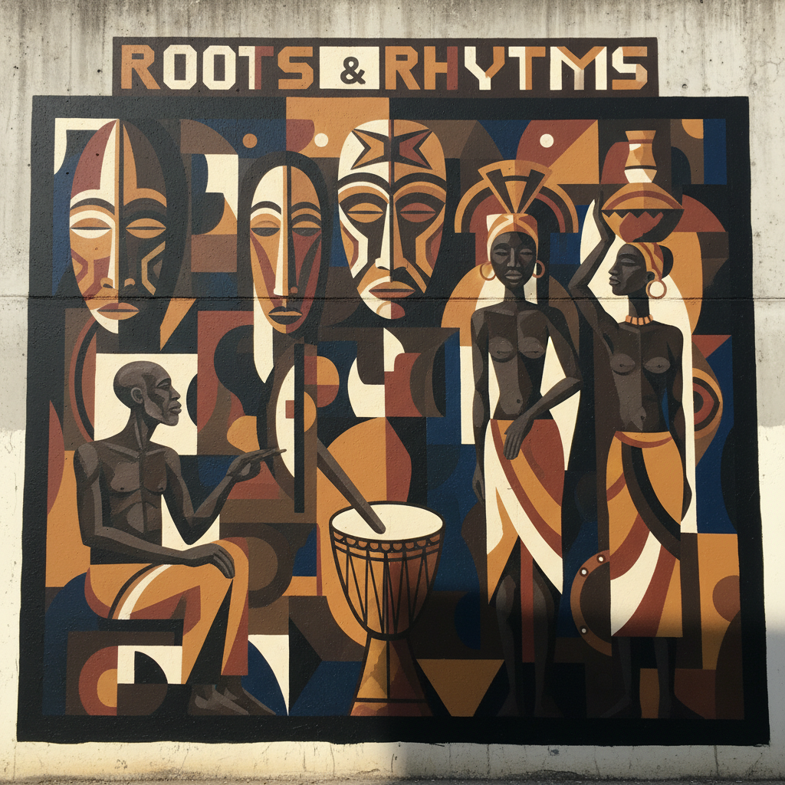

# Charles Alston 查尔斯·阿尔斯顿

> **时期：** 1907–1977  
> **关键词：** 哈莱姆壁画、多媒介大师、黑人现代主义、导师

## 概述

Charles Alston 是画家、雕塑家和壁画家，也是哈莱姆文艺复兴的核心组织者。他的工作室"306"是年轻艺术家的聚集地，Jacob Lawrence在此成长。Alston的风格从社会现实主义壁画演变为融合立体主义和非洲雕塑影响的现代主义，他是第一位为纽约市设计公共壁画的非裔美国艺术家。

## 风格特征

- **立体主义与非洲雕塑融合**：将毕加索式的几何分解与非洲面具的形式结合
- **壁画的公共性**：大尺幅作品面向社区，传达历史和社会信息
- **多媒介实践**：绘画、雕塑、插图、壁画均有建树
- **人物的尊严感**：无论风格如何变化，人物始终保持内在的庄严
- **从叙事到抽象**：晚期作品更加自由和抽象，但保持人文关怀

## 代表作品

- *Magic and Medicine*壁画（1936）
- *Walking*（1958）
- *Girl in a Red Dress*（1934）
- *Martin Luther King Jr.*半身像（1970）

## 历史意义

Alston 是哈莱姆文艺复兴到民权运动时期的桥梁人物。作为导师，他培养了Jacob Lawrence等下一代艺术家；作为创作者，他证明了非裔美国艺术家可以在任何媒介和风格中达到最高水平。

## 概念图

