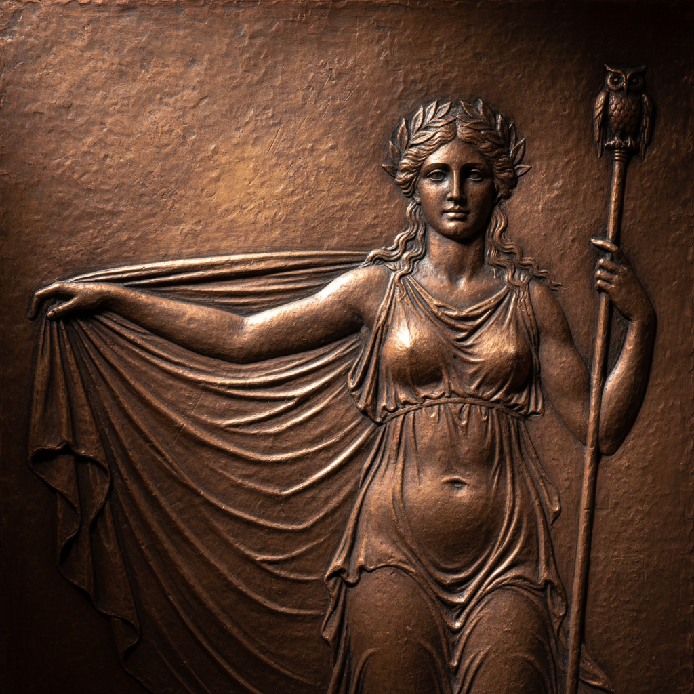

# Chasing and Repoussé Art 錾刻与锤揲艺术

> "Chasing and repoussé are two sides of the same coin — repoussé pushes metal from behind to raise forms, while chasing refines those forms from the front with punches and hammers. Together they transform a flat sheet of metal into a three-dimensional relief without removing any material. The metalsmith works blind from the back, feeling the form emerge under the hammer, then flips the sheet to sharpen every detail from the front." — Unknown

## 概述

錾刻与锤揲艺术（Chasing and Repoussé Art）是一对互补的金属浮雕技法——Repoussé（法语"推回"）从金属板背面用锤子和工具将金属推出形成凸起的浮雕；Chasing（錾刻）则从正面用錾子精修细节和轮廓。这两种技法结合使用，可以在不去除任何金属的情况下将平板金属转化为精美的三维浮雕。

錾刻与锤揲艺术的实践包括：1）锤揲——从背面锤打推出大形；2）錾刻——从正面精修细节；3）退火——反复退火保持金属柔软；4）沥青支撑——使用沥青作为工作支撑；5）高浮雕——创造高度突出的浮雕；6）低浮雕——创造浅浮雕效果；7）当代錾刻锤揲——将传统技法与现代设计结合的创作。

## 核心特征

| 特征 | 描述 |
|------|------|
| 双面 | 正反两面交替工作 |
| 浮雕 | 创造三维浮雕效果 |
| 不减 | 不去除任何金属 |
| 锤打 | 用锤子和工具锤打 |
| 古老 | 数千年的传统 |
| 精密 | 需要极高的技巧 |

## 视觉特征

- **浮雕**：立体的浮雕效果
- **细节**：精细的表面细节
- **流动**：流畅的形态过渡
- **光影**：浮雕产生的光影
- **力量**：锤打的力量感
- **华丽**：华丽精美的整体效果

## 代表作品

| 作品 | 艺术家/文化 | 年代 | 意义 |
|------|-------------|------|------|
| *Mask of Agamemnon* | 迈锡尼 | 公元前16世纪 | 最早的锤揲金面具 |
| *Statue of Liberty skin* | 美国 | 1886年 | 锤揲铜板外壳 |
| *Benvenuto Cellini works* | 意大利 | 16世纪 | 文艺复兴錾刻大师 |
| *Indian repoussé* | 印度 | 传统 | 印度锤揲传统 |
| *Contemporary chasing* | 国际 | 当代 | 当代錾刻艺术 |

## 历史时间线

| 时期 | 事件 |
|------|------|
| 公元前3000年 | 最早的锤揲金属器 |
| 古代 | 各文明的錾刻锤揲传统 |
| 文艺复兴 | 欧洲錾刻的黄金时代 |
| 19世纪 | 工业化对手工錾刻的冲击 |
| 当代 | 錾刻锤揲的艺术化复兴 |

## 中国语境

錾刻与锤揲在中国有极其悠久和精湛的传统。中国的錾刻工艺（錾花）是传统金属工艺的核心技法之一——从商周青铜器到明清金银器都广泛使用。中国的铜器錾刻是国家级非物质文化遗产——以其精湛的技法和丰富的图案著称。中国传统的金银器制作中，锤揲（打作）是最基本的成型技法——将金属板锤打成各种器物形状。中国西藏的铜器锤揲传统极为精湛——佛像和法器的制作大量使用锤揲技法。中国当代的金属艺术家将传统錾刻与现代设计结合——创造出具有当代感的金属浮雕作品。中国的美术院校中，錾刻作为金属工艺的核心课程——培养学生的金属造型能力。

## AI生成概念图

## 与其他风格的关系

- **Metalwork** → 金属工艺
- **Relief Sculpture** → 浮雕
- **Engraving** → 雕刻
- **Silversmithing** → 银器工艺
- **Armor Making** → 甲胄制作
- **Jewelry** → 珠宝艺术

---

*浮光艺志 | Chronicle of Artistry*
