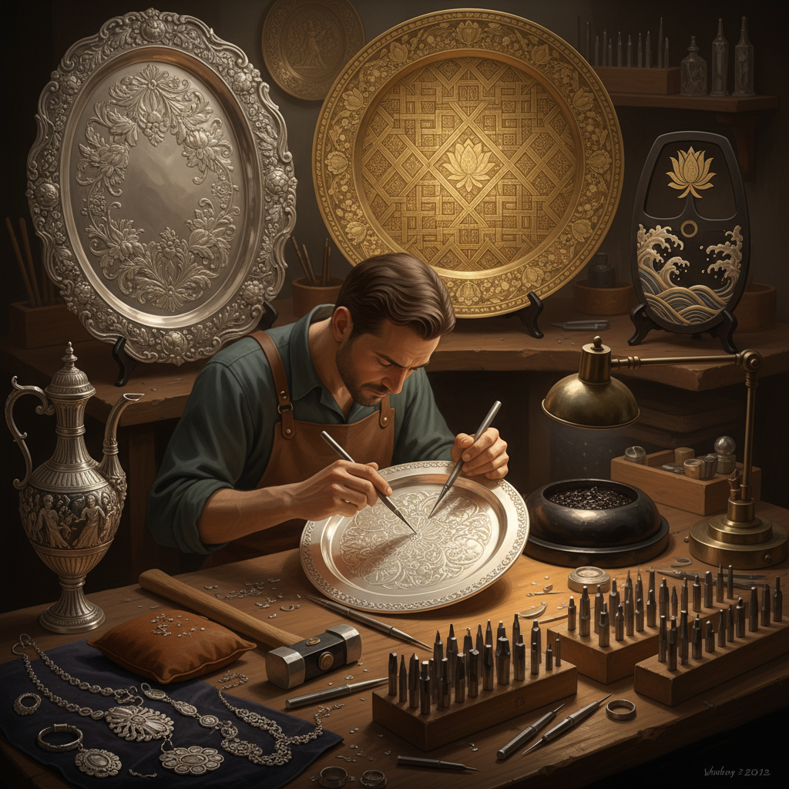

# Chasing Art 錾刻艺术

> "Chasing is drawing with a hammer — each tap of the chasing tool pushes the metal surface into a line, a curve, a texture, without removing any material. Where engraving cuts and carves, chasing merely displaces, moving metal aside to create pattern through pure compression. The chaser's tools number in the hundreds — each one ground to a specific profile, each one leaving its own signature mark in the yielding metal surface." — Unknown

## 概述

錾刻艺术（Chasing Art）是从金属正面使用各种形状的錾子（chasing tools）和锤子在金属表面创造图案和纹理的装饰技法——与repoussé（从背面推出）相对，chasing是从正面精修和添加细节。两种技法通常配合使用，repoussé建立大形，chasing精修细节。

錾刻艺术的实践包括：1）线刻——用线錾在金属表面刻出线条；2）面錾——用平面錾创造平坦区域；3）纹理——用各种纹理錾创造表面质感；4）精修——对repoussé作品进行正面精修；5）文字——在金属上錾刻文字；6）首饰——首饰表面的錾刻装饰；7）当代錾刻——将传统技法与现代设计结合的创作。

## 核心特征

| 特征 | 描述 |
|------|------|
| 正面 | 从正面工作 |
| 不减材 | 不去除金属材料 |
| 精细 | 极其精细的细节 |
| 工具 | 数百种专用工具 |
| 节奏 | 有节奏的锤击 |
| 配合 | 与repoussé配合使用 |

## 视觉特征

- **线条**：精细的錾刻线条
- **纹理**：丰富的表面纹理
- **细节**：极其精细的细节
- **光影**：纹理表面的光影
- **浮雕**：与repoussé配合的浮雕
- **金属**：金属表面的质感

## 代表作品

| 作品 | 艺术家/文化 | 年代 | 意义 |
|------|-------------|------|------|
| *Cellini works* | Benvenuto Cellini | 16世纪 | 文艺复兴錾刻 |
| *Victorian silver* | 英国维多利亚 | 19世纪 | 维多利亚银器 |
| *Indian chased brass* | 印度传统 | 古代至今 | 印度铜器錾刻 |
| *Japanese metalwork* | 日本传统 | 古代至今 | 日本金属工艺 |
| *Contemporary chasing* | Various | 当代 | 当代錾刻艺术 |

## 历史时间线

| 时期 | 事件 |
|------|------|
| 古代 | 最早的錾刻技法 |
| 古典时代 | 希腊罗马的錾刻 |
| 中世纪 | 宗教器物的錾刻 |
| 文艺复兴 | 錾刻艺术的高峰 |
| 当代 | 錾刻的现代传承 |

## 中国语境

錾刻艺术在中国有极其深厚的传统——中国称之为"錾花"或"錾刻"。中国的金银器制作中，錾刻是最重要的装饰技法之一——从商周的青铜器到唐代的金银器，錾刻贯穿了中国金属工艺的整个历史。中国的苗族银饰制作中，錾刻是核心技法——苗族银匠用各种錾子在银片上创造出精美的花鸟虫鱼图案。中国的铜器（如铜锣、铜盆）表面的装饰也多用錾刻技法。中国的景泰蓝制作中，铜胎表面的纹理处理也涉及錾刻。中国当代的一些金属工艺师继承和发展了传统錾刻技法——将其应用于当代首饰和器物设计。中国的非物质文化遗产中，多项金属工艺都包含錾刻技法——如花丝镶嵌、苗银制作等。

## AI生成概念图

## 与其他风格的关系

- **Repoussé** → 锤揲艺术
- **Engraving** → 雕刻艺术
- **Silversmithing** → 银器艺术
- **Goldsmithing** → 金器艺术
- **Metal Art** → 金属艺术
- **Jewelry Art** → 珠宝艺术

---

*浮光艺志 | Chronicle of Artistry*
