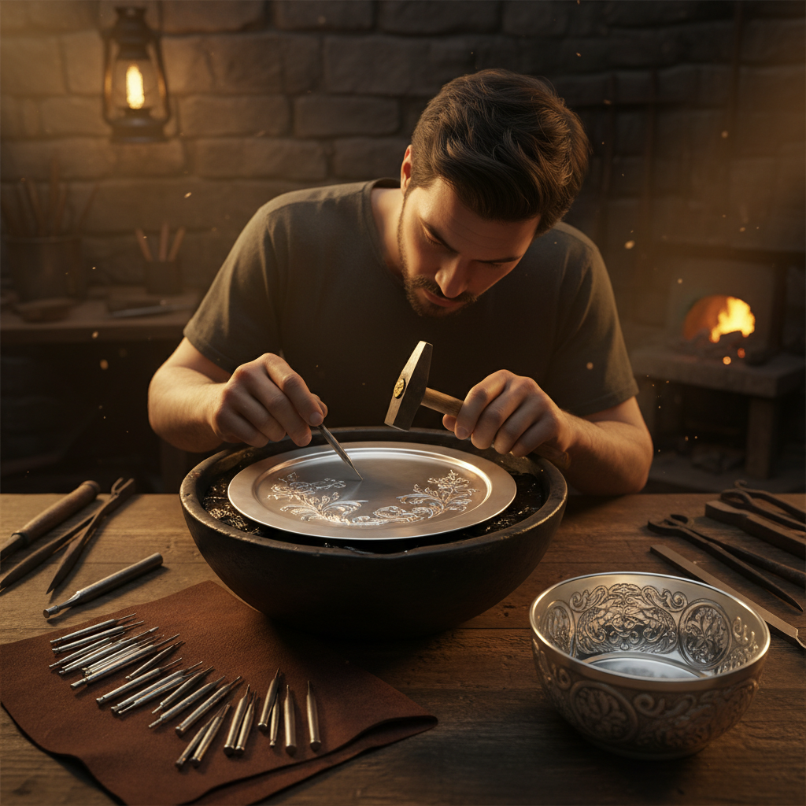

# Chasing 錾刻工艺

> "Chasing is drawing on metal with a hammer — each tap a precise mark that builds a world in relief." — Unknown

## 概述

錾刻工艺（Chasing）是从金属正面使用各种形状的錾子（punches）和锤子在金属表面创造浮雕图案的技法。与锤揲（Repoussé）从背面推出不同，錾刻从正面工作，将金属向下压入，精细地定义细节和纹理。实际操作中，錾刻和锤揲通常配合使用——先从背面推出大形，再从正面錾刻细节。錾刻不去除任何金属，只是移动和压缩它，这使得极薄的金属板也能承受精细的装饰。

錾刻的哲学在于：加法的减法——不切割、不去除，只是重新分配金属的位置，用压力创造出深度和细节。

## 核心特征

| 特征 | 描述 |
|------|------|
| 正面 | 从金属正面工作 |
| 錾子 | 使用各种形状的錾子 |
| 锤击 | 锤子驱动錾子 |
| 细节 | 精细的细节定义 |
| 配合 | 常与锤揲配合 |
| 无损 | 不去除金属材料 |

## 视觉特征

- **细节**：精细的表面细节
- **纹理**：丰富的表面纹理
- **浮雕**：低浮雕效果
- **线条**：錾刻的线条痕迹
- **质感**：独特的锤击质感
- **层次**：前后层次的深度

## 代表作品

| 作品 | 艺术家 | 年代 | 意义 |
|------|--------|------|------|
| *Ancient Greek armor* | 匿名 | 古希腊 | 希腊盔甲装饰 |
| *Medieval church silver* | 匿名 | 中世纪 | 教会银器 |
| *Cellini works* | Benvenuto Cellini | 16世纪 | 文艺复兴錾刻 |
| *Indian repousse/chasing* | 匿名 | 传统 | 印度金属工艺 |
| *Contemporary metalwork* | Various | 当代 | 当代錾刻艺术 |

## 历史时间线

| 时期 | 事件 |
|------|------|
| 青铜时代 | 最早的錾刻装饰 |
| 古希腊-罗马 | 盔甲和器物的錾刻 |
| 中世纪 | 教会器物的精细錾刻 |
| 文艺复兴 | Cellini等大师的作品 |
| 18-19世纪 | 银器錾刻的黄金时代 |
| 当代 | 当代金属艺术中的錾刻 |

## 中国语境

中国的錾刻工艺历史悠久——称为"錾花"或"錾刻"，是中国传统金银器制作的核心技法之一。唐代金银器上的精美錾刻图案代表了中国古代金属装饰的最高水平。中国传统錾刻使用的工具和技法与西方有所不同，但基本原理相同。当代中国的金属工艺师仍在传承錾刻技法，特别是在银饰和铜器制作中。

## AI生成概念图

## 与其他风格的关系

- **Repoussé** → 锤揲是錾刻的背面配合
- **Engraving** → 雕刻去除金属，錾刻不去除
- **Metalwork** → 金属装饰工艺
- **Silversmithing** → 银器錾刻
- **Goldsmithing** → 金器錾刻
- **Relief Sculpture** → 金属浮雕

---

*浮光艺志 | Chronicle of Artistry*
