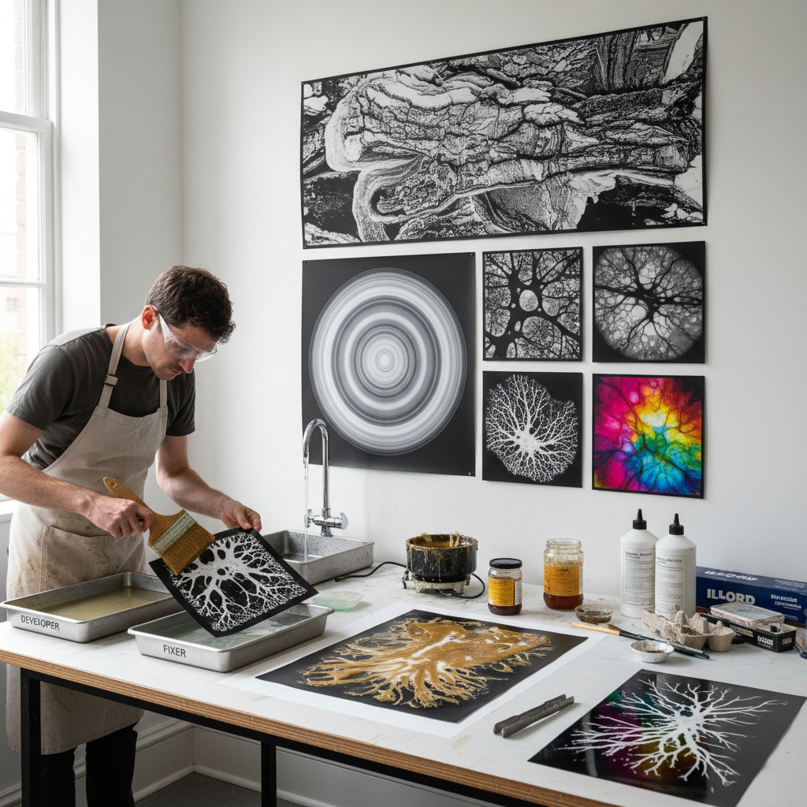

# Chemigram 化学图

> "A chemigram is a photograph made without light and without a camera — photographic paper attacked directly by chemistry, fixer and developer wrestling on the emulsion surface, their battle lines frozen into abstract patterns of black and white and every silver tone between." — Unknown

## 概述

化学图（Chemigram）是一种不使用相机或光线，而是直接在相纸上使用化学药品（显影液和定影液）创造图像的实验性摄影技法。化学图由比利时艺术家Pierre Cordier在1956年发明。艺术家在室内光线下（不需要暗房）将显影液和定影液直接涂抹、滴落或泼洒在相纸上，两种化学药品在相纸乳剂上的相互作用产生丰富的黑白色调和纹理。

化学图的核心原理：显影液使相纸乳剂中的银盐变黑（显影），定影液使银盐溶解变白（定影）。通过控制两种药品的接触顺序、时间和方式，以及使用抗蚀剂（蜡、油脂、清漆等）保护某些区域，艺术家可以创造出复杂的图案和纹理。化学图结合了摄影的化学过程和绘画的手工控制。

## 核心特征

| 特征 | 描述 |
|------|------|
| 无光 | 不需要光线曝光 |
| 化学 | 直接化学反应 |
| 相纸 | 使用银盐相纸 |
| 抗蚀 | 使用抗蚀剂 |
| 即兴 | 即兴的创作过程 |
| 独特 | 每件作品独一无二 |

## 视觉特征

- **黑白**：丰富的黑白色调
- **纹理**：复杂的化学纹理
- **有机**：有机的图案形态
- **对比**：强烈的明暗对比
- **抽象**：抽象的视觉效果
- **偶然**：偶然性的美感

## 代表作品

| 作品 | 艺术家 | 年代 | 意义 |
|------|--------|------|------|
| *Chemigrams* | Pierre Cordier | 1956起 | 技法的发明 |
| *Abstract chemigrams* | Various | 当代 | 抽象化学图 |
| *Large scale chemigrams* | Various | 当代 | 大型化学图 |
| *Color chemigrams* | Various | 当代 | 彩色化学图 |
| *Mixed process chemigrams* | Various | 当代 | 混合工艺化学图 |

## 历史时间线

| 时期 | 事件 |
|------|------|
| 1956年 | Pierre Cordier发明chemigram |
| 1960-70年代 | 技法的发展和展览 |
| 1990年代 | 替代摄影运动中的推广 |
| 2000年代 | 全球艺术家的广泛采用 |
| 当代 | 化学图的持续创新 |

## 中国语境

化学图在中国的实验摄影和当代艺术领域有逐步的发展。中国的摄影艺术院校在替代摄影课程中介绍化学图技法。中国的一些实验摄影艺术家使用化学图创作抽象作品——将化学图的偶然性和过程性与中国传统水墨的"意在笔先"理念对话。随着传统暗房摄影在中国的复兴，化学图作为一种不需要相机的摄影创作方式受到越来越多的关注。

## AI生成概念图

## 与其他风格的关系

- **Lumen Printing** → 光敏印刷
- **Photogram** → 光影图
- **Abstract Photography** → 抽象摄影
- **Alternative Photography** → 替代摄影
- **Process Art** → 过程艺术
- **Darkroom Art** → 暗房艺术

---

*浮光艺志 | Chronicle of Artistry*
