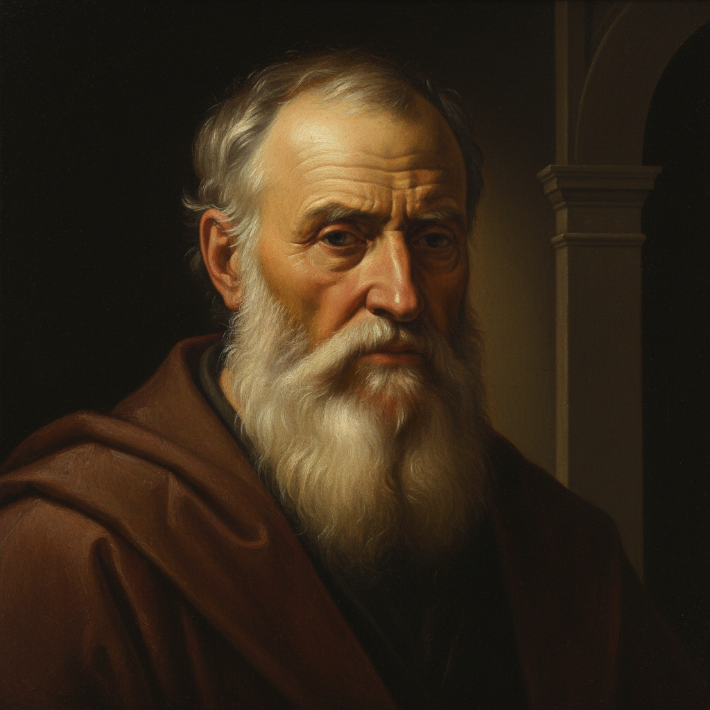

# Chiaroscuro Painting 明暗法绘画

> **时期：** 15世纪–至今  
> **关键词：** 光影对比、立体感、达芬奇、伦勃朗、体积塑造

## 概述

Chiaroscuro Painting（明暗法绘画，意大利语"chiaro"明+"scuro"暗）是文艺复兴以来最重要的绘画技法之一——通过光与影的渐变过渡来塑造三维立体感。达芬奇用它让蒙娜丽莎的面庞从背景中浮现，伦勃朗用它让人物仿佛被内在的光芒照亮。明暗法不仅是技术手段，更是一种哲学：在光明与黑暗的交界处，形体获得了生命。

## 风格特征

- **渐变过渡**：从亮到暗的柔和转换
- **体积塑造**：通过光影表现三维形体
- **空间深度**：明暗层次创造纵深感
- **情感表达**：光线暗示精神状态
- **统一光源**：逻辑一致的照明方向

## 代表人物与作品

- 列奥纳多·达芬奇《蒙娜丽莎》
- 伦勃朗《夜巡》自画像系列
- 卡拉瓦乔 宗教场景
- 弗朗西斯科·德·苏巴朗 静物

## 概念图

