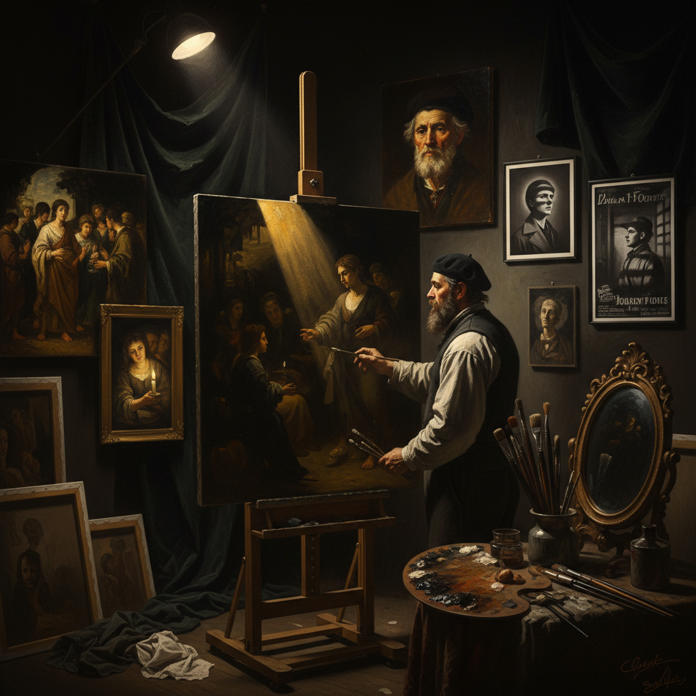

# Chiaroscuro Technique 明暗法

> "Chiaroscuro is the drama of light against darkness — the bold contrast between illumination and shadow that gives flat surfaces the illusion of three-dimensional form, turning paint into sculpture and canvas into theater, the technique that allowed Caravaggio to pull his figures from absolute blackness into blinding light as if a single candle could reveal the entire truth of human existence." — Unknown

## 概述

明暗法（Chiaroscuro），来自意大利语"chiaro"（明亮）和"oscuro"（黑暗），是一种通过强烈的明暗对比来创造立体感、戏剧性和氛围的绘画技法。Chiaroscuro不仅仅是简单的明暗处理——它特指那种极端的、戏剧性的光暗对比，其中光源通常是单一的、强烈的、方向性的，而阴影则是深邃的、几乎是纯黑的。

Chiaroscuro在文艺复兴晚期和巴洛克时期达到鼎盛。列奥纳多·达·芬奇首先系统地研究了光影关系，但将chiaroscuro推向极致的是卡拉瓦乔（Caravaggio）——他的"暗色主义"（tenebrism）将人物置于几乎全黑的背景中，用强烈的侧光照亮局部，创造出戏剧性的舞台效果。伦勃朗则将chiaroscuro发展为一种更加微妙和心理化的表达工具。

## 核心特征

| 特征 | 描述 |
|------|------|
| 强对比 | 极端的明暗对比 |
| 单光源 | 通常为单一光源 |
| 戏剧性 | 戏剧性的光影效果 |
| 立体感 | 强烈的三维立体感 |
| 氛围 | 创造强烈的氛围 |
| 聚焦 | 光线引导视线聚焦 |

## 视觉特征

- **黑暗**：深邃的黑色背景
- **光亮**：强烈的局部照明
- **对比**：极端的明暗对比
- **戏剧**：戏剧性的舞台感
- **立体**：强烈的体积感
- **神秘**：神秘的氛围

## 代表作品

| 作品 | 艺术家 | 年代 | 意义 |
|------|--------|------|------|
| *The Calling of St Matthew* | Caravaggio | 1599-1600 | 卡拉瓦乔明暗法杰作 |
| *The Night Watch* | Rembrandt | 1642 | 伦勃朗的光影大师作 |
| *Judith Beheading Holofernes* | Artemisia Gentileschi | 1620 | 真蒂莱斯基的明暗法 |
| *The Anatomy Lesson* | Rembrandt | 1632 | 伦勃朗的解剖课 |
| *St. Jerome Writing* | Caravaggio | 1605-1606 | 卡拉瓦乔圣杰罗姆 |

## 历史时间线

| 时期 | 事件 |
|------|------|
| 文艺复兴 | 达芬奇的光影研究 |
| 16世纪末 | 卡拉瓦乔的暗色主义 |
| 17世纪 | 巴洛克明暗法的鼎盛 |
| 18-19世纪 | 明暗法的学院化 |
| 当代 | 明暗法在摄影和电影中的应用 |

## 中国语境

明暗法在中国的西方绘画教育中是核心概念之一。中国的美术院校在素描和油画教学中强调明暗关系的训练。中国的写实油画传统深受伦勃朗和卡拉瓦乔的影响。有趣的是，中国传统绘画中并不追求西方式的明暗法——中国画使用"散点透视"和"平面化"的表现方式。但当代中国的一些摄影师和电影摄影师大量使用chiaroscuro式的布光。中国的戏曲舞台灯光中也有类似的明暗对比效果。

## AI生成概念图

## 与其他风格的关系

- **Tenebrism** → 暗色主义
- **Sfumato** → 晕涂法
- **Baroque** → 巴洛克
- **Caravaggio** → 卡拉瓦乔
- **Rembrandt** → 伦勃朗
- **Film Noir** → 黑色电影

---

*浮光艺志 | Chronicle of Artistry*
