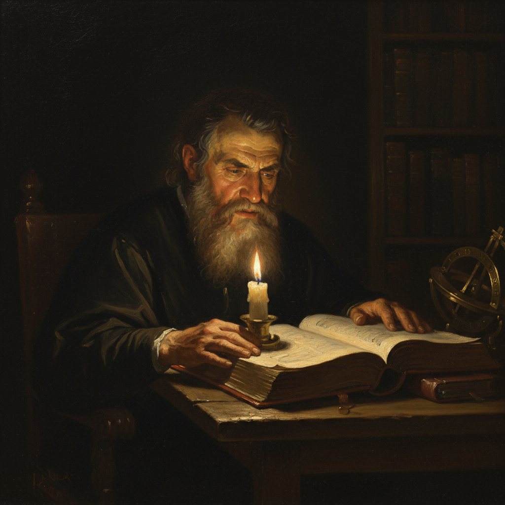

# Chiaroscuro 明暗法

> "Where there is much light, the shadow is deep." — Goethe

## 概述

明暗法（Chiaroscuro，意大利语 chiaro"明亮" + oscuro"黑暗"）是西方绘画中通过强烈的明暗对比来创造三维立体感和戏剧性效果的核心技法。从文艺复兴到巴洛克，从伦勃朗到电影摄影，明暗法是西方视觉艺术最基本的造型语言之一。

广义上，所有使用明暗来塑造体积的绘画都运用了明暗法；狭义上，它特指文艺复兴和巴洛克时期那种强烈的、戏剧性的光影对比——尤其是卡拉瓦乔式的暗色主义（Tenebrism）。

## 核心特征

| 特征 | 描述 |
|------|------|
| 明暗对比 | 强烈的光明与黑暗的对比 |
| 体积塑造 | 通过光影创造三维立体感 |
| 戏剧效果 | 光线如舞台聚光灯般的戏剧性 |
| 定向光源 | 清晰的、单一的光源方向 |
| 情绪营造 | 通过光影创造特定的情绪氛围 |
| 视觉引导 | 光线引导观者的视线 |

## 视觉特征

- **光线**：强烈的定向光，通常从侧面或上方
- **阴影**：深沉的、有层次的阴影
- **对比**：从纯白到纯黑的完整明暗范围
- **体积**：强烈的三维立体感
- **背景**：常为深色或黑色背景
- **焦点**：光线集中在画面的焦点区域

## 发展阶段

| 阶段 | 时期 | 代表 | 特点 |
|------|------|------|------|
| 早期 | 15世纪 | 达·芬奇 | 柔和的明暗过渡 |
| 盛期 | 16世纪 | 拉斐尔、提香 | 平衡的明暗处理 |
| 极端 | 1600年代 | 卡拉瓦乔 | 暗色主义（Tenebrism） |
| 黄金时代 | 17世纪 | 伦勃朗 | 温暖的金色明暗 |
| 现代 | 19-20世纪 | 电影摄影 | Film Noir 黑色电影 |

## 代表人物

| 画家 | Chiaroscuro 特点 | 时期 |
|------|-----------------|------|
| Leonardo da Vinci | 柔和的 sfumato 式明暗 | 文艺复兴 |
| Caravaggio | 极端的暗色主义 | 巴洛克 |
| Rembrandt | 温暖的金色明暗 | 荷兰黄金时代 |
| Georges de La Tour | 烛光场景 | 法国巴洛克 |
| Francisco de Zurbarán | 西班牙宗教画的强烈明暗 | 西班牙巴洛克 |
| Joseph Wright of Derby | 科学实验中的烛光 | 启蒙时代 |

## 与其他技法的关系

- **Sfumato** → 明暗法的极致柔化版本
- **Tenebrism** → 明暗法的极端化——卡拉瓦乔式
- **Glazing** → 透明罩染是建立明暗层次的手段
- **Grisaille** → 纯灰色的明暗练习
- **Film Noir** → 明暗法在电影中的直接应用
- **Rembrandt Lighting** → 摄影中的"伦勃朗光"

## 概念图

---

*浮光艺志 | Chronicle of Artistry*
