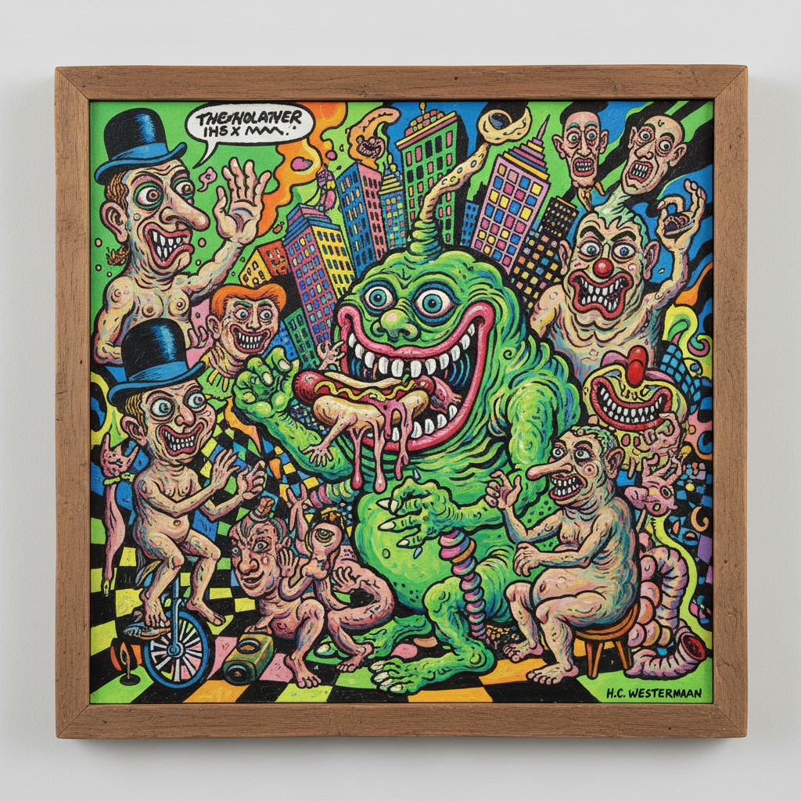

# Chicago Imagists 芝加哥意象派

> **时期：** 1960年代–1970年代  
> **关键词：** 怪诞具象、漫画影响、鲜艳色彩、芝加哥、反主流

## 概述

Chicago Imagists（芝加哥意象派）是1960年代在芝加哥艺术学院周围形成的一群画家，以"毛茸茸的谁"（Hairy Who）等展览团体闻名。他们从漫画、民间艺术、超现实主义和芝加哥街头文化中汲取灵感，创造出一种怪诞、幽默、色彩鲜艳的具象绘画——在纽约极简主义和波普艺术主导的年代，走出了一条完全不同的道路。

## 风格特征

- **怪诞人物**：扭曲、幽默、带有性暗示的形象
- **鲜艳色彩**：荧光色和高饱和度
- **漫画影响**：粗黑轮廓线和平涂
- **精细工艺**：小尺幅的精密绘制
- **反主流**：拒绝纽约艺术界的品味标准

## 代表人物与作品

- 吉姆·纳特 怪诞人物
- 格拉迪斯·尼尔森 有机形态
- 卡尔·沃瑟姆 漫画式绘画
- 芭芭拉·罗西 图案人物

## 概念图

