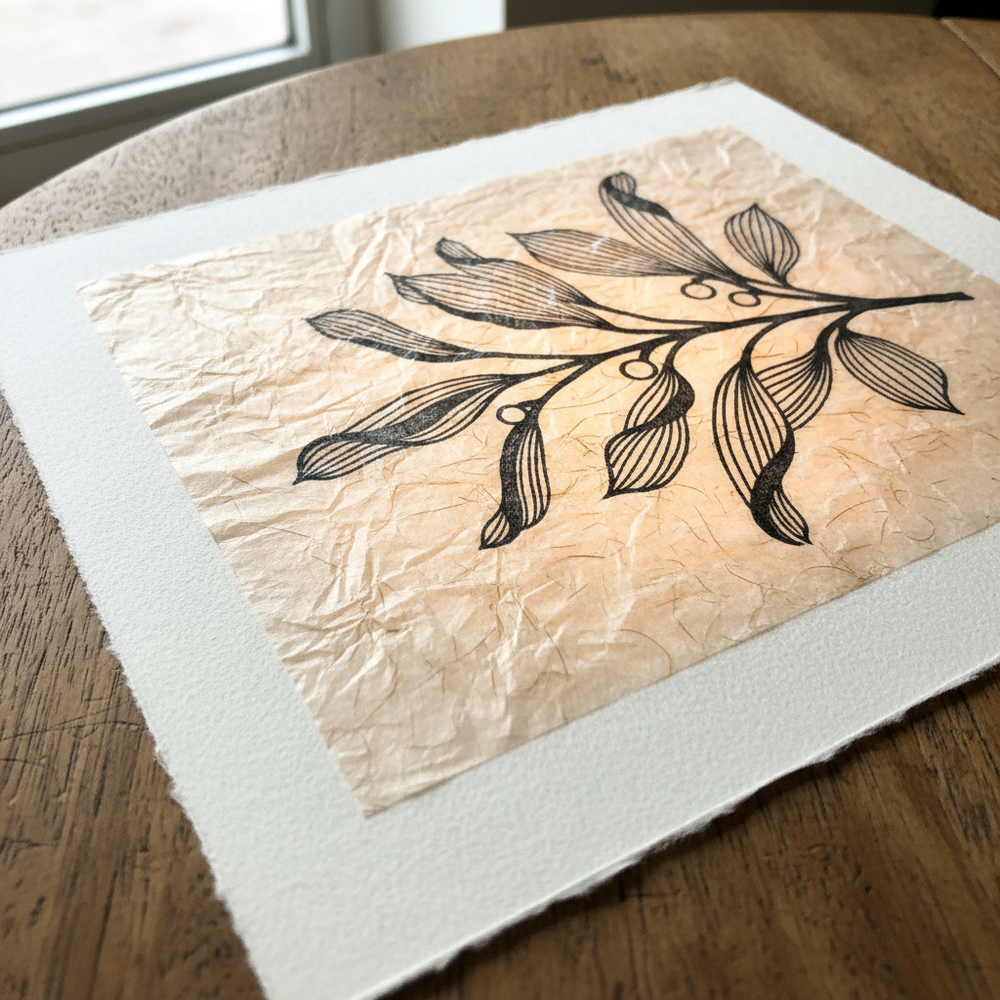

# Chine-Collé Art 薄纸拼贴版画艺术

> "Chine-collé is printmaking's whisper — a tissue-thin sheet of delicate paper is simultaneously printed and bonded to a heavier support in one pass through the press, creating a luminous ground that glows beneath the ink. The technique adds color, texture, and a floating quality to prints, as if the image hovers on a cloud of Japanese tissue or Indian chiffon." — Unknown

## 概述

薄纸拼贴版画艺术（Chine-Collé Art）是一种在版画印刷过程中将薄纸（如日本纸、印度纸或中国宣纸）同时粘贴到较厚的承印纸上的技法——在一次通过印刷机的过程中完成印刷和粘贴。Chine-collé为版画增加了色彩、纹理和一种漂浮的视觉品质。

薄纸拼贴版画艺术的实践包括：1）薄纸选择——选择合适的薄纸（日本纸、宣纸等）；2）裁切——将薄纸裁切为所需形状；3）涂胶——在薄纸背面涂布粘合剂；4）放置——将薄纸放在版面上；5）印刷——一次通过印刷机完成印刷和粘贴；6）色彩薄纸——使用有色薄纸增加色彩；7）当代Chine-collé——将传统技法与现代创作结合。

## 核心特征

| 特征 | 描述 |
|------|------|
| 薄纸 | 使用薄纸作为底层 |
| 同时 | 印刷和粘贴同时完成 |
| 发光 | 薄纸的发光效果 |
| 纹理 | 增加纹理和色彩 |
| 漂浮 | 漂浮的视觉品质 |
| 精致 | 精致的工艺要求 |

## 视觉特征

- **发光**：薄纸的发光品质
- **漂浮**：图像漂浮的感觉
- **纹理**：薄纸的独特纹理
- **色彩**：有色薄纸的色彩
- **层次**：纸张层次的深度
- **精致**：精致优雅的效果

## 代表作品

| 作品 | 艺术家/文化 | 年代 | 意义 |
|------|-------------|------|------|
| *Edgar Degas monotypes* | 法国 | 1870-90年代 | 德加的薄纸拼贴 |
| *Henri de Toulouse-Lautrec* | 法国 | 1890年代 | 劳特累克的石版画 |
| *Japanese ukiyo-e with chine* | 日本 | 19世纪 | 浮世绘中的薄纸技法 |
| *Contemporary chine-collé* | 国际 | 当代 | 当代薄纸拼贴版画 |
| *Mixed media chine-collé* | 国际 | 当代 | 混合媒体薄纸拼贴 |

## 历史时间线

| 时期 | 事件 |
|------|------|
| 18世纪 | Chine-collé技法的起源 |
| 19世纪 | 在欧洲版画中的广泛使用 |
| 印象派时期 | 德加等艺术家的使用 |
| 20世纪 | 技法的持续发展 |
| 当代 | Chine-collé的创新应用 |

## 中国语境

Chine-collé与中国有直接的历史联系——"Chine"一词即指中国纸。中国的宣纸和皮纸是Chine-collé技法中最常用的薄纸材料——中国纸的轻薄、强韧和吸墨性使其成为理想选择。中国的版画教育中，Chine-collé作为重要的版画技法——在各大美术院校教授。中国当代的版画艺术家将Chine-collé与中国传统纸张结合——利用宣纸的独特质感创造作品。中国的手工纸产业为国际版画界提供了大量的Chine-collé用纸——中国纸在这一领域有不可替代的地位。中国的版画展览中，使用Chine-collé技法的作品——因其精致的纸张效果而受到关注。

## AI生成概念图

## 与其他风格的关系

- **Intaglio** → 凹版印刷
- **Lithography** → 石版印刷
- **Collage** → 拼贴
- **Japanese Paper** → 日本纸
- **Printmaking** → 版画
- **Mixed Media** → 混合媒体

---

*浮光艺志 | Chronicle of Artistry*
