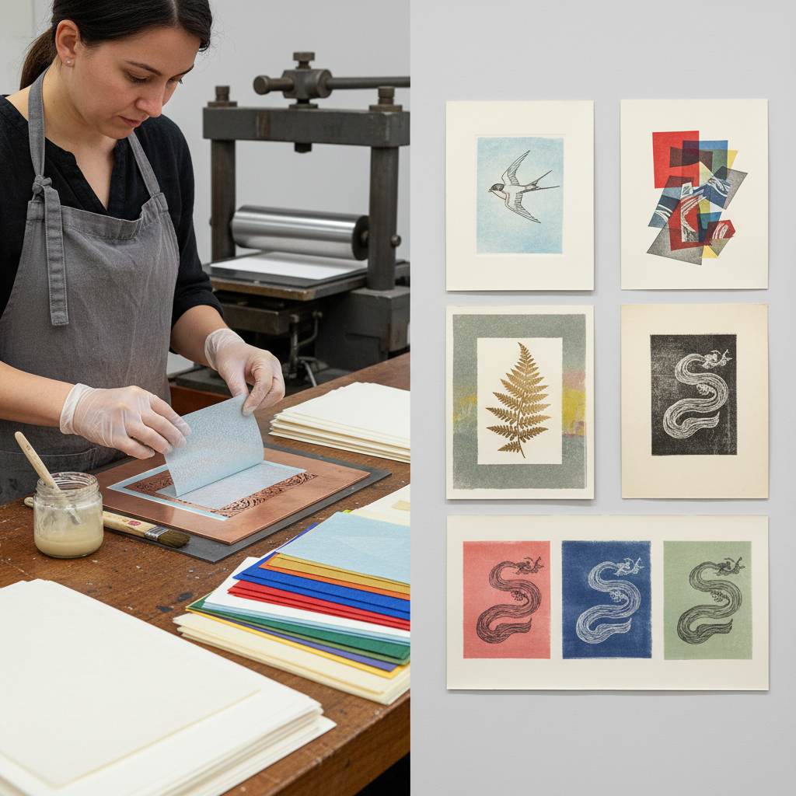

# Chine-Collé 薄纸拼贴版画

> "Chine-collé is printmaking's marriage of East and West — delicate Asian papers bonded to heavy European stock in the moment of impression, adding color, texture, and luminosity that ink alone cannot achieve." — Unknown

## 概述

薄纸拼贴版画（Chine-Collé）是一种将薄纸（通常是东方纸张如中国宣纸、日本和纸）在印刷过程中同时粘贴到较厚的承印纸上的版画技法。"Chine"指中国纸（泛指东方薄纸），"Collé"是法语"粘贴"的意思。在印刷时，薄纸被放置在版面和承印纸之间，通过印刷机的压力和预先涂抹的粘合剂，薄纸同时接受油墨印迹并粘合到底纸上。

Chine-Collé的优势在于：薄纸的纤维更细腻，能接受更精细的印迹；薄纸可以预先染色，为画面增加色彩底色；不同质感和颜色的薄纸可以拼贴组合，创造丰富的视觉层次；薄纸的半透明性产生独特的光泽感。这种技法在19世纪的法国版画中广泛使用，当代版画家继续发展其创造性应用。

## 核心特征

| 特征 | 描述 |
|------|------|
| 薄纸 | 使用东方薄纸 |
| 粘贴 | 印刷中同时粘贴 |
| 精细 | 更精细的印迹 |
| 色彩 | 薄纸增加色彩 |
| 层次 | 丰富的视觉层次 |
| 质感 | 独特的纸张质感 |

## 视觉特征

- **精细**：精细的印迹质量
- **层次**：纸张的层次感
- **色彩**：薄纸的色彩底色
- **质感**：不同纸张的质感
- **边缘**：薄纸的撕裂边缘
- **光泽**：半透明的光泽感

## 代表作品

| 作品 | 艺术家 | 年代 | 意义 |
|------|--------|------|------|
| *19th century French prints* | Various | 19世纪 | 法国版画传统 |
| *Japanese woodblock prints* | Various | 传统 | 日本版画中的应用 |
| *Contemporary chine-collé* | Various | 当代 | 当代创新应用 |
| *Mixed media prints* | Various | 当代 | 混合媒介版画 |
| *Artist books* | Various | 当代 | 艺术家书籍 |

## 历史时间线

| 时期 | 事件 |
|------|------|
| 18世纪 | Chine-Collé技法的早期使用 |
| 19世纪 | 法国版画中的广泛应用 |
| 19世纪 | 东方纸张在欧洲版画中的流行 |
| 20世纪 | 当代版画家的创新发展 |
| 当代 | Chine-Collé在混合媒介中的应用 |
| 当代 | 版画教育中的标准技法 |

## 中国语境

Chine-Collé与中国有天然的联系——"Chine"本身就指中国纸。中国的宣纸和其他手工纸是Chine-Collé技法的理想材料。中国的版画教育中，Chine-Collé作为一种高级版画技法被教授。中国的版画家在创作中使用各种中国传统手工纸进行Chine-Collé创作。中国丰富的手工纸传统（宣纸、皮纸、麻纸等）为Chine-Collé提供了独特的材料选择。

## AI生成概念图

## 与其他风格的关系

- **Intaglio** → 凹版画
- **Lithography** → 石版画
- **Collage** → 拼贴
- **Paper Art** → 纸艺
- **Mixed Media** → 混合媒介
- **Artist Books** → 艺术家书籍

---

*浮光艺志 | Chronicle of Artistry*
