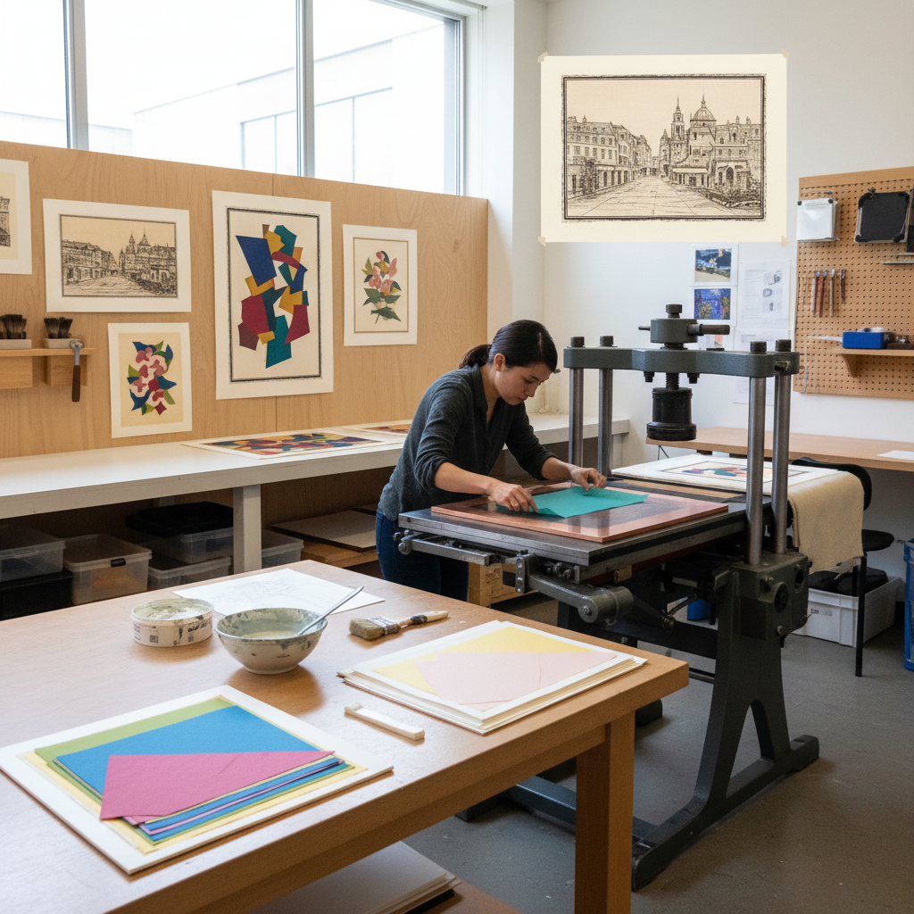

# Chine-collé 薄纸拼贴版画

> "Chine-collé is printmaking's most elegant marriage — a thin sheet of delicate paper bonded to a heavier support in the same pass through the press that transfers the image, the fragile Asian tissue becoming both ground and element, its color and texture adding a luminous dimension that transforms the print from ink on paper into something closer to a precious object, a jewel mounted in its own setting." — Unknown

## 概述

薄纸拼贴版画（Chine-collé），法语意为"Chinese gluing"（中国粘贴），是一种在版画印刷过程中将薄纸（通常是日本纸、中国宣纸或其他轻薄纸张）同时粘贴到较厚的支撑纸上的技法。在印刷时，薄纸放在版面和支撑纸之间，涂有粘合剂的一面朝向支撑纸——当印刷机的压力将油墨从版面转印到薄纸正面的同时，也将薄纸粘合到支撑纸上。

Chine-collé的名称来源于早期使用的中国薄纸（China paper）。这种技法有多重优势：薄纸比厚纸更能捕捉精细的线条和色调；薄纸的颜色和纹理为印刷品增加了额外的视觉层次；薄纸可以被裁剪成特定形状，创造拼贴效果。当代艺术家将chine-collé发展为一种独立的创作手段——使用各种彩色和纹理纸张创造复杂的拼贴版画。

## 核心特征

| 特征 | 描述 |
|------|------|
| 薄纸 | 使用轻薄纸张 |
| 同步 | 印刷和粘贴同步 |
| 层次 | 增加视觉层次 |
| 精细 | 捕捉更精细的细节 |
| 拼贴 | 可创造拼贴效果 |
| 色彩 | 纸张颜色增加色彩 |

## 视觉特征

- **层次**：多层次的纸张效果
- **精细**：极其精细的印刷质量
- **色彩**：薄纸的色彩层次
- **纹理**：不同纸张的纹理
- **边缘**：薄纸的柔和边缘
- **珍贵**：珍贵的手工质感

## 代表作品

| 作品 | 艺术家 | 年代 | 意义 |
|------|--------|------|------|
| *19th century chine-collé prints* | Various | 19世纪 | 经典薄纸拼贴版画 |
| *Picasso chine-collé prints* | Pablo Picasso | 20世纪 | 毕加索薄纸拼贴 |
| *Contemporary chine-collé* | Various | 当代 | 当代薄纸拼贴创新 |
| *Color chine-collé* | Various | 当代 | 彩色薄纸拼贴 |
| *Shaped chine-collé* | Various | 当代 | 异形薄纸拼贴 |

## 历史时间线

| 时期 | 事件 |
|------|------|
| 18世纪 | Chine-collé的早期实践 |
| 19世纪 | 在欧洲版画中的广泛应用 |
| 20世纪 | 现代艺术家的创新应用 |
| 1980年代 | 当代chine-collé的复兴 |
| 当代 | 作为独立创作手段的发展 |

## 中国语境

Chine-collé与中国有直接的历史渊源——这种技法的名称就来自中国纸（China paper）。中国的宣纸和皮纸是chine-collé的理想材料——薄而强韧，能够捕捉极其精细的印刷细节。中国的版画教育中教授chine-collé技法。中国的一些当代版画家在创作中使用chine-collé——将中国传统纸张的美学与西方版画技法结合。中国丰富的手工纸传统为chine-collé提供了独特的材料资源。

## AI生成概念图

## 与其他风格的关系

- **Printmaking** → 版画
- **Collage** → 拼贴
- **Paper Art** → 纸艺
- **Intaglio** → 凹版
- **Japanese Paper** → 日本纸
- **Mixed Media** → 混合媒介

---

*浮光艺志 | Chronicle of Artistry*
