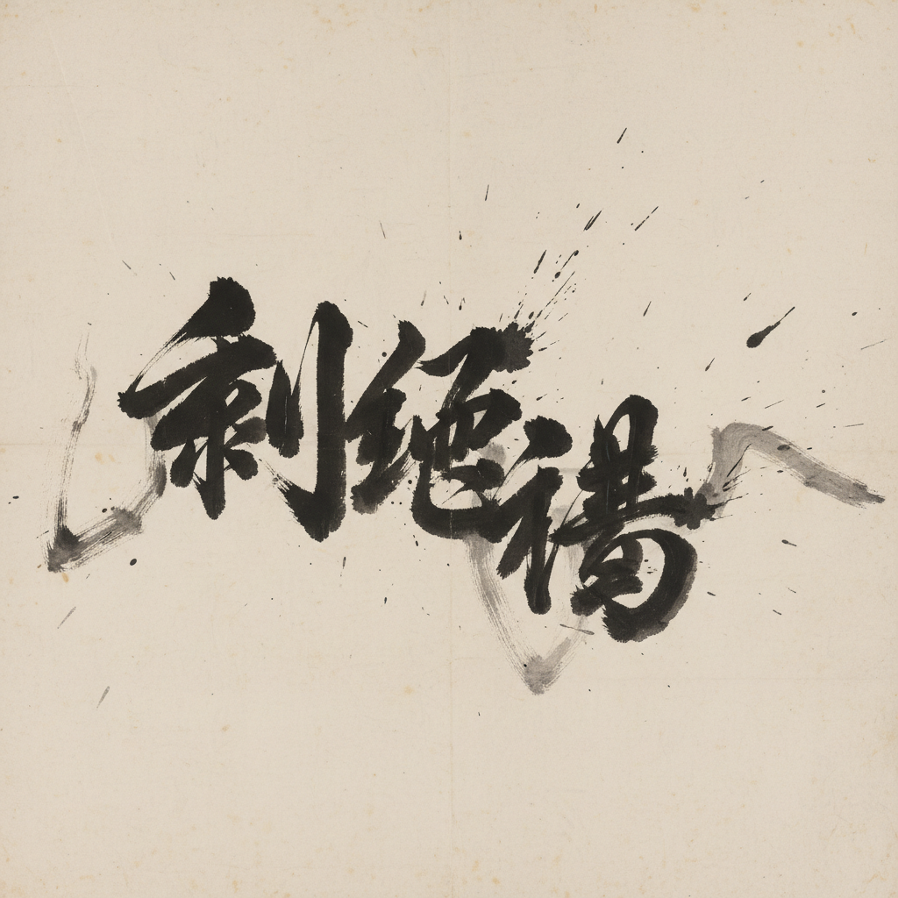

# Chinese Calligraphy 中国书法

> **时期：** 公元前1300年–至今  
> **关键词：** 毛笔墨韵、气韵生动、书体演变、文人精神、线条艺术

## 概述

Chinese Calligraphy（中国书法）是以毛笔、墨、纸为工具的线条艺术，从甲骨文到当代书法已有三千余年历史。它不仅是文字书写，更是一种通过笔画的轻重缓急、墨色的浓淡干湿来表达生命节奏和精神境界的艺术形式——每一笔都是身体、呼吸和意念的统一。

## 风格特征

- **笔法**：中锋、侧锋、藏锋、露锋的运笔变化
- **墨法**：浓、淡、干、湿、焦的墨色层次
- **结构**：字形的间架结构和空间分布
- **章法**：整幅作品的布局和气韵贯通
- **五体**：篆、隶、楷、行、草的书体系统

## 代表人物与作品

- 王羲之《兰亭集序》（行书圣品）
- 颜真卿《祭侄文稿》（楷书典范）
- 张旭《古诗四帖》（狂草）
- 怀素《自叙帖》（草书）

## 概念图

