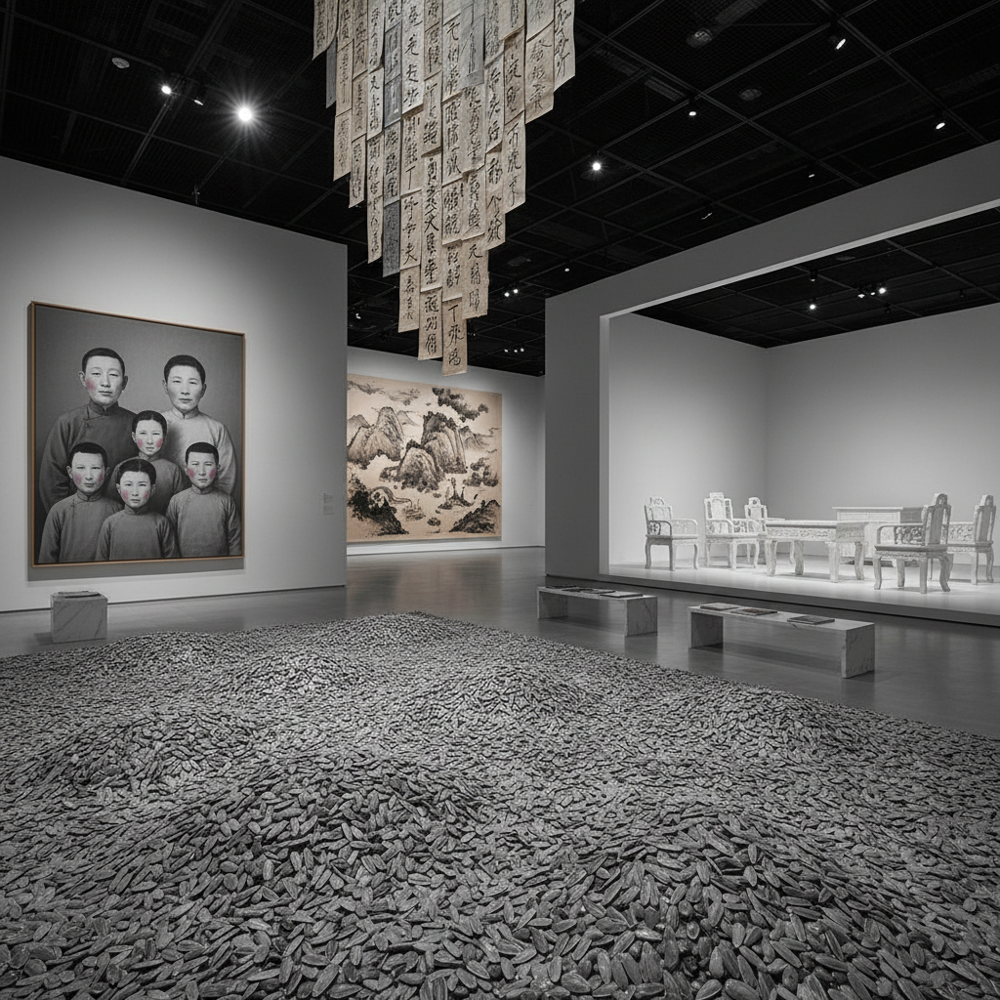

# Chinese Contemporary Art 中国当代艺术

> "Chinese contemporary art is the story of a civilization in fast-forward — of artists who witnessed their country transform from collective farms to megacities in a single generation, who inherited both five thousand years of ink painting tradition and the revolutionary aesthetics of socialist realism, who found themselves suddenly visible to a global art market hungry for the exotic and the political, and who had to navigate between state censorship and international celebrity, between cultural authenticity and market demand, between honoring tradition and burning it down, creating in the process some of the most vital, contradictory, and ambitious art of the twenty-first century." — Unknown

## 概述

中国当代艺术（Chinese Contemporary Art）是指1970年代末改革开放以来中国艺术家创作的当代艺术，涵盖绘画、雕塑、装置、行为、影像、新媒体等多种媒介。中国当代艺术的发展与中国社会的剧烈变革密不可分——从文化大革命的创伤、改革开放的冲击、到全球化和数字化的浪潮。

中国当代艺术的重要节点包括：1979年的"星星美展"（第一次非官方前卫艺术展）、1985-89年的"85新潮"运动、1989年的"中国现代艺术展"、1990年代的海外展览热潮（如1999年威尼斯双年展的中国馆）、2000年代的市场爆发、以及2010年代以来的多元化发展。代表艺术家包括艾未未、蔡国强、徐冰、张晓刚、岳敏君、曾梵志、刘小东、张洹等。

## 核心特征

| 特征 | 描述 |
|------|------|
| 变革 | 社会变革的反映 |
| 传统 | 传统与当代的张力 |
| 政治 | 政治性和批判性 |
| 全球 | 全球化的参与 |
| 多元 | 媒介和风格的多元 |
| 市场 | 艺术市场的影响 |

## 视觉特征

- **符号**：政治和文化符号的挪用
- **规模**：大规模的装置和绘画
- **材料**：非传统材料的使用
- **身体**：身体和行为的介入
- **文字**：文字和书法的转化
- **影像**：影像和新媒体

## 代表作品

| 作品 | 艺术家 | 年代 | 意义 |
|------|--------|------|------|
| *天书 (Book from the Sky)* | 徐冰 | 1987-91 | 徐冰的伪汉字 |
| *大家庭 (Bloodline)* | 张晓刚 | 1993起 | 张晓刚的家庭肖像 |
| *面具 (Mask)* | 曾梵志 | 1994起 | 曾梵志的面具系列 |
| *九级浪* | 蔡国强 | 2014 | 蔡国强的火药艺术 |
| *Sunflower Seeds* | 艾未未 | 2010 | 艾未未的瓷瓜子 |

## 历史时间线

| 时期 | 事件 |
|------|------|
| 1979 | 星星美展 |
| 1985-89 | 85新潮运动 |
| 1993 | 威尼斯双年展首次参展 |
| 2000年代 | 市场爆发期 |
| 2010年代至今 | 多元化发展 |

## 中国语境

中国当代艺术本身就是中国语境的产物。它的独特性在于：在一个经历了极端政治运动和极速经济发展的社会中，艺术家如何处理传统与现代、东方与西方、个人与集体、自由与限制之间的张力。中国当代艺术面临的核心问题包括：如何在全球艺术体系中保持文化主体性？如何在审查制度下进行批判性创作？如何避免被西方市场的"异国情调"期待所定义？如何在传统的重压下创新？这些问题使中国当代艺术成为全球最具活力和复杂性的艺术场域之一。

## AI生成概念图

## 与其他风格的关系

- **Political Pop** → 政治波普
- **Cynical Realism** → 玩世现实主义
- **Ink Painting** → 当代水墨
- **Performance Art** → 行为艺术
- **Installation Art** → 装置艺术
- **New Media Art** → 新媒体艺术

---

*浮光艺志 | Chronicle of Artistry*
