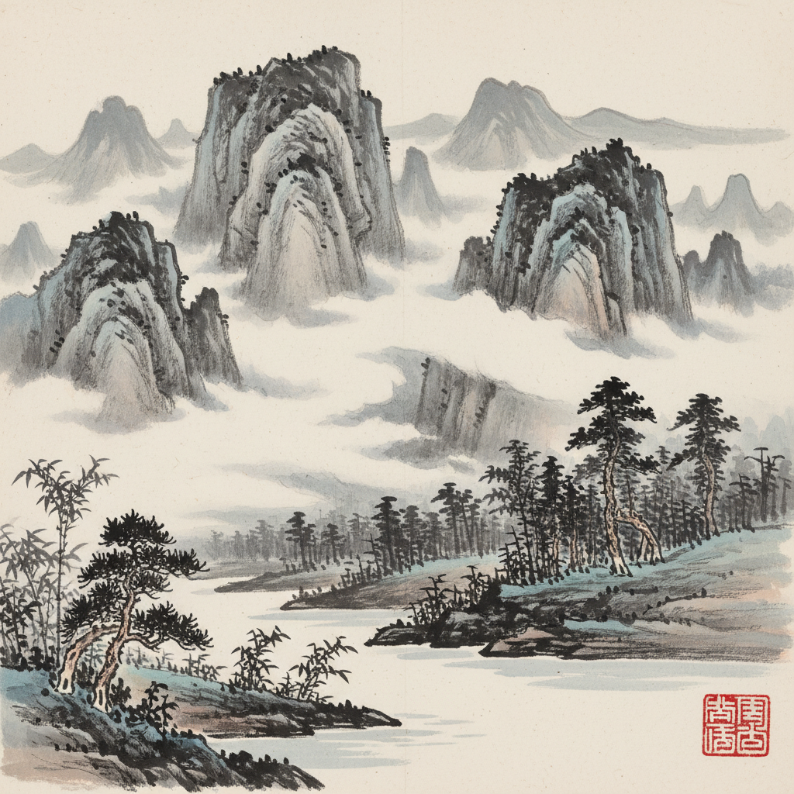

# Chinese Ink Painting 中国水墨画



> **"墨分五色、计白当黑——一笔之中见天地、留白之处藏万象。"**

## 概述

| 维度 | 描述 |
|------|------|
| 时期 | 唐代(7世纪)–至今 |
| 别名 | Chinese Ink Painting, Ink Wash, Sumi-e, 水墨画, 国画 |
| 核心色彩 | 墨色五分（焦浓重淡清）、宣纸白、偶有淡彩 |
| 关键元素 | 笔墨、留白、气韵生动、散点透视、诗书画印一体 |
| 代表人物 | 王维, 米芾, 八大山人, 齐白石, 张大千, 吴冠中 |
| 关联风格 | Calligraphy, Ukiyo-e, Minimalism, Zen Aesthetic, Watercolor |

---

## 历史脉络

| 年份 | 事件 |
|------|------|
| 唐代 | 王维开创"水墨为上"——文人画萌芽 |
| 宋代 | 山水画巅峰——范宽、郭熙、马远 |
| 元代 | 文人画成熟——赵孟頫、倪瓒 |
| 明清 | 写意花鸟——八大山人、石涛 |
| 近代 | 齐白石、黄宾虹——传统与现代 |
| 当代 | 吴冠中、徐冰——水墨的当代转化 |
| 2020s | AI水墨风格——传统美学的数字化 |

### 核心哲学

中国水墨画的精神是**"不画形——画意；不画物——画心"**：
- 气韵 = 生命（"气韵生动——画面要有呼吸"）
- 留白 = 空间（"不画的地方 = 云、水、天、无限"）
- 笔墨 = 修养（"一笔之中见功力——也见人品"）
- 写意 = 自由（"不求形似——求神似"）
- 齐白石: "妙在似与不似之间"

---

## 视觉语法

### 色彩系统

```
墨分五色：
  焦墨 (#0A0A0A) — 最浓、骨架
  浓墨 (#1A1A1A) — 主体
  重墨 (#333333) — 层次
  淡墨 (#666666) — 远景、氛围
  清墨 (#999999) — 最淡、虚无

辅色（淡彩）：
  花青 (#4682B4) — 山水、天空
  赭石 (#CD853F) — 山石、秋叶
  朱砂 (#FF4500) — 印章、花卉
  石绿 (#2E8B57) — 树木、春天

规则：
  - 墨色为主，色彩为辅
  - 留白 = 最重要的"颜色"
  - 宣纸的白 = 光、空气、水
  - 少即是多

质感：
  宣纸 — 渗透、晕染
  毛笔 — 粗细变化、飞白
  水墨 — 浓淡干湿
  印章 — 朱红点缀
```

### 标志性元素

| 类别 | 元素 |
|------|------|
| 技法 | 皴法、点苔、泼墨、破墨、飞白 |
| 构图 | 散点透视、留白、虚实、远近 |
| 题材 | 山水、花鸟、人物、梅兰竹菊 |
| 工具 | 笔墨纸砚（文房四宝） |
| 精神 | 诗书画印一体、文人精神 |
| 态度 | 写意、含蓄、空灵、修养、哲学 |

---

## 与千禧怀旧的关系

### 东方美学的全球化
- "Chinese ink style" = AI生图热门风格
- 中国风游戏（《原神》《黑神话》）中的水墨元素
- 水墨动画（《山水情》《大鱼海棠》）
- "在全球化时代——水墨是最能代表'中国'的视觉语言"

### 极简主义的东方源头
- 水墨的留白 → 日本侘寂 → 西方极简主义
- "Less is more的东方版本——早了1000年"
- 当代设计中的"东方极简" = 水墨精神的转化

---

## 设计应用

| 场景 | 应用方式 |
|------|----------|
| 品牌 | 中国风+高端+文化+传统+现代 |
| 游戏 | 中国风世界观+场景+角色+UI |
| 包装 | 茶叶+白酒+文创+食品 |
| 空间 | 中式+酒店+茶室+展览 |

---

## 相关风格

← [Ukiyo-e 浮世绘](ukiyo-e.md) | [Calligraphy 书法](calligraphy.md) →

↑ [返回千禧怀旧目录](README.md) | [返回总目录](../README.md)
