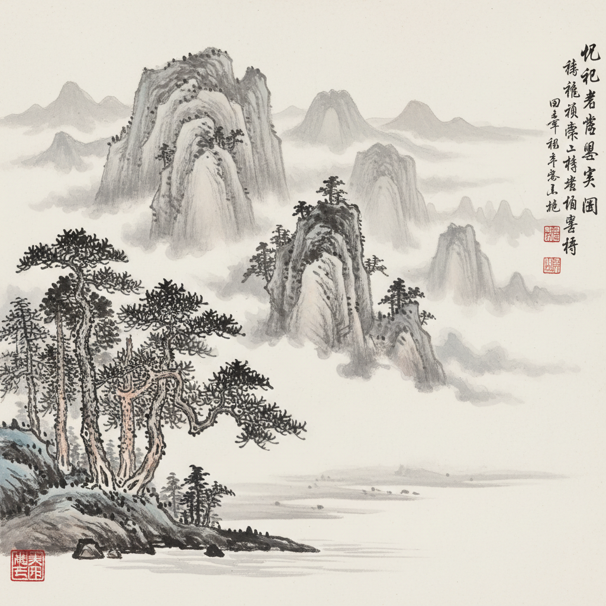

# Chinese Ink Painting 中国水墨画

> "以形写神" — 顾恺之
> "气韵生动" — 谢赫《六法》

## 概述

中国水墨画（Chinese Ink Wash Painting / 水墨画）是以水和墨为主要媒介、以毛笔在宣纸或绢上创作的东方绘画传统，有超过两千年的历史。它追求"以少胜多"——用最简洁的笔墨表达最丰富的意境，强调"气韵生动"和"意在笔先"。

水墨画不追求对自然的精确再现，而是追求画家对自然的主观感悟和精神表达——"似与不似之间"。留白不是空白，而是云、雾、水、天的暗示。

## 核心特征

| 特征 | 描述 |
|------|------|
| 笔墨为本 | 水和墨是核心媒介——"墨分五色" |
| 留白 | 空白是画面的有机组成部分 |
| 气韵生动 | 追求生命力和精神气质 |
| 写意精神 | 表达主观感悟而非客观再现 |
| 诗书画印 | 诗、书法、绘画、印章的统一 |
| 散点透视 | 移动视点——不同于西方焦点透视 |

## 视觉特征

- **媒介**：水墨在宣纸上的渗透和晕染
- **色彩**：以墨为主——"墨分五色"（焦浓重淡清）
- **留白**：大面积的空白——云、雾、水、天
- **笔触**：毛笔的提按转折——中锋、侧锋
- **构图**：散点透视、长卷、立轴
- **题材**：山水、花鸟、人物

## 主要分类

| 类型 | 特点 | 代表 |
|------|------|------|
| 工笔 | 精细勾勒、层层渲染 | 顾恺之、张萱、周昉 |
| 写意 | 简洁笔墨、意在笔先 | 梁楷、徐渭、八大山人 |
| 山水 | 自然山水的精神表达 | 范宽、郭熙、马远 |
| 花鸟 | 花卉、鸟兽、虫鱼 | 黄筌、徐熙、齐白石 |

## 代表人物

| 画家 | 代表作 | 时期 |
|------|--------|------|
| 王维 | 山水画始祖——"诗中有画，画中有诗" | 唐代 |
| 范宽 | *溪山行旅图* | 北宋 |
| 马远 | "马一角"——极简构图 | 南宋 |
| 徐渭 | 大写意花卉 | 明代 |
| 八大山人 | 极简的花鸟——"白眼向天" | 清初 |
| 齐白石 | 虾、蟹、花卉 | 近现代 |
| 张大千 | 泼墨泼彩山水 | 近现代 |

## 与其他风格的关系

- **Japonisme** → 日本水墨画通过浮世绘影响了西方
- **Impressionism** → 留白和简洁影响了印象派
- **Abstract Expressionism** → 书法性笔触影响了抽象表现主义
- **Minimalism** → "以少胜多"的东方极简美学
- **Zen Aesthetics** → 禅宗美学的视觉表达
- **Calligraphy** → 书法是水墨画的基础

## 概念图

---

*浮光艺志 | Chronicle of Artistry*
