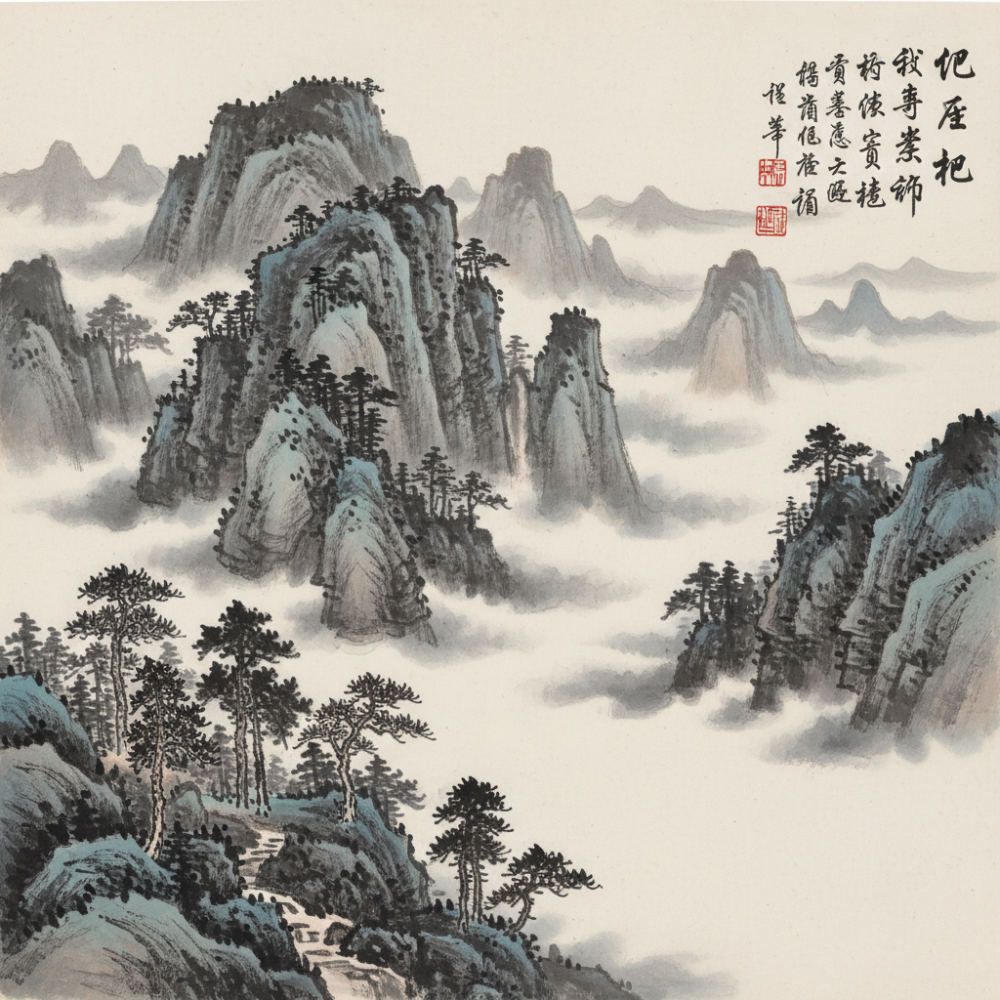

# Chinese Literati Painting 中国文人画 | 写意水墨

> **"逸笔草草，不求形似，聊以自娱耳。"** —— 倪瓒

## 概述

中国文人画（Literati Painting / Scholar Painting）是中国绘画史上最具哲学深度的传统，由宋代苏轼等文人士大夫倡导，在元明清三代成为中国绘画的主流。文人画强调"写意"而非"写形"，以笔墨趣味和精神境界为最高追求，将诗、书、画、印融为一体，形成了独特的东方美学体系。它不是一个时间段的"运动"，而是一种持续千年的艺术哲学。

## 核心理念

- **写意**：不求形似，追求神韵和意境
- **笔墨**：笔法和墨法本身即是审美对象
- **逸品**：超越技巧的精神自由
- **诗画一律**：画中有诗，诗中有画
- **以书入画**：书法用笔融入绘画
- **人品即画品**：画家的修养决定作品的境界

## 时间线

| 时期 | 发展 |
|------|------|
| 唐代 | 王维开创"诗中有画，画中有诗"传统 |
| 北宋 | 苏轼提出"论画以形似，见与儿童邻" |
| 南宋 | 梁楷减笔写意，开泼墨先河 |
| 元代 | 赵孟頫"以书入画"，元四家确立文人画正统 |
| 明代 | 沈周、文徵明吴门画派；徐渭大写意 |
| 清代 | 八大山人、石涛的极致个性表达 |
| 近现代 | 齐白石、黄宾虹、潘天寿的现代转化 |

## 代表画家

| 画家 | 时代 | 特征 |
|------|------|------|
| 王维 | 唐 | 水墨山水之祖，"诗佛" |
| 苏轼 | 宋 | 文人画理论奠基者 |
| 倪瓒 | 元 | 极简疏淡，"逸品"典范 |
| 黄公望 | 元 | 《富春山居图》 |
| 徐渭 | 明 | 大写意花鸟，狂放不羁 |
| 八大山人 | 清 | 极简造型，白眼向天 |
| 石涛 | 清 | "一画论"，笔墨当随时代 |
| 齐白石 | 近代 | 雅俗共赏，虾蟹传神 |

## 视觉特征

- 水墨为主，色彩为辅（"墨分五色"）
- 大量留白——"计白当黑"
- 散点透视（非焦点透视）
- 诗文题跋与印章构成画面有机部分
- 笔触的书写性——每一笔都有书法韵味
- 长卷和立轴的独特展示方式

## 四君子与常见题材

| 题材 | 象征 |
|------|------|
| 梅 | 傲骨、高洁 |
| 兰 | 幽雅、君子 |
| 竹 | 气节、虚心 |
| 菊 | 隐逸、淡泊 |
| 山水 | 天人合一、卧游 |
| 枯木怪石 | 文人的倔强与孤傲 |

## 与其他风格的关系

| 风格 | 关系 |
|------|------|
| 日本水墨画 | 直接传承，雪舟等杨赴华学习 |
| 抽象表现主义 | Franz Kline 受书法启发 |
| 极简主义 | 共享"少即是多"的哲学 |
| 侘寂 Wabi-sabi | 共享对不完美和朴素的欣赏 |
| 当代水墨 | 传统笔墨语言的当代转化 |

## 概念图

---

*浮光艺志 | Chronicle of Artistry*
