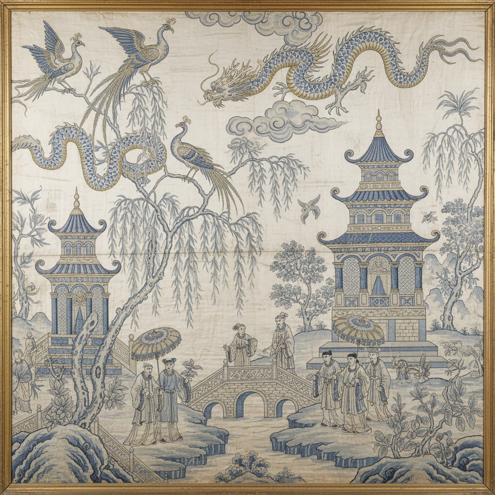

# Chinoiserie Art 中国风艺术

> "Chinoiserie is Europe's dream of China — not China as it was, but China as the Western imagination wished it to be: a land of pagodas and parasols, mandarins and monkeys, willow trees and dragons, all rendered in a playful, asymmetrical style that borrowed freely from Chinese motifs while obeying none of China's actual artistic conventions, creating a fantasy Orient that decorated everything from Rococo salons to Chippendale chairs." — Unknown

## 概述

中国风艺术（Chinoiserie Art）是17至19世纪欧洲对中国艺术和文化的想象性诠释——并非对中国艺术的忠实模仿，而是欧洲艺术家和工匠基于有限的了解和丰富的想象，将中国元素（如宝塔、龙、凤、竹、柳树、人物等）融入欧洲装饰艺术中创造出的独特风格。中国风在洛可可时期达到高峰，影响了家具、瓷器、纺织品、壁纸和建筑等多个领域。

中国风艺术的实践包括：1）瓷器——仿中国风格的欧洲瓷器；2）壁纸——中国风图案的壁纸；3）家具——中国风装饰的家具；4）纺织品——中国风图案的丝绸和棉布；5）建筑——中国风的亭台楼阁；6）漆器——仿中国漆器的欧洲制品；7）当代中国风——将传统中国风元素与现代设计结合的创作。

## 核心特征

| 特征 | 描述 |
|------|------|
| 想象 | 对中国的想象性诠释 |
| 异域 | 异域情调的追求 |
| 装饰 | 高度装饰性 |
| 不对称 | 不对称的构图 |
| 洛可可 | 与洛可可风格结合 |
| 跨文化 | 东西方文化的交融 |

## 视觉特征

- **宝塔**：宝塔和亭台的形象
- **龙凤**：龙、凤和其他中国元素
- **柳树**：柳树和竹子的图案
- **人物**：穿着中国服饰的人物
- **蓝白**：蓝白色调的瓷器风格
- **金色**：大量使用金色装饰

## 代表作品

| 作品 | 艺术家/文化 | 年代 | 意义 |
|------|-------------|------|------|
| *Willow Pattern* | 英国 | 1790年代 | 柳树图案瓷器 |
| *Brighton Pavilion* | 英国 | 1815-1823年 | 布莱顿皇家行宫 |
| *Meissen chinoiserie* | 德国 | 18世纪 | 迈森中国风瓷器 |
| *Chippendale Chinese furniture* | 英国 | 18世纪 | 齐彭代尔中国风家具 |
| *Toile de Jouy chinoiserie* | 法国 | 18世纪 | 茹伊印花中国风 |

## 历史时间线

| 时期 | 事件 |
|------|------|
| 17世纪 | 中国风在欧洲兴起 |
| 18世纪前半 | 洛可可时期中国风的高峰 |
| 18世纪后半 | 新古典主义的冲击 |
| 19世纪 | 维多利亚时代的复兴 |
| 当代 | 中国风在当代设计中的回归 |

## 中国语境

中国风是一个有趣的跨文化现象，从中国视角来看有特殊的意义。中国风反映了历史上欧洲对中国的想象和误读——是文化交流史的重要组成部分。中国的学者对中国风进行了深入研究——从后殖民主义和跨文化交流的角度进行分析。中国当代的设计师——有时会反向借鉴中国风的元素，创造出有趣的文化对话。中国的博物馆——收藏和展示中国风的欧洲艺术品，作为中西文化交流的见证。中国的文化研究中，中国风作为"他者"视角下的中国形象——是重要的研究课题。中国的时尚和设计界——对中国风的当代演绎有持续的兴趣和讨论。

## AI生成概念图

## 与其他风格的关系

- **Rococo** → 洛可可
- **Japonisme** → 日本主义
- **Orientalism** → 东方主义
- **Blue and White** → 青花瓷
- **Willow Pattern** → 柳树图案
- **Decorative Arts** → 装饰艺术

---

*浮光艺志 | Chronicle of Artistry*
