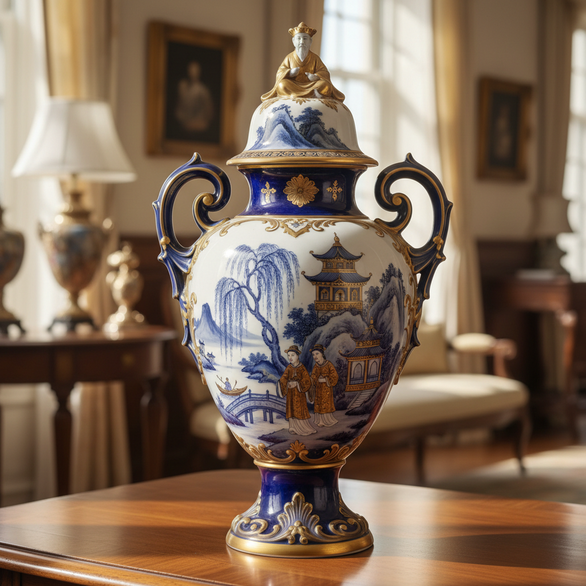

# Chinoiserie Ceramic Art 中国风陶瓷艺术

> "Chinoiserie is not China — it is Europe's dream of China, painted in cobalt and gold." — Decorative arts history

## 概述

中国风陶瓷艺术（Chinoiserie Ceramic Art）是17-19世纪欧洲陶瓷中模仿、想象和重新诠释中国艺术风格的装饰传统。中国风（Chinoiserie）不是中国艺术本身——而是欧洲人对中国的想象和浪漫化诠释，是一种独特的跨文化创造。

中国风陶瓷的兴起与17世纪欧洲对中国瓷器的狂热密切相关。当时中国瓷器通过荷兰东印度公司等贸易渠道大量进入欧洲——其精美的蓝白装饰和神秘的东方图案令欧洲人着迷。由于真正的中国瓷器价格昂贵，欧洲各地的陶瓷工坊开始模仿中国风格——但由于对中国文化的了解有限，他们创造的往往是一种想象中的"中国"：奇异的宝塔、穿着长袍的人物、龙凤、假想的中国风景。

中国风陶瓷艺术的核心要素包括：1）文化想象——欧洲对中国的浪漫化想象；2）蓝白传统——模仿中国青花的蓝白装饰；3）异国情调——追求东方的神秘和异国感；4）宝塔图案——想象中的中国建筑；5）人物形象——穿着长袍的东方人物；6）龙凤纹样——龙、凤、麒麟等神兽；7）贸易驱动——全球贸易推动的文化交流。

## 核心特征

| 特征 | 描述 |
|------|------|
| 文化想象 | 欧洲对中国浪漫化想象 |
| 蓝白传统 | 模仿中国青花蓝白装饰 |
| 异国情调 | 追求东方神秘异国感 |
| 宝塔图案 | 想象中的中国建筑 |
| 人物形象 | 穿着长袍东方人物 |
| 贸易驱动 | 全球贸易推动文化交流 |

## 视觉特征

- **蓝白色调**：模仿青花的蓝白色调
- **宝塔风景**：想象中的中国风景
- **东方人物**：穿长袍的人物形象
- **龙凤图案**：龙、凤等神兽装饰
- **花鸟纹样**：梅花、竹子、鸟类
- **金色点缀**：金彩的华丽点缀

## 代表作品

| 作品 | 年代 | 意义 |
|------|------|------|
| *代尔夫特中国风* | 17世纪 | 荷兰模仿 |
| *迈森中国风瓷器* | 18世纪 | 德国诠释 |
| *柳树图案* (Willow Pattern) | 1780年代 | 英国创造 |
| *塞弗尔中国风* | 18世纪 | 法国宫廷 |
| *伍斯特中国风* | 18世纪 | 英国工厂 |
| *当代中国风* | 21世纪 | 后现代诠释 |

## 历史时间线

| 时期 | 事件 |
|------|------|
| 16世纪末 | 中国瓷器大量进入欧洲 |
| 17世纪 | 代尔夫特开始模仿中国风格 |
| 18世纪初 | 迈森瓷器的中国风装饰 |
| 18世纪中期 | 中国风在欧洲达到高峰 |
| 1780年代 | 柳树图案设计 |
| 19世纪 | 中国风逐渐衰落 |
| 当代 | 后现代语境中的重新审视 |

## 中国语境

中国风陶瓷对中国人来说是一面有趣的"哈哈镜"——它反映的不是真实的中国，而是欧洲人想象中的中国。这种"误读"本身就是跨文化交流的重要现象——它揭示了文化传播中不可避免的变形、简化和浪漫化。中国风陶瓷中的"中国"元素——宝塔、龙、穿长袍的人物——往往是对中国文化的刻板印象和浪漫化想象。但从另一个角度看，中国风也证明了中国文化对世界的巨大影响力——它激发了欧洲陶瓷工业的发展，推动了全球贸易，并创造了一种独特的跨文化美学。当代艺术家对中国风的重新审视——包括中国艺术家对这一传统的回应——为理解全球化语境中的文化身份和文化挪用提供了重要的视角。

## 概念图

## 与其他风格的关系

- **Chinese Blue-and-White** → 中国青花瓷（模仿对象）
- **Delft** → 代尔夫特（荷兰中国风）
- **Meissen** → 迈森瓷器（德国中国风）
- **Transfer Ware** → 转印陶瓷（柳树图案）
- **Japonisme** → 日本主义（平行现象）
- **Orientalism** → 东方主义

---

*浮光艺志 | Chronicle of Artistry*
