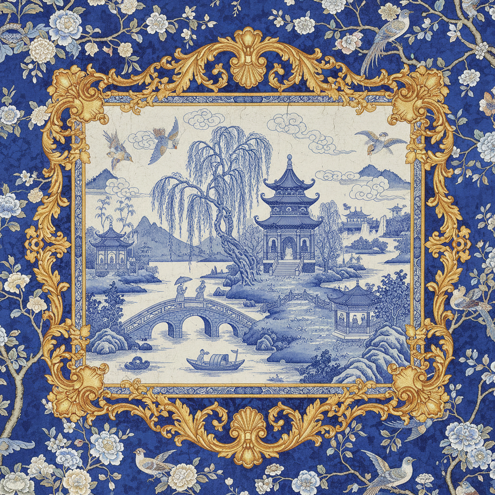

# Chinoiserie 中国风



> **"欧洲人想象中的中国——青花瓷、宝塔、龙凤——一个美丽的'误读'。"**

## 概述

| 维度 | 描述 |
|------|------|
| 时期 | 17世纪–19世纪/影响至今 |
| 别名 | Chinoiserie, 中国风, Chinese-inspired Design |
| 核心色彩 | 青花蓝白、金色、翡翠绿、朱红、黑漆 |
| 关键元素 | 宝塔、龙凤、花鸟、山水、青花瓷图案、漆器 |
| 代表人物 | William Chambers, Thomas Chippendale, Wedgwood |
| 关联风格 | Rococo, Art Deco, Japonisme, Orientalism |

---

## 历史脉络

| 年份 | 事件 |
|------|------|
| 1600s | 东印度公司——中国商品大量进入欧洲 |
| 1700s | Chinoiserie全盛期——洛可可+中国元素 |
| 1757 | William Chambers 设计邱园中国塔 |
| 1800s | Chinoiserie衰落——被"真正的"中国研究取代 |
| 1920s | Art Deco中的Chinoiserie复兴 |
| 2000s | 当代时尚/家居中的Chinoiserie回归 |
| 2020s | "新中式"——中国设计师重新定义Chinoiserie |

### 核心哲学

Chinoiserie的精神是**"想象比真实更美——欧洲人梦中的中国比真正的中国更'中国'"**：
- 想象 = 创造（"不是复制中国——是创造一个'理想中国'"）
- 异域 = 魅力（"越远的地方越美——因为你可以自由想象"）
- 融合 = 新生（"洛可可+中国 = 一种全新的美"）
- 误读 = 价值（"'错误'的理解也可以产生'正确'的美"）
- "Chinoiserie不是中国艺术——是关于中国的欧洲艺术"

---

## 视觉语法

### 色彩系统

```
主色：
  青花蓝 (#003399) — 瓷器、经典
  瓷白 (#F5F5F5) — 底色、纯净
  金色 (#FFD700) — 装饰、奢华
  翡翠绿 (#00A86B) — 玉、自然

辅色：
  朱红 (#FF4500) — 漆器、喜庆
  黑漆 (#0C0C0C) — 漆器、深邃
  粉色 (#FFB7C5) — 花卉、洛可可

规则：
  - 蓝白是核心（青花瓷）
  - 金色装饰
  - 高对比
  - 精细图案

质感：
  瓷器 — 光滑、精细
  漆器 — 光泽、深邃
  丝绸 — 柔软、光泽
  壁纸 — 重复图案
```

### 标志性元素

| 类别 | 元素 |
|------|------|
| 建筑 | 宝塔、拱桥、亭台、园林 |
| 动物 | 龙、凤、仙鹤、锦鲤、猴 |
| 植物 | 牡丹、梅花、竹、兰、菊 |
| 器物 | 青花瓷、漆器、屏风、扇子 |
| 人物 | 仕女、文人、渔夫（欧洲想象中的） |
| 态度 | 异域、奢华、精细、想象、融合 |

---

## 与千禧怀旧的关系

### 当代Chinoiserie的复兴
- 高端家居品牌的Chinoiserie壁纸（de Gournay）
- 时尚中的Chinoiserie元素（Gucci, Dior）
- "Chinoiserie不是过去的——它一直在演变"
- 与"新中式"设计的对话和张力

### "新中式" vs 传统Chinoiserie
- 传统Chinoiserie = 欧洲人想象的中国
- 新中式 = 中国人自己定义的当代中国美学
- "谁有权定义'中国风'？"
- 从"被想象"到"自我表达"的转变

---

## 中国语境

- Chinoiserie作为"文化误读"的研究对象
- 中国设计师对Chinoiserie的重新诠释
- "新中式"设计运动——中国人自己的Chinoiserie
- 中国品牌的国际化视觉策略

---

## 设计应用

| 场景 | 应用方式 |
|------|----------|
| 家居 | 壁纸+瓷器+家具+装饰+奢华 |
| 时尚 | 印花+刺绣+配饰+高定 |
| 品牌 | 奢侈品+茶+瓷器+东方+精致 |
| 空间 | 酒店+餐厅+SPA+东方氛围 |

---

## 相关风格

← [Art Nouveau 新艺术运动](art-nouveau.md) | [Ukiyo-e 浮世绘](ukiyo-e.md) →

↑ [返回千禧怀旧目录](README.md) | [返回总目录](../README.md)
